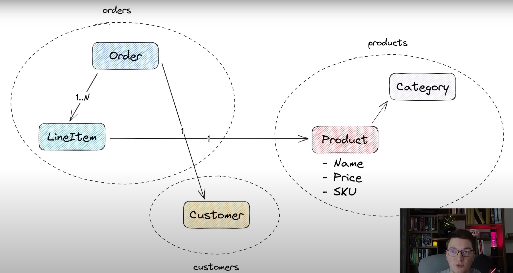

# Modeling a Domain with Domain-Driven Design from Scratch
* eShop App

* Domain has 3 Aggregates: 
  * Orders, 
  * Products, 
  * Customers
* In DDD an entity is something which is **uniquely identifiable.**

## Customer Domain
* **Entities**
  ```csharp
    // Customer Entity
    internal class Customer
    {
        // identifier as it is an entity. This will be used to reference this entity from other entities or aggregate route
        public Guid Id { get; private set; }
        //Private setters as we dont want these properties to change directly from outside this class. we will expose some methods to do so. 
        public string Email { get; private set; } = string.Empty;
        public string Name { get; private set; } = string.Empty;
    }
  ```


## Product Domain
* **Entities**
  ```csharp
   internal class Product
    {
        public Guid Id { get; set; }

        public string Name { get; private set; } = string.Empty;

        // Value Object
        public Money Price { get; private set; }
        // Value Object
        public Sku Sku { get; private set; }

    }
  ```

* **Value Objects**
  * **Money Value Object**
    ```csharp
    // Records have structural equality by default. Hence these are suitable for ValueObjects
    // Records are immutable by design.
    // This is a Value object
    // Below is demonstration of primary constructor feature 
    public record Money(string Currency, decimal Amount);
    ```
    * **Sku Value Object**
    ```csharp
     // Stock Keeping Unit
    public record Sku
    {
        private const int DefaultLength = 15;
        private Sku(string value) => Value = value;

        // init setter: As soon as value is set it cannot be changed. 
        public string Value { get; init; }

        public static Sku? Create(string value)
        {
            if(string.IsNullOrEmpty(value)) return null;
            if(value.Length != DefaultLength) return null;
            return new Sku(value);
        }
    }
    ```

## Orders Domain
* **Aggregate Root**: It comprises of one or more entities
    ```csharp
    // We can store a reference of another entity using the foreign key
    internal class Order
    {
        private readonly HashSet<LineItem> _lineItems = new ();
        private Order()
        {

        }
        public Guid Id { get; private set; }
        public Guid CustomerId { get; private  set; }

        // Factory method to create an order. This uses the private constructor
        public static Order Create(Customer customer)
        {
            var order = new Order()
            {
                Id = Guid.NewGuid(),
                CustomerId = customer.Id,
            };
            return order;
        }

        public void Add(Product product)
        {
            var lineItem = new LineItem(Guid.NewGuid(), Id, product.Id, product.Price);
            _lineItems.Add(lineItem);
        }
    }
    ```
* **Entities**
    ```csharp
    public class LineItem
    {
        internal LineItem(Guid id, Guid orderId, Guid productId, Money price)
        {
            Id = id;
            OrderId = orderId;
            ProductId = productId;
            Price = price;
        }

        public Guid Id { get; private set; }
        public Guid OrderId { get; set; }
        public Guid ProductId { get; set; }

        // Money has meaning in our entire domain so we can move it to common place
        public Money Price { get; private set; }
    }
    ```