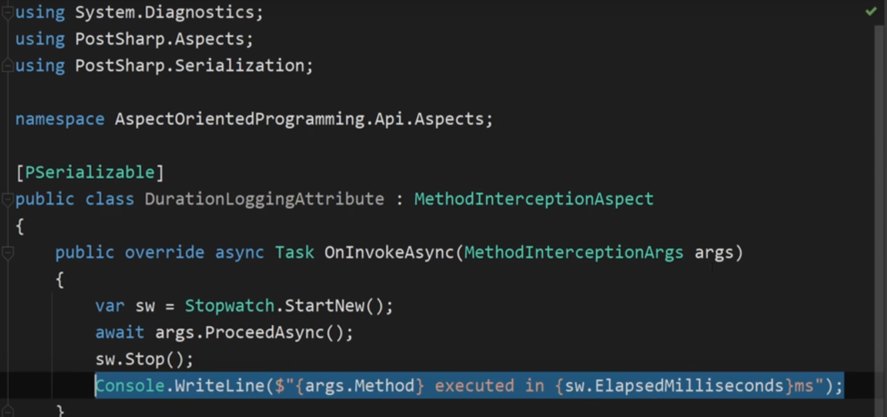
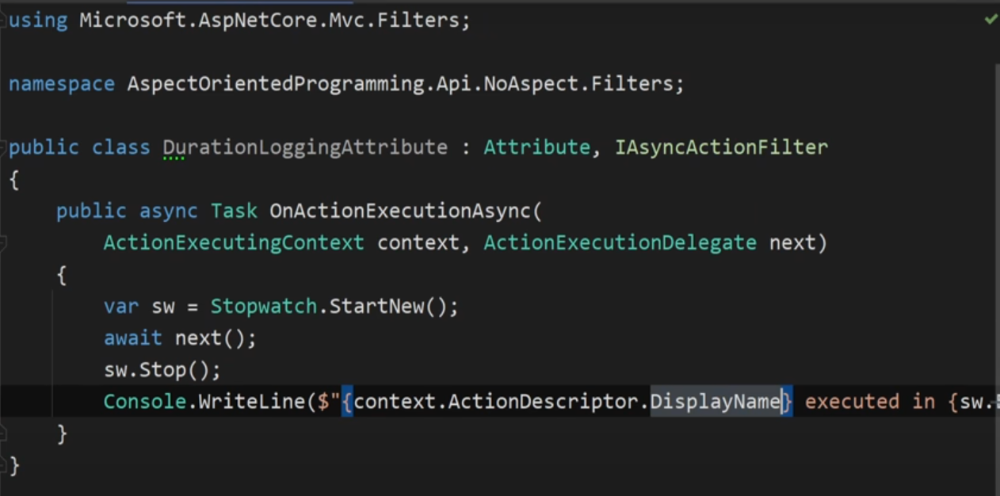
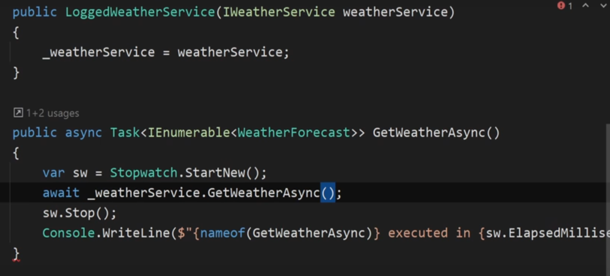
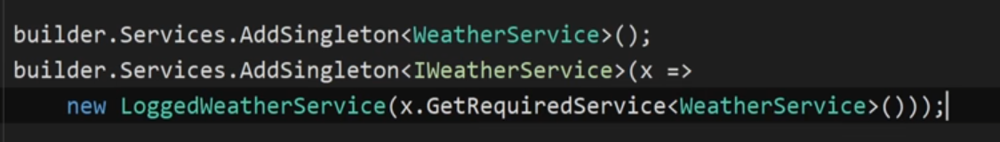

# Aspect Driven Development

*  It allows to modularize things that cut across multiple concerns. 
* Logging or metric collection are example of such concerns. 
* PostShop is a paid nuget package which can be used to implement ADD by allowing to create aspect. 
* In below example we have created a Duration logging aspect which would act as a middleware. And In methods we have to log we can just add this attribute. 

* But the limitation is these are compile time things so we cant have dependency injection So for example we wont be able to get a logger instance to be able to log.
 

* But the same things can be achieved without PostSharp we can create filters or AsyncActionFilters and achieve the same functionality. 

* the above filter can be applied to the controller method. This cannot be done or any other method which is not an Action method. 
 

* To overcome the above limitation of not being able to apply this on any non-action methods, we can use **Decoration Pattern** which will also support DI but it will not be as modular or elegant solution as with PostShop 

* Now for Adding our IWeatherService which we decorated we need to implement that in the following way that whenever someone ask for IWhetherService we will return a new LoggedWeatherService. 

* this would violate DRY 