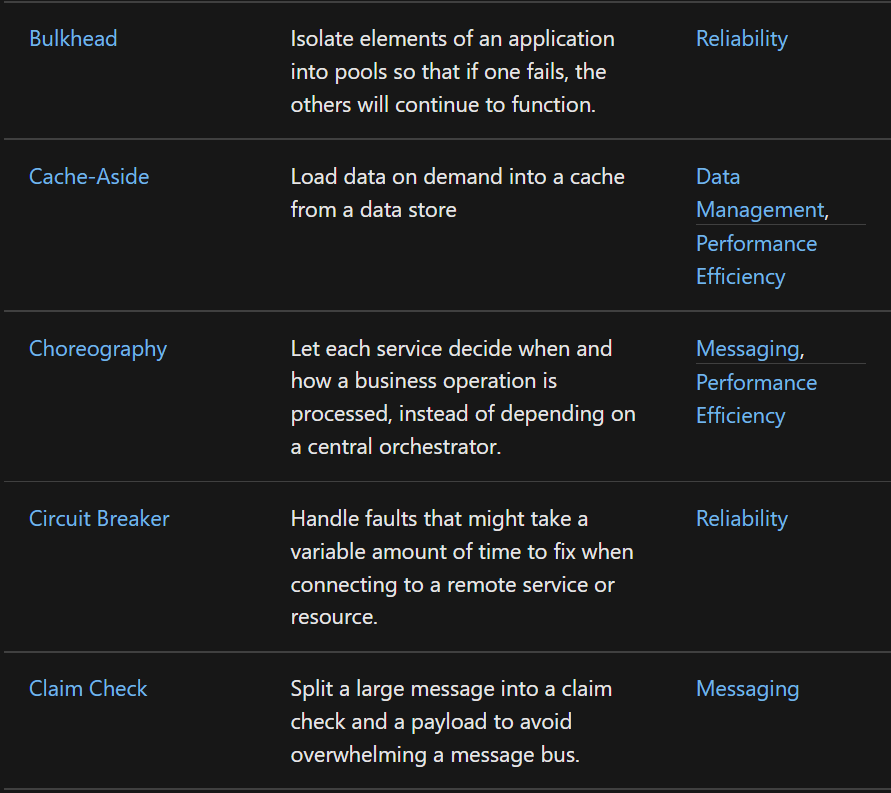
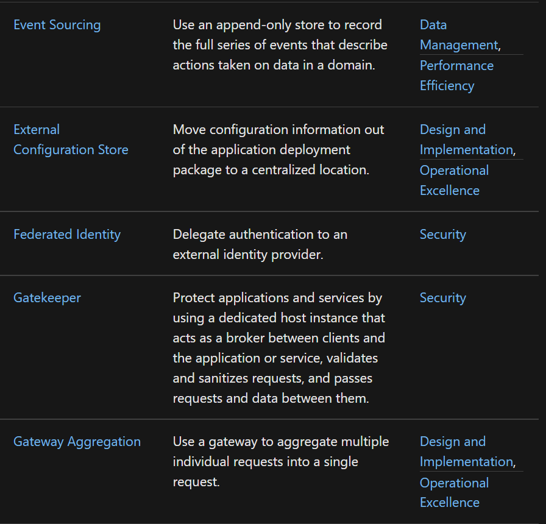
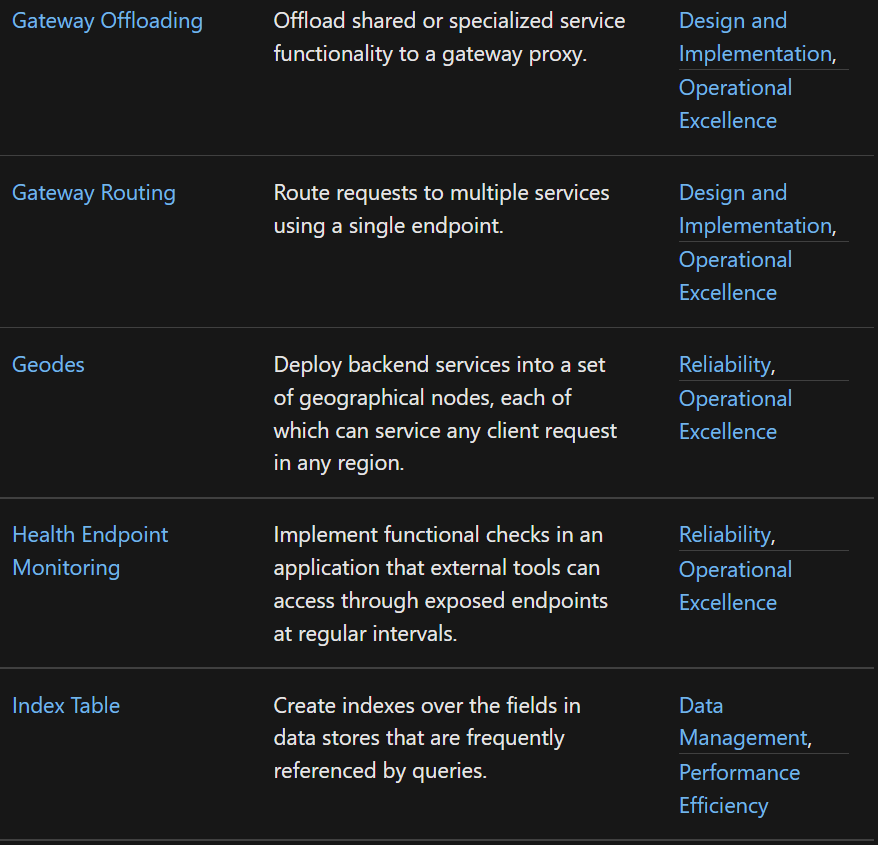
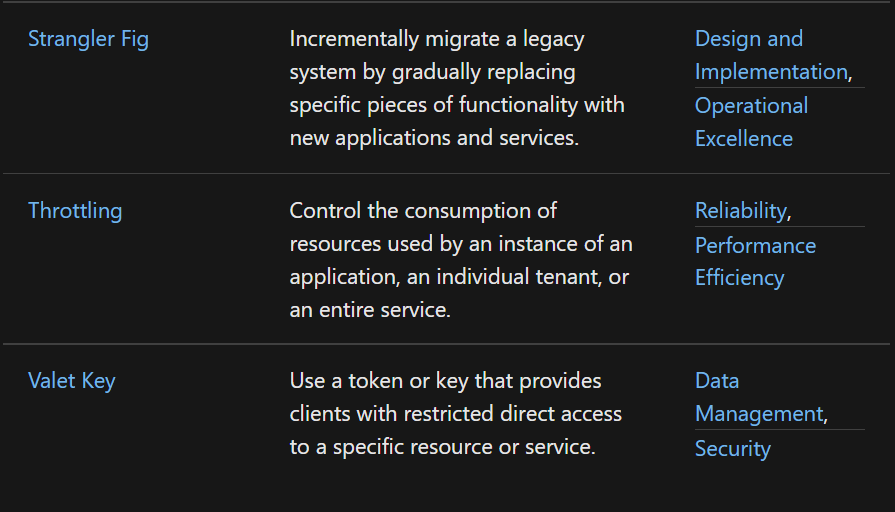

# Cloud Design Patterns 

## Category 
1. [Design and Implementation](https://docs.microsoft.com/en-us/azure/architecture/patterns/category/design-implementation)
2. [Operational Excellence](https://docs.microsoft.com/en-us/azure/architecture/framework/devops/devops-patterns)
3. [Messaging](https://docs.microsoft.com/en-us/azure/architecture/patterns/category/messaging)
4. [Reliability](https://docs.microsoft.com/en-us/azure/architecture/framework/resiliency/reliability-patterns)
5. [Data Management](https://docs.microsoft.com/en-us/azure/architecture/patterns/category/data-management)
6. [Performance Efficiency](https://docs.microsoft.com/en-us/azure/architecture/framework/scalability/performance-efficiency-patterns)
7. [Security](https://docs.microsoft.com/en-us/azure/architecture/framework/security/security-patterns)

## Catalog

