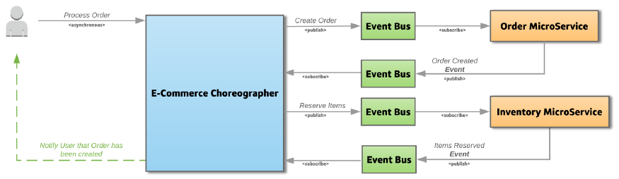

# Handling Distributed Transactions
* **Distributed Transactions**: 
    * Transactions which span over multiple services/components. 
    * The services are called in sequence to complete a transaction. 
    * very complex process with a lot of moving parts that can fail. **best to avoid them** 
    * We loose **ACID** nature of transaction
    * E.g. we created the microservices OrderMicroservice and InventoryMicroservice, which have separate databases. When a Checkout request comes from the user, both these microservices will be invoked to apply changes into their own database. Because the transaction is now across multiple databases via multiple systems, it is now considered a distributed transaction.

### Problems*
1. **Keeping transaction autonomic**:  It's hard to ensure either all steps complete or none happen
2. **handling concurrent requests**: If an object from any one of the microservice is being persisted to the database and at the same time, another request reads the same object. Should the service return the old data or new ?
### Possible Solutions 
1. **Two Phase Commit 2PC** 
2. **Eventual Consistency and Compensation / SAGA**

#### 2 PC 
* It has 2 Stages: **Prepare Phase** & **Commit Phase**
* **Transaction Coordinator** maintains the life cycle of transaction 
* In prepare phase, all mservices notify coordinator they are ready to complete the transaction. 
* Then in commit phase either a commit or rollback is issues by the coordinator. 

##### Advantages
* Transactions are ensured atomicity
* It allows **read-write isolation** changes are not visible until coordinator issues commit.
* Its sync call so client is notified directly 
##### Disadvantages
* Quite Slow 
* Highly dependent on transaction coordinator.
* Possibility of deadlock when two transactions mutually lock each other.

#### Eventual Consistency
*  Each service publishes an event whenever it updates its data. Other service subscribe to events. When an event is received, a service updates its data. 
* A distributed transaction is fulfilled by async local transactions on related microservices. 

* On this request the Choreographer emits an event Create Order, marking the start of the transaction.

* All the event based communication between microservices happen via the Event Bus and is Choreographed by another system to address the complexity issue.

##### Advantages
* Each microservices focuses on each atomic transaction. 
* Microservice is not blocked if another service taking longer time. 
* No Database Lock is required. 
* System is **highly scalable under heavy load** due to async event based solution
##### Disadvantages
* Does not have **read isolation**

