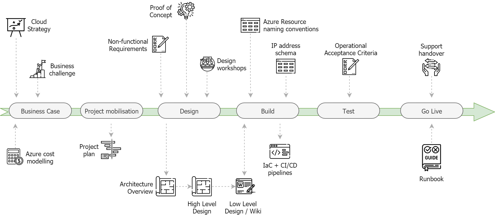
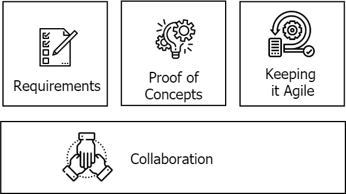

# Azure Architecture - Design Principles
* Major Project Scenarios 
    1. Lifting-and-shifting existing workloads to virtual machines 
    2. re-platforming legacy .NET apps to Windows containers running on AKS 
    3. Cloud-first apps using PaaS services or microservices. 
* **Challenges** Security, Governance, Availability and performance. 

# Project Lifecycle 

<figcaption align = "center">Project Input and Deliverables</figcaption>

# Success Factors 

    
    <figcaption align="center">Project Success Factors</figcaption>

# Requirements 
* NFR's are key inputs & key success factors to the design phases. 
* Without knowing **RPO(Recovery Point Objective), RTO(Recovery Time Objective) & other performance and security requirements** we can make key azure arch decisions. 
> **EXAMPLES**
    Does solution needs to be single/multi-region?
    Any compliance requirements i.e. PCI DSS? 
    How many concurrent users is the system expected to support? 

# Proof of Concepts
* By running a proof-of-concept, we gain experience and unearth any limitations, gotchas and other lessons learned.
* PoCs should be **time-boxed(allocating a fixed maximum unit of time to an activity)** 

# Keeping it Agile 
* Design decisions made early on have implications for subsequent stages for Azure project. 
* working in an agile manner is more sucessfull, like we may build CI/CD pipelines and Azure Infra(Infrastructure as Code) before HLD/LLD document is finalized. 

# Collaboration
* Collaborations with **application teams, project managers, business stakeholders, security and operations teams** throughout the project lifecycle helps reduces surprises and makes transition from **design --> build --> support** easier. 

# Design Considerations
* For design, Type of project needs to be identified: 
> **questions to ask**
Is it greenfield, or are we deploying into the organization’s existing Azure subscription?
What are the application/s that will be deployed to Azure?
What is the application architecture? Monolithic, microservices, PaaS based etc.?
Which regulatory and compliance frameworks does the solution need to adhere to?

## Core Infra
* For greenfield project this becomes important as Infra is our scaffolding or foundation upon which we can start building and deploying our applications. 
* **IMPORTANT CONSIDERATIONS**
    1. Management groups and subscription — what does this structure look like?
    2. Subscriptions — single vs multiple subscriptions?
    3. Identity — is there an existing Azure AD?
    4. On-premises connectivity — ExpressRoute, VPN etc.
    5. Perimeter security — Application Gateways, Firewalls etc.
    6. Monitoring + logging — is integration with existing tools required?
    7. Security + Governance — Azure Sentinel, Security Centre, security policies, RBAC etc.
    8. 3rd party services — what 3rd party services are needed, i.e. firewalls, SIEM’s etc.
    9. Infrastructure configuration and deployment — Azure DevOps, GitLab, Terraform vs ARM etc.

## Application Hosting 
* We can leverage services like API management, Kubernetes, Web Apps, Functions, Logic Apps. 
* **IMPORTANT CONSIDERATIONS**
    1. Is this an application/s to be migrated from on-premise? or cloud-native?
    2. Application architecture — microservices vs traditional monolith?
    3. Azure subscriptions — dedicated vs shared application subscriptions?
    4. Application authentication — Azure AD, B2B/B2C?
    5. Will the application be public facing? Or via a private ExpressRoute or VPN connection?
    6. What industry regulations does the solution need to comply with? i.e. PCI-DSS, GPDR
    7. Regional and data residency requirements?
    8. Performance and availability — what are the RTO/RPO’s and performance metrics?
    9. What Azure services does the application require? SaaS / PaaS / IaaS
    10. What 3rd party services does the application require? i.e. auth0, SendGrid etc.
    11. Database requirements — Azure SQL / CosmosDB / PostgreSQL etc.
    12. Data warehousing and archival? — Synapse, storage accounts etc.
    13. Monitoring and alerting — integration with incident management tools
    14. Network security — firewalls, VNET service endpoints, Private Link, NSG’s
    15. Disaster Recovery and Backup — what does this look like?
    16. Incident management for application issues

## Artifacts 
* All above considerations feed into the actual artifacts and deliverables that we create throughout the project. 
* Before writing design documents the target audiences: 
    1. Client architects — key stakeholder and likely responsible for document sign-offs
    2. Microsoft architects — provide Azure related technical feedback
    3. Project engineers — build the solution based upon the design
    4. 3rd party vendors — are interested in any integrations
    5. Operations team — are interested in support implications

### Important design artifacts 
1. **Architecture Overview documents** 
    * Provides an overarching view or blueprint for the solution
    * This also ties back design decisions to NFRs 
2. **High Level Design Document** 
    * Expands upon the arch overview and provides the next level of detail 
    * should cover resource groups, VNETs, environments, configurations of each Azure service. 
    * It should also cover performance, regional resiliency, availability zones, disaster recovery and backups
3. **Low-Level Design/WiKi** 
    * The advantage of wikis is that they are more easily maintained and accessible. They are useful to include the following types of information -
        * Pipeline guides and how to’s
        * Azure resource naming conventions
        * IP address schemas
        * etc.
    
# Reusability And Best practice
* Re-use of design documents, templates or snippets of ARM templates, or Terraform modules. 
* Design with re-usability in mind - eg. an environment hosting design can often be templated to allow it to be easily re-used. 
* Templatizing and creating a library of commonly used artifacts is the best way to accelerate designing for and deploying to Azure consistently.

# Choosing an Azure service
* Following considerations should be made to choose any Azure service: 
    * **Requirements**: 
    * **Familiarity** 
    * **Scalability** 
    * **Resilience and Availability** 
    * **Cost** 
    * **Limitations**

# Design Tools 
* One Note
* App.diagrams.net / Powerpoint / Visio 
* Official [SVG](https://docs.microsoft.com/en-us/azure/architecture/icons/) Icon Pack
* [How to enable SVG thumbnail preview in Windows](https://arlanblogs.alvarnet.com/azure-icons-enable-svg-thumbnail-preview-in-file-explorer/)

# Keeping Up to Date 
* [Azure Update Site](https://azure.microsoft.com/en-us/updates/)

# Useful Links 
* [Azure pricing calculator](https://azure.microsoft.com/en-gb/pricing/calculator/) — calculate costs for Azure services
* [Azure Services](https://azure.microsoft.com/en-gb/services/) — directory of all Azure services
* [Azure Charts](https://azurecharts.com/) — a visual representation of services, SLA’s etc.
* [Azure Architecture Center](https://docs.microsoft.com/en-us/azure/architecture/) — stepping off point into design patterns etc.
* [Azure Well-Architected Framework](https://docs.microsoft.com/en-us/azure/architecture/framework/) — guiding design principles
* [Azure decision trees](https://docs.microsoft.com/en-us/azure/architecture/guide/technology-choices/compute-decision-tree) — how to choose the best service
* [Cloud Adoption Framework](https://docs.microsoft.com/en-us/azure/cloud-adoption-framework/get-started/) — more focused on strategy and adoption. But still an excellent resource for landing zones, best practices etc.
* [The Azure Cloud-Native Architecture Mapbook](https://azure.microsoft.com/en-gb/resources/azure-cloud-native-architecture-mapbook/) — an excellent and recent free ebook on Azure architecture