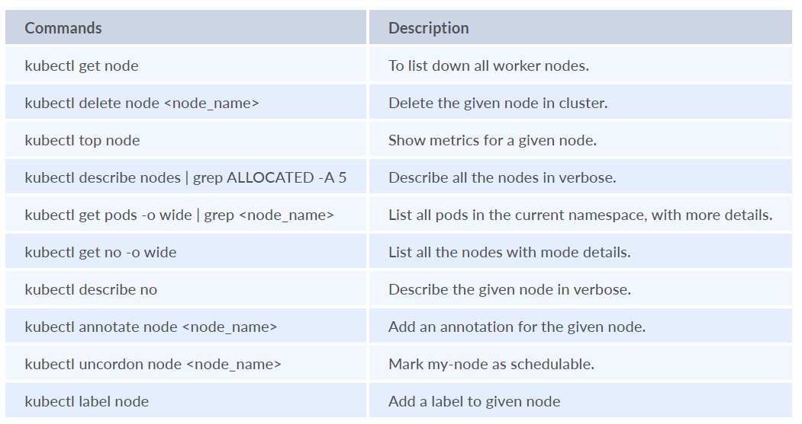
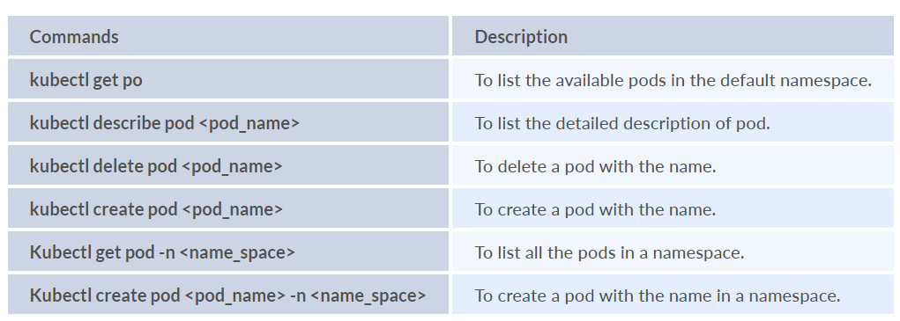
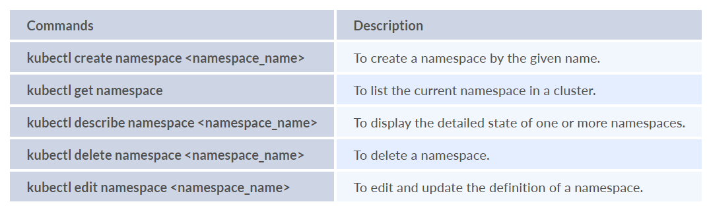
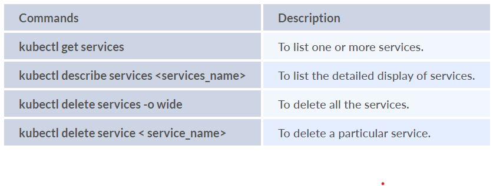
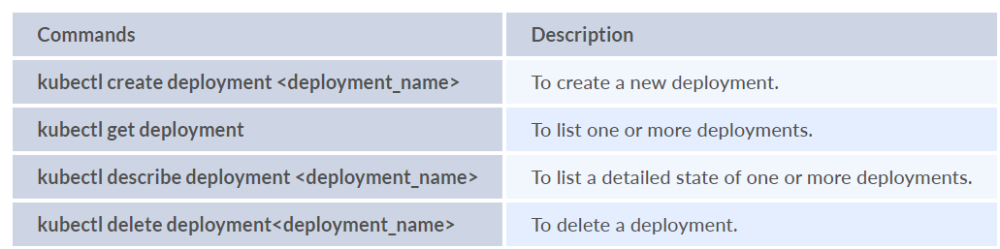

# Kubernetes Cheat Sheet
* Kubernetes is a container orchestrator that makes sure that each container is where it is supposed to be and that the containers work properly.
* Containerization does solve the issue of scalability, downtime and dependency management quite efficiently
* K8s takes care of upgrades without downtime, establish communication between containers. 
* K8s provides a platform to run distributed environment resiliently. 
* K8s can help you manage canary deployments also(like deploying new features slowly to a subset of users first).

## Terminologies
* **Cluster**: Group of physical/virtual servers where k8s is installed.
* **Nodes**: 
  * A node will have two components - `kubelet` & tools
    * Kubelet - Agent for managing and communicating with master
    * Tools - tools for running container.
  * 2 Types of Node
  * **Master Nodes**:  It is a physical or virtual server that is used to control the Kubernetes cluster.
    * It is used to coordinate all cluster activities.
    * scheduling applications, maintaining applications' state, scaling applications, and rolling out new updates
  * **Worker Nodes**: It is where workload runs in given container technology
* **Pods**: Pods are smallest unit of kube object that can be deployed. 
  * Kube packages one or mode containers into pods. 
  * 
* **Labels**: Associated with pods, these are key value pairs
* **Master**: It is controls plane components to provide access points for admins to manage the cluster workloads.
* **Service**: It can be viewed as an abstraction that serves as a proxy for a group of Pods performing a "service".

# Commands
## Kube Nodes Commands
* Shorthand = no
* A Node is a worker machine in Kubernetes.
* A Node can be running of physical/virtual server. 
* Each node is managed by Control Plane. 
* A node can have multiple pods. 
* Control plane automatically handles the scheduling of pods across nodes.

## Kube Pods Commands
* Shorthand = po
* Pods are smallest deployable units of computing that you can create and manage in k8s. 

## Kube Namespaces Commands
* Shorthand = ns
* namespaces provide a mechanism for isolating groups of resources within a single cluster. 
* Names of resources need to be unique with in namespace but not across namespaces. 

## Kube Services Commands
* shorthand = services
* A service is a logical set of pods and a policy by which to access them. 
* Services provide a stable endpoint that can be used by clients to communicate with the pods, regardless of dynamic nature.
* Service Provides:
  * **Stable Network Endpoints** A service is assigned a stable IP address and a DNS name that clients can use to access the pods associated with the service.
  * **Service Types**: Kubernetes supports several types of services, including ClusterIP, NodePort, LoadBalancer, and ExternalName.
  * **Pod discovery and load balancing**: 
    * Services automatically discover and load balance traffic to pods that match the service's label selector.
  * **Service Discovery**: Kubernetes provides DNS-based service discovery, allowing services to be accessed by other services or applications using the service's DNS name.

## Kube Deployment Commands
* A deployment provides a declarative way to update pods and replica sets. 

## Kube Replica Commands
* A replica set's purpose is to maintain stable set of replica pods running at any given time.
* It is used to guarantee a minimum number of replicas of a POD at any given time.
* 