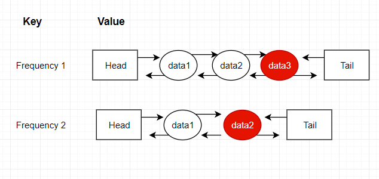

# Least Frequently Used Cache 
* it selects entries for replacement which were least frequently used. 
* **In Case of Ties**: least recently used data with least frequency would be selected for replacement. 
## Requirements & Design
* To track, each data's frequency we can add an extra property to data called frequency. 
* All data entries should me managed by frequency, & we need to be able to track least frequency over data entries at all times. 
* For data with same frequency we should be able to get, least recently used data entry. 
* All operations should be O(1) complexity. 

* for data entries with the same frequency, we will use a double-linked list as a container to store these data entries. And the double-linked list would be helpful to maintain the order of data entries by least recently used.
