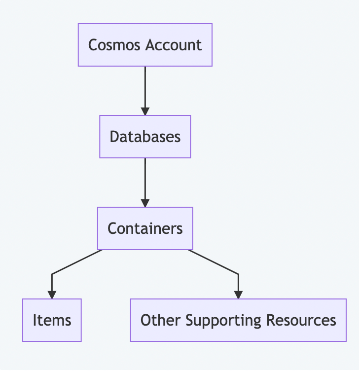

# Walkthrough of CosmosDb
* Fully managed, globally distributed, horizontally scalable. 
* Multi-Model NoSQL database scaling across Azure regions.

## NoSQL Databases 
* Reasons for preferring NoSQL database: 
    * **Rapidly Changing Data Types**: Data is now in different formats like: 
        * Structured
        * UnStructured 
        * Semi-Structured
    * NoSQL has efficient storage and query capabilities for semi-structured & unstructured data. 

## Categories of NoSQL Databases
1. **Columnar**: Data is stored in groups of column families that are often accessed together rather than row wise as in relational databases. An instance of data can have any number of columns and these columns are grouped or aggregated as required for data retrieval. Examples **HBase, Cassandra, Amazon DynamoDb, Google Big Table**
    * **Use Cases**
        1. **Analytical Workloads**: Columnar databases excel at handling analytical workloads, where the focus is on querying and analyzing large volumes of data. By storing data column-wise, these databases can quickly access and aggregate specific columns, enabling faster query execution times 
        2. **Aggregation And Summarization**: It is ideal for applications that require aggregation and summarization such as calculating totals, average or other statistical measures.
        3. **Time-series Data**: Capturing and analyzing data points over time. These can handle high volumes associated with time-series ingestion. 
        4. **High Selective Queries**: It is useful for queries often select a subset of column rather than all column. 
        5. **Handling Large volumes of data**: due to compression and encoding
        6. **Real-time analytics**:

2. **Key-value**: Data is represented as combination of a **unique attribute(key)**  and it's **related content(value)**. Example: **Redis, Riak, Berkeley DB, Couchbase and MemcacheDB**
    * **Use Cases**
        1. **Caching**
        2. **Session Management**: Can be used to store session data for web apps. Can be used to store session attributes, user preferences and temporary data. 
        3. **User Profiles and Personalization**: Can store settings, preference and recommendations. 
        4. **Distributed Data Storage**: It is used in distributed system to store and retrieve data across multiple nodes. Provides scalability, fault-tolerance, allowing data to distribute and replicate across different servers. 
        5. **Real-time Analytics**: It supports fast data ingestion and retrieval are critical. Can store event data, sensor data or log data. 
        6. **Content Management Systems**:  where the keys represent unique identifiers for content items (e.g., articles, blog posts), and the values store the content itself. This allows fast retrieval and efficient content organization.
        7. **Message Queues**: It can be used as databases for message queues, pub-sub systems. 
        8. **High Performance LookUps**
        9. **Distributed Caching**
        10. **IoT Data store**
3. **Document**: A document is equivalent to rows in relational database. It is complex self-contained hierarchical data structures that contains key values pairs or nested documents. Document is typically formatted in **XML, JSON , BSON**. Examples: **MongoDB, CouchDB, IBM Domino & CosmosDB**
4. **Graph**: Data is stored as network of entities and relationship. Example: **Neo4j, OrientDB & FlockDB**

## Azure Cosmos DB Features
* **Global Distribution**: It is **Azure Foundational(Ring O) Service** hence available in every location where azure is available. Data can be **replicated** and guaranteed low latency. It has **automatic and manual failover** enables high availability and disaster recovery. 
* **Performance**: Throughput based on the provisioned output capacity. This can be controlled at **database and container level**
* **Pricing**: Pricing is done on **required throughput and storage necessary**
* **Single digit millisecond latency**.

## Multi-model & Multi APIs
* It supports multiple data models through single integration platform. It allows to store **key-value, columnar, document or graph data stores**. 
* Apart from multi-model it allows multiple APIs for data access: 
    * **SQL API or MongoDB API*(for document databases)**
    * **Table API(Key-Value databases)**
    * **Cassandra API(Columnar databases)**
    * **Gremlin API(Graph Databases)**

## 5 well-defined consistency levels
* It allows to chose a **consistency level** that strike a balance between **latency, throughput and availability**. 
* **Different levels of Consistency**:
    * **Strong Consistency**: Ensures consistency **across all nodes, in all regions** but this comes at cost of overall performance.
    * **Bounded Staleness Consistency**: Provides means to **set level of freshness of data**. Dirty reads are possible. 
        * After write operation is performed the data is guaranteed to be available in next T seconds.
    * **Session Consistency**:  Ensures that there are no dirty reads for the writer but it’s possible to have dirty reads for other users. This is the default consistency level for Azure Cosmos DB.
        * This is good when the juicer reads and writes are taken care by a single region
    * **Consistent Prefix**: Ensures that the read data has been updated to all replicas. Under this level, the reads never see out-of-order writes.
    * **Eventual Consistency**:  Provides no guarantees on the freshness of the data or on the order. However, this provides the fastest performance.

## Resource Hierarchy

* **Cosmos Account**: It is the entry point to our cosmosDB Instances:
    * A **unique DNS Name** to connect with database instances `https://{account}.documents.azure.com/`
    * **Global distribution** - We can define regions for data distribution. 
    * **Default Consistency Levels** for all resources in your account. Individual resources can override this.
* **Database & Containers**: Account --(Contains)--> Databases --(Contains)--> Containers.
    * Dbs can be used to manage **users, permissions & throughput for underlying containers.**
    * Each container is analogous to **table** in SQL, **Collection** in MongoDB, **graph** in Gremlin.
    * Containers are **Horizontally partitioned** and replicated across many regions. 
    * **Throughput techniques for containers**: 
        1. **Dedicated provisioned throughput mode**: fixed throughput; Costlier & backed by SLAs
        2. **Shared provisioned throughput mode**: total throughput of all container instances running in shared mode remains the same while individual containers can have different real-time throughput.  
    * **Contents of a containers**: A container can contain multiple resources. Items are most important which is like single unit of record. Other resources in a containers include Javascript based: 
        1. Stored procedures
        2. User-defined functions
        3. Triggers 

## Request Units(RUs)
> The cost to do a point read, which is fetching a single item by its ID and partition key value, for a 1KB item is 1RU.
*  RUs consumed by our application are eventually billed to the account.
* **Billing Strategy**   
    1. **Provisioned Throughput mode**:  Set up the expected throughput in terms of **RUs per second**. The mode is chosen at the **account level** but the RUs can be provisioned at the database or container level.
    2. **Serverless mode**: Pay for actual consumed units.
    3. **Auto scale mode**: This is good for applications with variable or unpredictable usage.

## Database Partitioning
* A container can be partitioned into multi partition using Partition Key.
* [Partition Strategy](https://www.youtube.com/watch?v=QLgK8yhKd5U)

### Partitions & Index
* **Logical Partition**:
    * Items sharing same partition Key values.
    * Eg. Container: `User` Partition Key: `State`
* **Index**: Used for **querying performance improvements**
    * Like SQL cosmosDB also creates a unique key known as `ItemID`
    * **Default Index**: `Partition Key + ItemID`
> A Partition Key should Aim at equal data distribution. 

* **Physical Partitions**: Provides horizontal scalability. It is **collection of one or more logical partitions**. 
    * Data from single partition cannot exist across more than 1 physical partition. 
    > **Note**: Users have no control on how data is distributed across physical partitions. CosmosDB will automatically distribute data across the physical partitions when scalability is needed.

    <br/>

    > **IMPORTANT**: The partition keys should lead to `smaller logical partitions`. If partition is too large then it will effect the limit to which system can scale.

### How to choose partition keys?
* Guidelines to consider:
    1. **Immutable**: It should not change after the data is created. 
    2. **High Cardinality**: A large number of possible values for the partition key will lead to large number of small logical partitions. Good for `indexing & scalability`
    3. **Even Distribution**: Possible values should be equally likely.
    4. **Read heavy containers**: For read-heavy containers we should choose keys that are frequently used in read operations. Otherwise the benefit of partition key based index will be lost. 
    5. **Using itemID as Partition Key**: This is auto generated and unique key and is good choice for partition keys. [Suggested further reading-`Why not to use itemID as partition key.`]()

### Synthetic Partition keys
* Concatenate multiple fields together to create a partition key. 
* Use a hash function to create PK suffix
* Use a random string to create partition key suffix.

## Data Model 
### Document Data Model
* Each entry is a document. 
* Each item should be non-relational
* Due to this it is easy to scale our
* No Schema enforcement. 
* **ITEMS**: Item in cosmosDB is JSON Document. Write operations are atomic. Partition Keys can be nested as well.
```json
{
    "id": "1",
    "name": "John",
    "address": {
        "street": "1 Main St",
        "city": "New York"
    }
}
```
