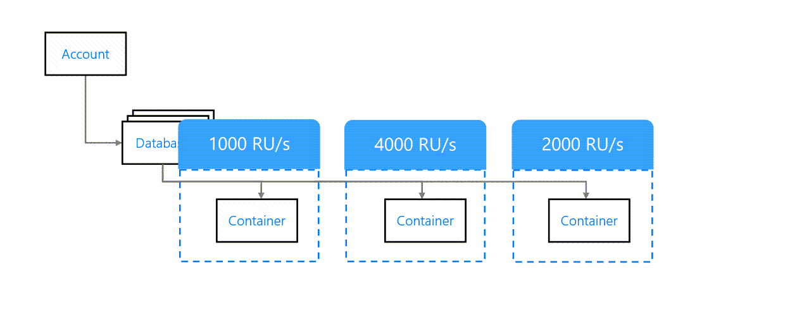
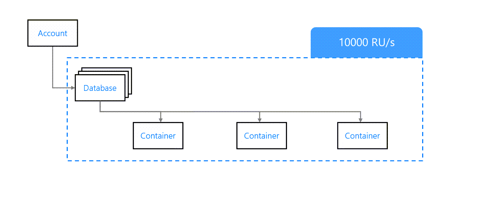

# Configuring Azure CosmosDB 
* SQL APIs allows to query data using SQL like syntax. This is preferred over other APIs: 
    1. Low Latency
    2. Automatic Scaling
    3. 99.999% availability backed by SLAs

* **Use Cases**:
    * Collecting & Query data from IoT devices.
    * Retail Applications - With varied usage patterns.
    * Multi platform application - can benefit from flexibility in document structure. 

## Throughput Provisioning
* Can be provisioned either or both the database and container level.
* **Container Level**: Applies only to container. Doesn't effect other containers. If each container is mapped to separate application function, then it makes sense to map throughput at container level.

* **Database Level**: Set at Db level and shared across all the containers. It is okay if `all the containers are expected to have similar load pattern.`. It may lead to `unpredictable results.`

* **Mixed Throughput**: We can mix by 1st defining @ Database level --> While Creating container we can specify which throughput mode to use. 
    * Containers with **Shared Throughput Mode** use database level throughput. 
    * Containers with **dedicated throughput mode** use own throughput.

## Storage
* We can use **[Azure CosmosDB Capacity Calculator](https://cosmos.azure.com/capacitycalculator/)**
* We need to enter `estimated load, replication strategy & Storage requirements`  to get to the cost. 

## TimeToLive(TTL)
* it can be set on documents and useful when some data is expected to live for shorter period of time. It can also be configured at `container level` and `overridden at document level`. 
* Maximum TTL: 2147483647
* At `container level` it can be set: 
     1. **Does not Exist**: No TTL & no expiration even if trying to set on a document.
     2. **-1**: No TTL by default but can be set at document level.
     3. **Number of seconds**: This can be overridden at document level
> **NOTE**: Expiring docs can result in optimized storage and better performance. 

## Cosmos DB Consumption Model
* **Serverless**: Service is billed as per actual number of RUs consumed. 
    * Good when unpredictable consumption pattern due to unpredictable features like `campaigns, feature releases, time of the day, seasonal sales, holidays`
    * **Use cases**: 
        1. Newly launched app- less load + load growth is not clear.
        2. DB supports a servless app hosted on azure function. 
        3. New adapters
        4. services not expected to scale.

* **Provisioned vs Serverless**: 
The workload – predictable and sufficiently large workload favours provisioned consumption model.
RU limiting – Provisioned throughput will not exceed the maximum decided RU while Serverless can scale up to the maximum possible RUs/s allowed in Cosmos DB. When expecting burst situations, you can use Serverless.
Global Distribution – This is an important factor. Serverless models are not distributed across regions and so can be used for a single region. Provisioned models are distributed across regions and can be used for multiple regions.
Storage Limits – Serverless only stores 50 GB of data per container while Provisioned can store unlimited data per container.