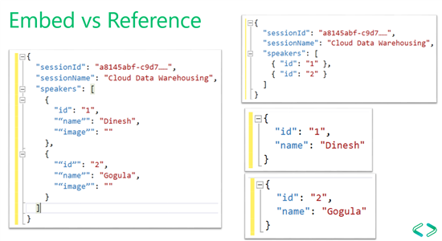

# Schema Design Strategies
* Relations databases we tend to identify entities and tends to normalize them. But when application grows the multiple partitions and join operations across them causes the performance hit due to node-to-node interactions.
* the schema we want to use needs to be managed or enforced by outside applications.
* Data should be de-normalized and optimized for `query and writes`. 

* [Schema Design Strategy](https://www.youtube.com/watch?v=QLgK8yhKd5U)

* NoSQL DeNormalization Techniques: 
    1. **Embedding children into parent entities**: This is tradeoff between storage vs write throughput. Here we may run into limits of the largest record size when number of lines are exceedingly large.
    2. **Embedding copy of parent record in child record**: This is tradeoff between storage sacrifice vs faster read/writes. Here we duplicate parent record into child record. The hit is on storage but we get faster read and writes if frequently querying by line item. 
    3. **Referencing**: But this approach will involve reading multiple documents for same data. 
    * Left side of image is embedding and right side of image is referencing.
    
     * What should be qeuried together should be embedded and what is not should be separated. Like Orders and Users can be separated. as users are not queried when order is getting queried.

* **When to embed**: 
    * There are contained relationships between entities. 
    * There are one-to-few relationships between entities.
    * There's embedded data that **changes infrequently**
    * There's embedded data that won't grow without bound
    * There's embedded data that is **queried frequently together**

* **When not to embed**" 
    * Consider below json, the comments array can be an unbounded array, so this type of embedding should be avoided:
    ```json
    {
    "id": "1",
    "name": "What's new in the coolest Cloud",
    "summary": "A blog post by someone real famous",
    "comments": [
        {"id": 1, "author": "anon", "comment": "something useful, I'm sure"},
        {"id": 2, "author": "bob", "comment": "wisdom from the interwebs"},
        …
        {"id": 100001, "author": "jane", "comment": "and on we go ..."},
        …
        {"id": 1000000001, "author": "angry", "comment": "blah angry blah angry"},
        …
        {"id": ∞ + 1, "author": "bored", "comment": "oh man, will this ever end?"},
    ]
    }
    ```

> **NOTE**: Every property of document is getting indexed, so no need to create manual indexes. **Hash Index** is created for every path in document. **Range based index** is created for numbers & String. We can define **exclusion paths** of document which we never query hence saving time for index writing. **navigation**: CosmosDb --> Settings --> Indexing Policies.

* **Partition Key Decisions**: 
    * For read-heavy containers, use a field that is optimized for frequently run queries. 
    * For write-heavy container, use a field with diverse data that balances the load.

* **Numbers in JSON**:
    * All numbers should be ideally converted to string if there is any chance that they are outside the boundaries of double precision number. 
;  
* **Reference Data**
* Embedding data can also have some issues in scenarios where de-normalization of data is problamatic. 
* We can have information in one document which can be related to information in another document.
> **NOTE**: Relational Data Systems Shouldn't be built using Azure CosmosDB or any document based database. However simple relationships should be fine. 
* Consider below json about a person and stock holding by that person
```json
Person document:
{
    "id": "1",
    "firstName": "Thomas",
    "lastName": "Andersen",
    "holdings": [
        { "numberHeld":  100, "stockId": 1},
        { "numberHeld":  50, "stockId": 2}
    ]
}

Stock documents:
{
    "id": "1",
    "symbol": "zbzb",
    "open": 1,
    "high": 2,
    "low": 0.5,
    "vol": 11970000,
    "mkt-cap": 42000000,
    "pe": 5.89
},
{
    "id": "2",
    "symbol": "xcxc",
    "open": 89,
    "high": 93.24,
    "low": 88.87,
    "vol": 2970200,
    "mkt-cap": 1005000,
    "pe": 75.82
}
```
* Here the draw back is that more database trips are required while showing stock information about a person. Here write operations are optimized as they are more frequent but read operations are compromised. 

* **Foreign Keys**
* There is no concepts of foreign keys and what we have is "weak links" which needs to be verified at the application side or using triggers or stored procedures in CosmosDB Side. 

* **Where to put relationships**
* ***The growht of the relationships will help determing in which document to store the reference.***
* If books per publisher is limited then stored book reference within the publisher document is suitable but if each publisher can be having unbounded number of books published then publisher reference should be stored in books documents. 
```json
// Scenario 1: Limited Books published per publisher
Publisher document:
{
    "id": "mspress",
    "name": "Microsoft Press",
    "books": [ 1, 2, 3, ..., 100, ..., 1000]
}

// Scenario 2: Unbounded number of Books published per publisher
Publisher document:
{
    "id": "mspress",
    "name": "Microsoft Press",
    "books": [ 1, 2, 3, ..., 100, ..., 1000]
}

```

* **Modeling Many-to-Many Relationships**
* We may be tempted to model data like the relational database approach. Like having collection as Book, Author and BookAuthorLink but this would involve multiple database queries while loading data through the either book or author collection.
* However here embedding can be useful, by glueing both the data together like: 
```json
Author documents:
{"id": "a1", "name": "Thomas Andersen", "books": ["b1", "b2", "b3"]}
{"id": "a2", "name": "William Wakefield", "books": ["b1", "b4"]}

Book documents:
{"id": "b1", "name": "Azure Cosmos DB 101", "authors": ["a1", "a2"]}
{"id": "b2", "name": "Azure Cosmos DB for RDBMS Users", "authors": ["a1"]}

```

# NOTE Embedding(De-Normalizing) and Referencing (Normalizing)
* **Hybrid Data Modeling**: We can mix referencing and de-normalizing while data modeling to have hybrid models
```json
Author documents:
{
    "id": "a1",
    "firstName": "Thomas",
    "lastName": "Andersen",
    "countOfBooks": 3,
    "books": ["b1", "b2", "b3"],
    "images": [
        {"thumbnail": "https://....png"}
        {"profile": "https://....png"}
        {"large": "https://....png"}
    ]
},
{
    "id": "a2",
    "firstName": "William",
    "lastName": "Wakefield",
    "countOfBooks": 1,
    "books": ["b1"],
    "images": [
        {"thumbnail": "https://....png"}
    ]
}

Book documents:
{
    "id": "b1",
    "name": "Azure Cosmos DB 101",
    "authors": [
        {"id": "a1", "name": "Thomas Andersen", "thumbnailUrl": "https://....png"},
        {"id": "a2", "name": "William Wakefield", "thumbnailUrl": "https://....png"}
    ]
},
{
    "id": "b2",
    "name": "Azure Cosmos DB for RDBMS Users",
    "authors": [
        {"id": "a1", "name": "Thomas Andersen", "thumbnailUrl": "https://....png"},
    ]
}
```
* **NOTE**: in above example: there are pre-calculated aggregates values to save expensive processing on a read operation. In the example, some of the data embedded in the author document is data that is calculated at run-time. Every time a new book is published, a book document is created and the countOfBooks field is set to a calculated value based on the number of book documents that exist for a particular author. This optimization would be good in read heavy systems where we can afford to do computations on writes in order to optimize reads.