# Real World Data Modeling Example
## Requirment
* Building a bloggin portal where user can add posts, and also like and comment to these posts. 
* A front page displays a feed of recently created posts,
* We can fetch all posts for a user, all comments for a post and all likes for a post,
* Posts are returned with the username of their authors and a count of how many comments and likes they have,
* Comments and likes are also returned with the username of the users who have created them,
* When displayed as lists, posts only have to present a truncated summary of their content.

## Step 1: Identifying the main access paterns. 
* Initial structure is given by identifying our solution's access patterns. Understanding **which requests our models needs to be served**. 
* For ease we have to categorize different requests as **commands or queries** by borrowing vocab from CQRS. 

#### List of request exposed by platform: 
1. [Command-1] Create/Edit user.
2. [Query-1] Retrieve a user.
3. [Command-2] Create/Edit post. 
4. [Query-2] Retrieve a post. 
5. [Query-3] List a user's post in short form. 
6. [Command-3] Create a comment. 
7. [Query-4] List a post's coments. 
8. [Command-4] Like a post. 
9. [Query-5] List a post's like. 
10. [Query-6] List the x most recent posts created in short form(feed)

## V1: First Version
* Staring with 2 containers: `users` and `posts`.
* **user Container**: 
```json
{
    "id": "<user-id>",
    "username": "<username>"
}
```

* **post container**: It would have entities such has `posts, comments and likes`.
```json
{
    "id": "<post-id>",
    "type": "post",
    "postId": "<post-id>",
    "userId": "<post-author-id>",
    "title": "<post-title>",
    "content": "<post-content>",
    "creationDate": "<post-creation-date>"
}

{
    "id": "<comment-id>",
    "type": "comment",
    "postId": "<post-id>",
    "userId": "<comment-author-id>",
    "content": "<comment-content>",
    "creationDate": "<comment-creation-date>"
}

{
    "id": "<like-id>",
    "type": "like",
    "postId": "<post-id>",
    "userId": "<liker-id>",
    "creationDate": "<like-creation-date>"
}
```

* Container is `partitioned by` postId. so logical partitions within that container contains one post and all comments and likes. 
* here data referencing is used instead of data embedding because: 
    * No limit on how many posts user can create. 
    * Post be be very long
    * no limits on post comments
    * we should be able to add a comment or a like to a post without havign to update the post. 

## Computing Model Performance
* **Create/Edit User**: The requests are nicely spread across all paritition due to `id` parititon key. 
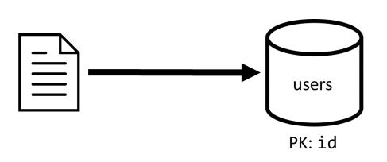

* **Retrieve a user**
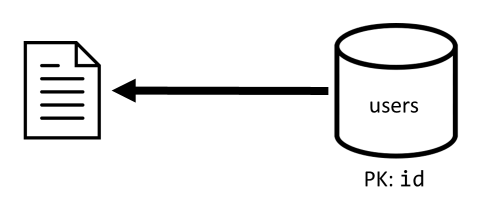

* **Retrieve a post**: First we retrieve post from post container. then we need to have aggregate of username of post's author, count of commments and counts of like for the post. These aggregations require **3 more SQL queries to be issues**
* Each of the query filters are on the partition key of its respective container which is exactly what we want to maximize performance and scalability. 
> **NOTE**: This needs to be optimized in next iteration for performance reasons
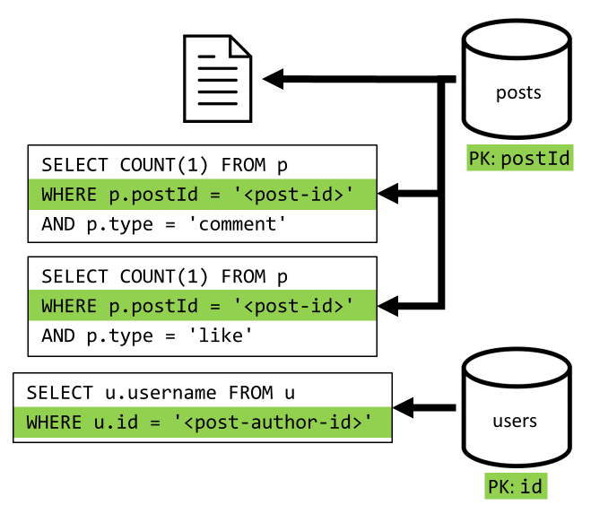

* **List user post in short form**:  we have to retrieve the desired posts with a SQL query that fetches the posts corresponding to that particular user. But we also have to issue more queries to aggregate the author's username and the counts of comments and likes.
    * **Drawbacks**
        1. Queries aggregating likes, comments needs to be issued for each posts returned in first query. 
        2. Main container doesn't filter on partition key of the `post` container, leading to `fan-out and partition scan` across the container. 
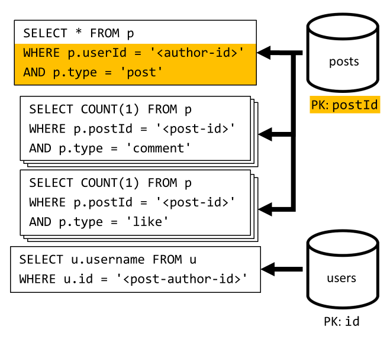

* **Creating a comment**: 
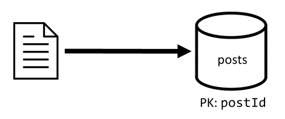

* **List a post's comments**: We start with a query that fetches all the comments for that post and once again, we also need to aggregate usernames separately for each comment.
    * the main query would filter on partition key but the second aggregation query will be performance kill. 
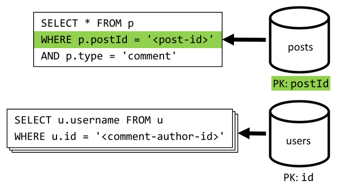

* **like a post**:
.png)

* **List a Posts Like**: We have to query the likes and then aggregate their usernames. 
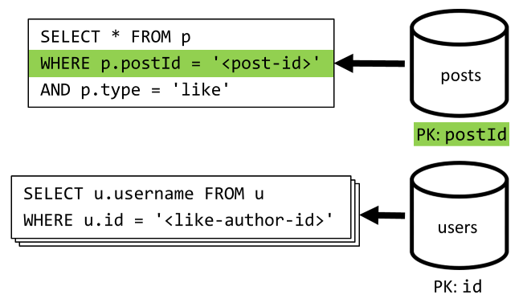

* **List the X most recent post created by the user in short time(feed)**
    * Get posts in descending order of created date and then aggregate the username and count of likes and comments for each post. 
    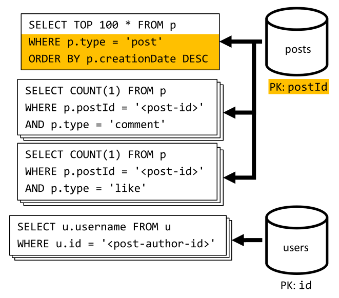
    * **Drawbacks**: 
        1. No filtering in post container on partition key. 
### v1 Performance issues
1. Some requests needs multiple queries for required data. 
2. Some queries dont filter on partition key data leading to `fan-out` which causes scalability issues. 

## V2: Using de-normalizing for performance benefits for READ Queries
* The issue is the initial request doesn't contain all data we need. 
* To our `post` container we de-normalize and add following attributes for `author-username`, `count-of-likes`, `count-of-comments`
```json
{
    "id": "<post-id>",
    "type": "post",
    "postId": "<post-id>",
    "userId": "<post-author-id>",
    "userUsername": "<post-author-username>",
    "title": "<post-title>",
    "content": "<post-content>",
    "commentCount": <count-of-comments>,
    "likeCount": <count-of-likes>,
    "creationDate": "<post-creation-date>"
}
```

* Also `Comments` & `Likes` are modified to have username who created them. 
```json
{
    "id": "<comment-id>",
    "type": "comment",
    "postId": "<post-id>",
    "userId": "<comment-author-id>",
    "userUsername": "<comment-author-username>",
    "content": "<comment-content>",
    "creationDate": "<comment-creation-date>"
}

{
    "id": "<like-id>",
    "type": "like",
    "postId": "<post-id>",
    "userId": "<liker-id>",
    "userUsername": "<liker-username>",
    "creationDate": "<like-creation-date>"
}
```

#### De-normalizing comment and like counts
* What we want to achieve is that every time we add a comment or a like, we also increment the commentCount or the likeCount in the corresponding post. As postId partitions our posts container, the new item (comment or like), and its corresponding post sit in the same logical partition. As a result, we can use a stored procedure to perform that operation.
* When you create a comment ([C3]), instead of just adding a new item in the posts container we call the following stored procedure on that container:

```js

function createComment(postId, comment) {
  var collection = getContext().getCollection();

  collection.readDocument(
    `${collection.getAltLink()}/docs/${postId}`,
    function (err, post) {
      if (err) throw err;

      post.commentCount++;
      collection.replaceDocument(
        post._self,
        post,
        function (err) {
          if (err) throw err;

          comment.postId = postId;
          collection.createDocument(
            collection.getSelfLink(),
            comment
          );
        }
      );
    })
}
```

> **NOTE** As stored procedures are executed as atomic transactions, the value of commentCount and the actual number of comments always stays in sync.
* We obviously call a similar stored procedure when adding new likes to increment the likeCount.

#### De-normalizing Username
* this has different approach as data sits in a different parititon and different container. In this case we have to use [change feed](https://learn.microsoft.com/en-us/azure/cosmos-db/change-feed) for data denormalization.
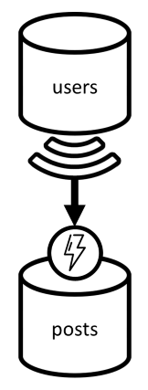
* we use change feed of users to react whenever users updates thier usernames. We propagate this change by calling another stored procedure on the posts container

```js
function updateUsernames(userId, username) {
  var collection = getContext().getCollection();
  
  collection.queryDocuments(
    collection.getSelfLink(),
    `SELECT * FROM p WHERE p.userId = '${userId}'`,
    function (err, results) {
      if (err) throw err;

      for (var i in results) {
        var doc = results[i];
        doc.userUsername = username;

        collection.upsertDocument(
          collection.getSelfLink(),
          doc);
      }
    });
}
```

### Executing a Stored Procedure

* to Create a stored procedure, we need to provide a **js function** that performs desired operation. 
* Example of a stored procedure which updates the document.
```js
function updateDocument(id, updatedDoc) {
    var container = getContext().getCollection();
    var query = "SELECT * FROM c WHERE c.id = '" + id + "'";
    var accept = container.queryDocuments(container.getSelfLink(), query, function (err, documents, options) {
        if (err) throw new Error("Error: " + err.message);
        if (documents.length != 1) throw new Error("Document not found");
        var doc = documents[0];
        doc = updatedDoc;
        container.replaceDocument(doc._self, doc, function (err, updatedDoc) {
            if (err) throw new Error("Error: " + err.message);
            getContext().getResponse().setBody(updatedDoc);
        });
    });
    if (!accept) throw new Error("Unable to read document");
}
```

* Executing Stored procedure programatically
```js
var client = new CosmosClient(connectionString);
var storedProcedure = client.getStoredProcedure("your container link", "updateDocument");
var response = await storedProcedure.execute({id: "your document id", updatedDoc: {your updated document}});
```

#### Performance Gains of V2 

* **Retrieving Post**: Due to denormalization it has become a single request. 
[v2-q2](./img/v2-q2.png)
* **List Post Comments**: 
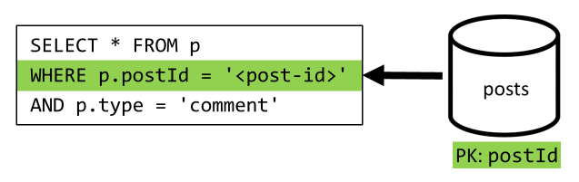
* **List Post Likes**
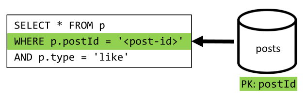

## V3: Making Sure all requests are scalable
* Query-3 and QUery-6 are still not being issued on the paritition key of the container which may cause the scalabilit issue. 

#### List a user's post in short form
* In v2 we were able to get rid of spare queries being run for this
* **Coming to the solution**: 
  1. 