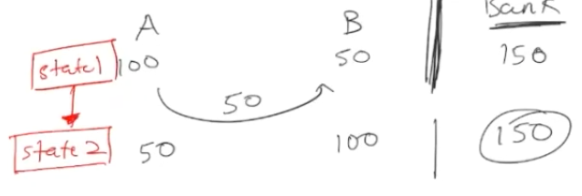
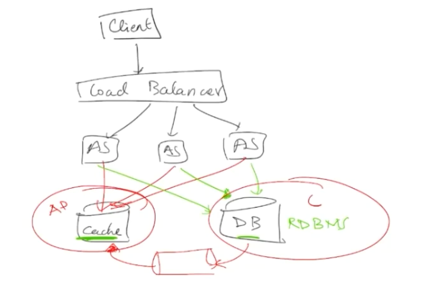
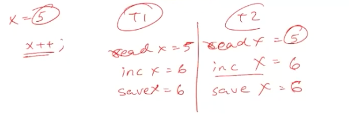

# NOSQL vs SQL 
* **NEEDS FROM DATA ECOSYSTEMS**
    1. Store Data (done via databases)
    2. Fast Retrieval (done via Cache)
    3. Search & Filter (Search Indexes like ES)
    4. Event Based Systems (Streaming)
    5. Batch Processing Operations(Periodically process data)

* most of time data cannot fit in one machine which brings storage and throughput limitations. 

* When you go beyond **Storage requirements** then you can do **Sharding** by using shard Key. Most SQL dbs dont supports so we can design this at application layer level using **Consistent Hashing**
* When you do beyond **Throughput requirements** then you can do **replication** 

> **NOTE**: SQL Based dbs are powerful, we need to choose based on our use case. 

## 1st Consideration:  Data Manipulation
* How do you interact, persists and retrieve data. 
* See what **query language** is supported by DB. EG: **SQL(RDBMS), KV(in caching), Cassandra(CQL), Graph Query Language** 

## 2nd Consideration: ACID Properties
* SQL or RDBMS based systems are primarily ACID complaint. 
1. **Atomicity**: One transaction will be atomic in nature. In SQL world transactions typically goto one node where as data may be distributed across nodes in NOSQL , taking lock on different nodes becomes different so they have **limited support for atomicity** like guarantee within one node.
2. **Consistency**: You can only transition from a valid state1 to valid state2. In NOSQL we dont have state based consistency we have **eventual consistency.**

3. **Isolation**: If there are two parallel transactions going on then result of transaction doesn't effect each other. In NOSQL this goes **idempotent** , NOSQL system are once delivery system i.e. if you have written to one node , then data will be delivered to other nodes atleast once, it is possible this same record can be delivered more than once. In a scenario where a node doesn't receive ack after some time, same data will be sent again. 
4. **Durability**: If the system crashes and we start it again, then data will recover totally without data loss. As they would primarily write to disk. In NOSQL to optimize for performance, they hold in memory to reduce latency by storing the data in RAM. 

## 3rd Consideration: Wire Protocol 
* Different db supports protocol like http, TCP/IP, gRPC which leads to wider acceptance of the database. 
* We should also check if it support popular DB protocols. 
* Eg Initially in our proj we chose a RDBMS system(MYSQL or PostgreS), Prefer Postgres in case you want to switch to Document based database then we can use **CockroachDB** which support Postges protocol. Memcache can be converted to couchDB
* Also see if it support standard protocols like support for JDBC.  
* **It is important to check for which interfaces is supported by the database.** 

## 4th Consideration: Support for Schema 
* **Schema less** system is where you can dump any json. 
* MongoDB was released with schema-less but it was realized that it is good for **write heave data scenario where we dont have a read pattern yet**
* Eg: Hotstar collects user data for personalization, they have multiple clients like IOS, Android, Mobile Web, Web, FireTV, PlayStation etc now each collects WatchTime in a SchemaLess approach different clients can send differently like {WatchTIme: 1 hr 5 min 30 sec}, {watch-time: 3500s} or {watchTime: 3600.00s} so just for reading the data there will be lot of cleaning operations required. 
* There is one class of database between SchemaLess and Schema those are **columns family database** like **cassandra or HBase** they are SchemaLess but we need **column Indexes**

## 5th Consideration: CAP theorem 
*  **Scenario** We have NODES A, B, C -> Now X=5 is written to Node-A but has not been propagated to NODE-B & NODE-C, Then if we perform READ(X) then if this goes to NODE-A: 5, NODE-B: undefined & NODE-C: undefined. 
* So when data comes to NODE-A we can reply: 
    1. Data return to A & async replication
    2. Data return to A & sync replication
* So in case of **Async Replication** then we will loose on **Consistency** but I am gaining **Availability** i.e. even when NODE-A is writing then NODE-B & NODE-C can reply to READ(X) , this system will become **Eventually Consistent**
* SO in case of **Sync Replication** then we have **consistency** but loose on **Availability** as we will gain a lock on NODE-A, B & C. 
* Try to find out what kind of guarantees which your database system regarding Consistency, Availability & Partition Guarantee. Most DB Systems offers **tuneable** consistency
> **NOTE** : Within a same system like same microservice we can have **CP - Writes** and **AP - reads** . **EG:**

* **Polyglot Persistence**: Most of DBs/ Systems will not have one DB it will be amalgam of multiple databases. To maintain consistency between databases we can have a queue through will other systems can gain updates. 

* **Green Arrow** Writes, **Red Arrow** Read

## 6th Consideration: Technical Consideration
1. **performance benchmarks**: Reports on **latency**, **throughput** & **concurrency**
    1. **Latency**: When database gets a req. at T0 and return at T1, then **Latency= T1-T0**. This **doesn't include network time**
    2. **Throughput**: **Number of queries per second**
    3. **Concurrency**: **Number of parallel open request/connections**. 
    * EG: Latency: 1ms , Concurrency: 50 then Throughput: 50K if assuming 1 Thread can handle 1000 req so to **increase throughput reduce latency or increase concurrency.** 
    * **THROUGHPUT = CONCURRENCY * 1 / (LATENCY(s))**
    * **Dont collect benchmark from Offial site** Collect from NETFLIX OSS, Uber, Google, Facebook, AirBNB, Pinterest -> Follow them on Medium/Twitter/Blogs
2. **Operations & Maintenance**: EG: RDBMS is Backbone of Facebook TAO to build their graph db system. Similarly LinkedIn built Expresso. as there is a huge community.  
3. **Support**: **Check support for database support. DynamoDB is just provided by AWS so we wont be able to move from it. See how many people contribute to it, If only one company is putting commits and are there Hosted Services are there.**
4. **DATABASE TYPES**: 
    1. **Relational**: All columns of one row will be placed together i.e data is strongly related. Stored in **binary tree** and is suitable for **OLTP queries**
    2. **Columnar**: **OLAP Queries** Analytical queries
    3. **Key Value DB**: Primarily RAM based. but do provide sync persistance also. 
    4. **Document** 
    5. **graph db**: Primarily used for storing relationships and used to find first degree, second degree relations

## 7th Consideration: Data Organization
* Looks at how data is stored in database by looking into **index document for db** 
* If in a **B Tree** index, it is suitable for **in place updates** . Here write will be O(LogN) on disk is slower. 
* **LSM**: LSM tree is like a file and everything can be appended, so we can do **sequential write**. **Writes** will be much faster. O(1) operation on disk

## 8th Consideration: Replication
* TO avoid single point of failure. This also helps overcome disasters due to geography, political conflicts. 
* Does you database support **multi region deployments** most dont do support. 
* We can decide to chose **sync or async** replication 

## 9th Consideration: COST 
* **DISK TO MEM Ratio** : How much data will be required to be stored on RAM compared to total data stored on disk. 
* **COMPUTE**: Does you db require single, multiple or virtual core
* **Power Consumption**: SSD is better than HDD
* **Density Of Storage**: If I have 1MB data to store in ES we will need more than 1MB, if there is some db which applies GZIP then we need lesser storage like 10KB.  **It is defined as amount of storage required to store a certain size of data.**

## Why NOSQL came into picture? 
* Google released paper on NOSQL db, they utilized their commodity hardware which couldn't host a full fledged database these were build around concepts of sharding, Replication, Consistency, Leader Election , Master less protocols. 
* Most of them is built using Horizontal Scalability is most important aspect. 

## Why Atomicity is IMP? 
*  Consider a Multi-Threaded application, where on T1 & T2 x++ is called, now if atomicity is not there then following situation may happen
