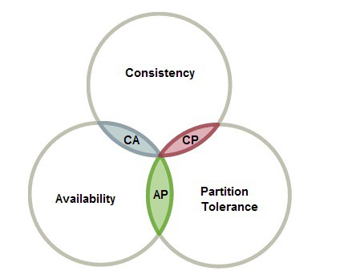
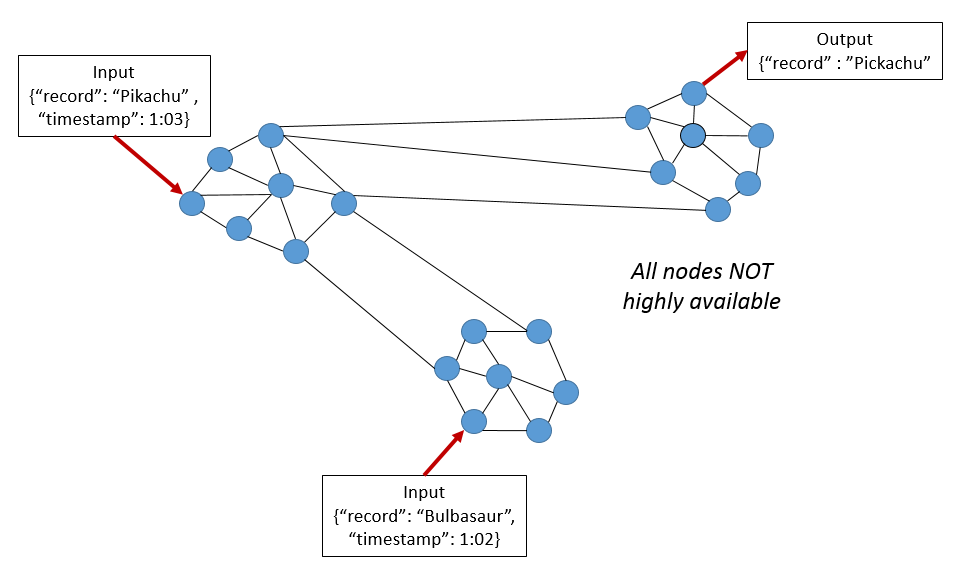
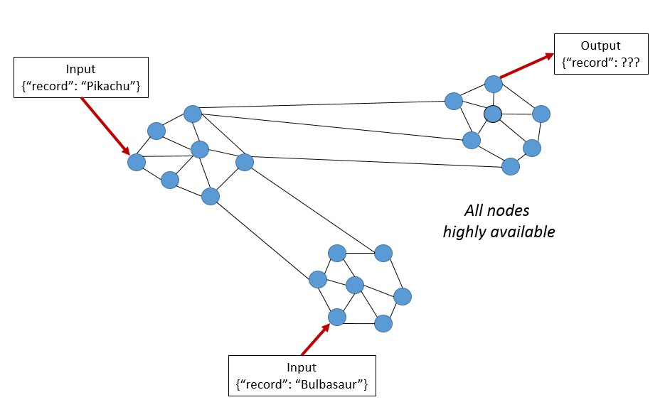

# CAP Theorem 

* A distributed database system can only have 2 of 3: Consistency, Availability, Partition Tolerance

## Partition Tolerance

* This condition states that the system continues to run, despite the number of message being delayed by the network between the nodes. 
* A Partition-Tolerant system can handle any amount of **network failure** that doesn't result in a failure of entire network. 
* ata records are sufficiently replicated across combinations of nodes and networks to keep the system up through intermittent outages. When dealing with modern distributed systems,**Partition Tolerance is not an option. It’s a necessity**. **Hence, we have to trade between Consistency and Availability.**

## High Consistency 

* **Condition**: All nodes see the same data at the same time. 
* Eg Performing a read operation will return the value of the most recent write operation causing all nodes to return the same data. 
* A system has consistency if a transaction starts with the system in a consistent state, and ends with the system in a consistent state.
* A **system can and does shift into inconsistent state during the transaction** 

## High Availability 

* **Condition**: Every request gets a response on success/failure. 
* System remains operational 100% of time. 
* Every client gets response regardless of state of any individual node in ths system. 