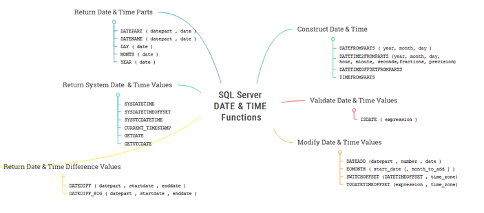

# Aggregate Function 
* Used to perform calculation on one more values and returns a single value. 
* Commonly used with **SELECT, GROUP BY & HAVING** 
* **Syntax**: `aggregate_function_name(DISTINCT | ALL expression)`
    * **aggregate_function_name**: name of function we want to apply 
    * **Distinct**: if we want that function to only work on distinct records provided. 
    * **All**: If we want that aggregate function to consider duplicate records also. If nothing is specified the by default all is selected. 
    * **Expression** - can be any column value of table or an expression which returns multiple values. 

# Aggregate Function List 

| Aggregate Function | Description | 
| :--- | :---: | 
| AVG  | The AVG() aggregate function calculates the average of non-NULL values in a set. | 
| CHECKSUM_AGG | The CHECKSUM_AGG() function calculates a checksum value based on a group of rows. | 
| COUNT | The COUNT() aggregate function returns the number of rows in a group, including rows with NULL values. | 
| COUNT_BIG | The COUNT_BIG() aggregate function returns the number of rows (with BIGINT data type) in a group, including rows with NULL values. | 
| MAX | The MAX() aggregate function returns the highest value (maximum) in a set of non-NULL values. | 
| MIN | The MIN() aggregate function returns the lowest value (minimum) in a set of non-NULL values. | 
| STDEV | The STDEV() function returns the statistical standard deviation of all values provided in the expression based on a sample of the data population. | 
| STDEVP | The STDEVP() function also returns the standard deviation for all values in the provided expression, but does so based on the entire data population. | 
| SUM | The SUM() aggregate function returns the summation of all non-NULL values a set. | 
| VAR | The VAR() function returns the statistical variance of values in an expression based on a sample of the specified population. | 
| VARP | The VARP() function returns the statistical variance of values in an expression but does so based on the entire data population. | 

 

# Date Time Function 

## Returning The Current Date And Time 
| Function | Description | 
| :--- | :--- | 
| CURRENT_TIMESTAMP |  Returns the current system date and time without the time zone part. It takes no argument [SELECT CURRENT_TIMESTAMP AS current_date_time;] | 
| GETUTCDATE | Returns a date part of a date as an integer number.
GETUTCDATE() | 
| GETDATE | Returns the current system date and time of the operating system on which the SQL Server is running. SELECT     GETDATE() current_date_time; | 
| SYSDATETIME | Returns the current system date and time with more fractional seconds precision than the GETDATE() function. | 
| SYSUTCDATETIME |  Returns the current system date and time in UTC time | 
| SYSDATETIMEOFFSET | Returns the current system date and time with the time zone.  SELECT     SYSDATETIMEOFFSET() [datetimeoffset with timezone]; 2019-05-03 08:56:48.0645108 +07:00 | 

## Returning Date And Time Parts 
| Function | Description | 
| :--- | :--- | 
| DATENAME | Returns a date part of a date as a character string. It is similar to the datepart but only difference is it returns a string where are datepart returns an integer number.   **SYNTAX** : DATENAME(date_part,input_date) There are multiple possible values for date_part which can be looked up online.   **SELECT** DATENAME(year, '2018-05-10') as [datename]; | 
| DATEPART | Returns a date part of a date as an integer number |
| DAY | Returns the day of a specified date as an integer | 
| MONTH | Returns the month of a specified date as an integer | 
| YEAR | Returns the year of the date as an integer. | 

## Returning Difference Between 2 dates 
| Function | Description | 
| :--- | :--- | 
| DATEDIFF | Returns a difference in date part between two dates.  **SYNTAX** :    DATEDIFF( date_part , start_date , end_date) Date_part is in which output format we want to find difference in like year month, quarter etc i.e difference in terms of months, days, years or quarter etc | 
