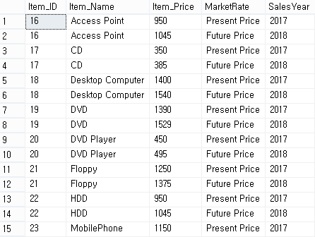
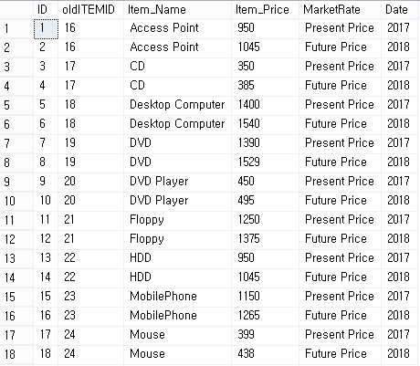

# Common Table Expression
* **Definition**:it allows you to define a **temporary result set** which is available temporarily in the execution scope of statements such as `SELECT`, `INSERT`, `UPDATE`, `DELETE` & `MERGE`
* **SYNTAX** 
```
WITH expression_name[(column_name [,...])]
AS
    (CTE_definition)
SQL_statement;
```

* `expression_name` which you can refer later in the query. 
* Comma Separated column names after expression name. 
> **NOTE** Number of columns defined after expression_name must be same as number of columns defined in `CTE_DEFINITION` 
* Then the AS keyword should be mentioned after expression name or column names if they are defined.
* Define a `SELECT` statement whose result set populates the common table expression. 
* Finally refer the common table expression in query (`SQL_Statement`) such as `SELECT, INSERT, UPDATE DELETE & MERGE`'
> **NOTE**: We use CTE instead of sub query because CTEs are more readable. This is also used in queries containing **analytical or windows functions**
* To view **CTE results** we can do following: 
> SELECT [Column1, Column2, Column3...ColumnN] from expression_name 
* **OR** 
> SELECT * from expression_name

<br/>

## CTE Examples 
1. **Simple SQL Server CTE example** 
```
WITH cte_sales_amount (staff, sales , year ) AS (
    SELECT first_name  + ' ' + last_name, 
        SUM(quantity * list_price * (1- discount) ), 
        YEAR(order_year)
    FROM sales.order o 
    INNER JOIN sales.order_items i on i.order_id = o.order_id 
    INNER JOIN sales.staff s on s.staff_if = o.staff_id 
    GROUP BY 
        first_name + ' ' + last_name, 
        YEAR(order_date)
) 

SELECT 
    staff, 
    sales 
FROM 
    cte_sales_amount 
WHERE 
    year = 2018 
```
<br/>

2. **Using a common table expression to make report averages based on counts**
```
WITH cte_sales AS (
    SELECT 
        staff_id, 
        COUNT(*) order_count 
    FROM 
        sales.order 
    WHERE
        YEAR(order_date) = 2018 
    GROUP BY 
        staff_id 
) 

Select
    AVG(order_count) aver_orders_by_staff 
FROM 
    cte_sales 
```
<br/>

3. **Using multiple SQL server CTE in a single query** 
```
WITH cte_category_count (
    category_id, 
    category_name, 
    product_count
)
AS (
    SELECT 
        c. category_id, 
        c.category_name, 
        COUNT(p.product_id)
    FROM 
        production.products p 
    INNER JOIN 
        production.categories c
    ON 
        c.category_id = p.category_id 
    GROUP BY 
        c.category_id, 
        c.Category_name
), 
cte_category_sales(
    category_id, 
    sales
) AS (
    SELECT 
        p.category_id, 
        SUM(i.quantity * i.list_price * (1 - i.discount)), 
    FROM 
        sales.order_item i 
    INNER JOIN 
        production.products p 
    ON 
        p.product_id = i.product_id 
    INNER JOIN 
        sales.orders o 
    ON 
        o.order_id = i.order_id
    WHERE 
        o.order_status = 4 --completed 
    GROUP BY 
        p.category_id
)

SELECT 
    c.category_id. 
    c.category_name, 
    c.product_count 
    s.sales
FROM 
    cte_category_counts c 
INNER JOIN 
    cte_category_sales s
ON 
    s.category_id = c.category_id 
ORDER BY 
    c.category_name;

```
<br/>

## Common Table Expression Types 
### Non-Recursive CTE 
* It doesn't use any recursion or any repeated processing in of a sub-routine. 

```
with cte_row (
    row_no
) AS (
    SELECT 
        ROW_NUMBER() OVER(ORDER BY name ASC) AS row_no 
    FROM
        sys.databases
    WHERE 
        database_id > <= 10>
)

SELECT * FROM cte_row -> Prints 1, 2, 3 ,4 ... 10 
```

### Recursive CTE 
* Use repeated **procedural loops called recursion** 
* The recursive query calls themselves until the condition is met. 
* We should **provide a condition to terminate recursion** 

```
DECLARE @row_no  int = 1
with cte_row AS (
    SELECT 
        @row_no as row_no 
    UNION ALL 
        SELECT @row_no + 1
    FROM 
        cte_row
    WHERE 
        row_no < 10 
)
SELECT * from cte_row
```

#### CTE Without UNION ALL 
* we have create a simple CTE query to display the RowNo, start date and week number. When we run this we will get only one result with RowNo as “1” ,StartDate as current date and week number along with week day.
<br/>

```
DECLARE @start_date datetime; 
        @end_date datetime;

SELECT @start_date = getDate(),
       @end_date = getDate() + 16;

WITH cte_print_date AS (
    SELECT 
        1 as row_no, 
        @start_date StartDate, 
        'W - ' + CONVERT(varchar(2), DATEPART(wk, @start_date)) + ' / D (' + CONVERT(varchar(2), @start_date, 106) + ')' as 'WeekNumber' 
)
SELECT 
    row_no,
    CONVERT(varchar(10), StartDate, 105) as StartDate, 
    WeekNumber 
FROM 
    cte_print_date
```

#### CTE with UNION ALL 
```
DECLARE @start_date datetime,  
        @end_date datetime;  
  
SELECT  @start_date = getdate(),  
        @end_date = getdate() + 16;  
-- select @sDate StartDate,@eDate EndDate  
;with cte_print_date AS  
   (  
      SELECT 
        1 as ROWNO,
        @startDate StartDate,
        'W - '+convert(varchar(2),  
            DATEPART( wk, @startDate))+' / D ('+convert(varchar(2),@startDate,106)+')' as 'WeekNumber'       
    UNION ALL 
       SELECT  
       ROWNO+1 ,
       dateadd(DAY, 1, StartDate) ,  
       'W - '+convert(varchar(2),DATEPART( wk, StartDate))+' / D ('+convert(varchar(2),  
       dateadd(DAY, 1, StartDate),106)+')' as 'WeekNumber'     
  FROM  
    cte_print_date  
  WHERE 
  dateadd(DAY, 1, StartDate)<=  @endDate    
    )  
SELECT 
    ROWNO,
    Convert(varchar(10),StartDate,105)  as StartDate ,WeekNumber 
FROM
    cte_print_date
```

## Using CTE query for our table data 
1. **STEP 1: Create Database**: We create a database for creating our table. 
```
USE MASTER 
GO 
-- 1) Check for the database Exists. If database exists then drop and create new database. 

IF EXISTS (SELECT [name] FROM sys.databases WHERE [name]  = 'cteDB')
DROP DATABASE cteDB
GO 

CREATE DATABASE cteDB
GO --This tells sql server to execute all preceding code as one batch

USE cteDB 
GO 
```

2. **STEP 2: Create Table**: Create a new sample table items.
```
IF EXISTS(SELECT [name] FROM sys.tables WHERE [name]= 'ItemDetails')
DROP TABLE ItemDetails 
GO 

CREATE TABLE ItemDetails(
    Item_ID INT IDENTITY(1,1), 
    Item_Name VARCHAR(100) NOT NULL, 
    Item_Price INT NOT NULL,
    Date VARCHAR(100) NOT NULL, 
    CONSTRAINT [PK_ItemDetails] PRIMARY KEY CLUSTERED (
        [Item_ID] ASC
    ) WITH (PAD_INDEX==OFF, STATISTICS_NONCOMPUTE=OFF, IGNORE_DUP_KEY=OFF, ALLOW_ROW_LOCKS=ON, ALLOW_PAGE_LOCKS=ON) ON [PRIMARY]
    ) ON [PRIMARY]

GO
```

3. **STEP 3: INSERT SAMPLE DATA**: We will insert few records for our CTE usage purpose 

```
Insert into ItemDetails(Item_Name,Item_Price,Date) values('Access Point',950,'2017-02-10')    
Insert into ItemDetails(Item_Name,Item_Price,Date) values('CD',350,'2017-02-13')     
Insert into ItemDetails(Item_Name,Item_Price,Date) values('Desktop Computer',1400,'2017-02-16')    
Insert into ItemDetails(Item_Name,Item_Price,Date) values('DVD',1390,'2017-03-05')    
Insert into ItemDetails(Item_Name,Item_Price,Date) values('DVD Player',450,'2017-05-07')    
Insert into ItemDetails(Item_Name,Item_Price,Date) values('Floppy',1250,'2017-05-07')    
Insert into ItemDetails(Item_Name,Item_Price,Date) values('HDD',950,'2017-07-10')       
Insert into ItemDetails(Item_Name,Item_Price,Date) values('MobilePhone',1150,'2017-07-10')    
Insert into ItemDetails(Item_Name,Item_Price,Date) values('Mouse',399,'2017-08-12')    
Insert into ItemDetails(Item_Name,Item_Price,Date) values('MP3 Player ',897,'2017-08-14')    
Insert into ItemDetails(Item_Name,Item_Price,Date) values('Notebook',750,'2017-08-16')     
Insert into ItemDetails(Item_Name,Item_Price, Date) values('Printer',675,'2017-07-18')    
Insert into ItemDetails(Item_Name,Item_Price,Date) values('RAM',1950,'2017-09-23')    
Insert into ItemDetails(Item_Name,Item_Price,Date) values('Smart Phone',679,'2017-09-10')    
Insert into ItemDetails(Item_Name,Item_Price,Date) values('USB',950,'2017-02-26')    
    
select * from ItemDetails
```

* **CTE EXAMPLE** 
```
WITH cte_item (Item_ID, Item_Name, Item_Price, Sales_year) AS (
    SELECT 
        Item_ID, 
        Item_Name, 
        Item_Price, 
        YEAR(date) as 'Sales_Year'
    FROM 
        Item_Details
)

SELECT 
    * 
FROM 
    cte_item
```

* **CTE Using UNION ALL** 
    1. **SCENARIO 1**: Display Each Item Price of Current Year
    2. **SCENARIO 2**: Increment 10% of each item price for next year. 

```
WITH cte_item (Item_ID, Item_Name, Item_Price, Market_Price, Sales_Year) AS (
    SELECT 
        Item_ID, 
        Item_Name,
        Item_Price, 
        'Present Price' AS Market_Price, 
        YEAR(date) As Sales_year
    FROM
        ItemDetails 
    UNION ALL 
    SELECT 
        Item_ID, 
        Item_Name, 
        (Item_Price + ((10/100) * Item_Price)) AS Item_Price, 
        'Future Price' AS Market_Rate, 
        YEAR(DATEADD(YEAR, 1, date)) AS Sales_YEAR
    FROM 
        ItemDetails 
)

SELECT 
    * 
FROM 
    cte_item
```
* **OUTPUT**


## CTE For Insert 
* **STEP 1: CREATE ITEM HISTORY TABLE**: 
```
CREATE TABLE ItemHistory(
    ID INT IDENTITY(1, 1), 
    Old_item_id INT, 
    Item_Name VARCHAR(100) NOT NULL, 
    Item_Price INT NOT_NULL, 
    MARKET_RATE VARCHAR(100) NOT NULL, 
    Date VARCHAR(100) NOT NULL
)
```

* **STEP 2: Performing INSERT using CTE** 
```
WITH cte_item (Item_ID, Item_Name, Item_Price, Market_Rate, Date) AS (
    SELECT 
        Item_ID,
        Item_Name, 
        Item_Price, 
        "PRESENT PRICE' AS Market_Rate, 
        Date 
    From 
        ItemDetails 
    UNION ALL 
    SELECT 
        Item_ID, 
        Item_Name, 
        Item_Price + ((10/100) * Item_Price), 
        'FUTURE PRICE' AS Market_Rate, 
        DATEADD(YEAR, 1, Date) AS Date
    FROM 
        ItemDetails
)

-- Define the outer query referencing the CTE name 
INSERT INTO 
    ItemHistory (Old_item_id, Item_Name, Item_Price, Market_Rate, Date)
SELECT 
    Item_ID, 
    Item_Name, 
    Item_Price, 
    Market_Rate, 
    YEAR(Date)
FROM 
    cte_Item
ORDER BY 
    Item_Name, 
    Date
```

* **OUTPUT**

<br/>

## Create VIEW with CTE 
* Here we create a view and we add the CTE result inside the view. When we select the view as a result, we can see the CTE output will be displayed.
```
CREATE VIEW CTE_VIEW 
AS 
WITH cte_item1 AS (
    SELECT 
        Item_ID, 
        Item_Name, 
        Item_Price ,
        'Present Price' as MarketRate,
        Date as IDate
    FROM 
        ItemDetails  
	UNION ALL
	SELECT 
        Item_ID as Item_ID, 
        Item_Name,
        (Item_Price + (Item_Price *10 )/100) as Item_Price,
        'Future Price' as MarketRate,  
        dateadd(YEAR, 1, Date) as IDate
    FROM 
        ItemDetails
)

SELECT Item_ID, Item_Name, Item_Price,MarketRate,year(IDate) as IDate from cte_item1 
GO 

SELECT 
    * 
FROM 
    CTEVIEW 
Order by 
    Item_Name,
    IDate
GO
````
<br />

# When to USE CTE
* if you need to reference/join the same data set multiple times you can do so by defining a CTE. Therefore, it can be a form of code re-use.
* Create a recursive query.
* Substitute for a view when the general use of a view is not required; that is, you do not have to store the definition in metadata.
* Enable grouping by a column that is derived from a scalar subselect, or a function that is either not deterministic or has external access.
* Reference the resulting table multiple times in the same statement.
* Use to break down complex queries. 