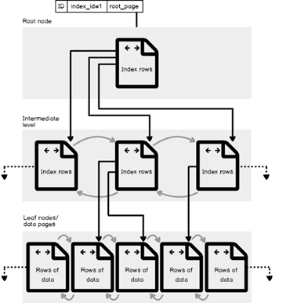

# Indexing 
[Read About Table Structure](https://www.sqlshack.com/sql-server-table-structure-overview/)
[SQL Server IN-depth Doc](https://www.sqlshack.com/sql-server-indexes-series-intro/)

* Indexes are special data structure associated with **table & views** and can help us to speed up the data retrieval process. 
* it gives us access to table rows without having to scan all table data. 
* SQL has two types of Indexes: 
    * **Clustered Index** 
    * **Non Clustered Index** 
* It is fast as it is **created using shape of Binary Tree** structure of 8KB pages, with each page is known as **index node**. So at each point it just has to decide to go left or right.  
* It contains **3 main level** 
    * **Root Level**: The top single page node 
    * **Leaf Node** 
    * **Intermediate Level** 

| Clustered Index | Non-Clustered Index | 
| :---: | :---: | 
| It is faster | Comparatively slower. | 
| Requires **less memory for operations** | Requires more memory for operation | 
| Index is the **main data** | Index is **copy of data** | 
| A table can have **only one clustered index** | A table can have **multiple non-clustered index** | 
| Clustered Index has **inherent ability of storing data on the disk** | Non-Clustered index does not have inherent ability of storing data on the disk | 
| Clustered index **store pointers to block not data** | Non Clustered index store **both value and a pointer to actual row that hold data** | 
| In Clustered index leaf nodes are actual data itself | In non clustered index leaf nodes are not the actual data itself rather they only contains included columns | 
| In clustered index, Clustered key defines order of data within table. | In Non Clustered index, index key defines order of data within index | 
| A Clustered index is a type of index in which table records are physically reordered to match the index. | A Non-Clustered index is a special type of index in which logical order of index does not match physical stored order of the rows on disk. | 