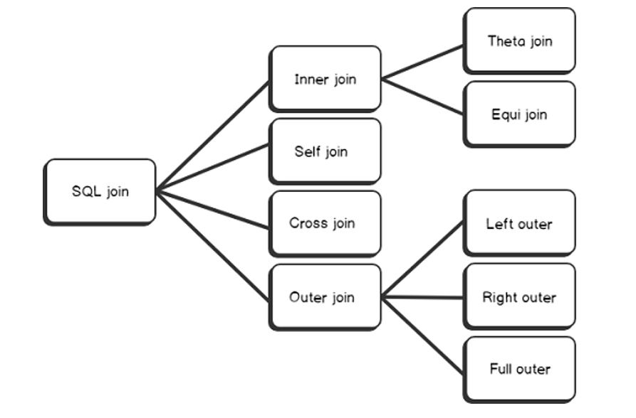

# Joins
* It is important to join related rows from variable table.
* **Definition**: A SQL join is a way of combining data from multiple tables to get a meaningful result using a KEY



> **NOTE**: The outer keyword is optional. Mentioning it or not mentioning it will not make any difference in execution. Eg **select columnList from table1 left join table2 on joinCondition** is same as **select columnList from table1 left outer join table2 on joinCondition**

## Inner Join (Simple Join)
* It is default join which we get when we write join keyword. 

* Inner joins returns all the rows from multiple tables where join condition is met. 
```
select columns 
from table1
inner join table2 
on table1.column = table2.column
```
### Equi Join
* Those inner join which contains = operator in join condition is called **Equi Join**

### Theta Join (not Equi Join)
* Those inner joins in which tables are joined based on a relationship other than equality is known as theta join. 

## Self Join 
* It is a way of joining the table with itself. This mostly happen in a table which has a foreign key referencing primary key in the same table. 
```
select a.column_name, b.column_name ... 
from table1 a, table2 b
where a.common_field = b.common_field
```

## Cross Join 
* it returns all rows from all possible combination between two tables. This type of join is known as **Cartesian Product**
**Example** 
```
select e.BusinessEntityID, d.Name as Department
from HumanResources.Employee AS e 
cross join HumanResources.Department as d
```


## Left Outer Join (Left Join)

* It returns all rows from the left hand table specified in the ON condition and only those rows from the other table where the joined fields are equal (join condition is met)
```
select columns
from table1
left [outer] join table2
on table1.column = table2.column
```

## Right Outer Join (Right Join)

* This type of join returns all rows from the right-hand table specified in the ON condition and only those rows from the other table where the joined fields are equal. 
```
select columns 
from table1 
right [outer] join table2
on table1.column = table2.column
```

## Full Outer Join (Full Join)

* This type of join returns all rows from the left hand table and right hand table with nulls in place where the join condition is not met. 
```
select columns 
from table1
full [outer] join table2
on table1.column = table2.column
```