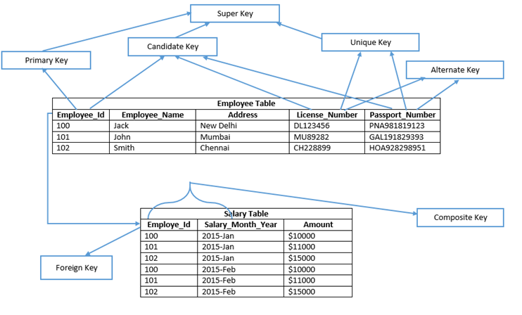

# KEYS in SQL 
* It is a single or combination of multiple fields/columns in a table. Using keys we can retrieve data and establish relationships. 

## Different Types Of Keys 
1. **Super Key**: 
    * It is set of one or more keys that can uniquely identify a record in a table. 
    * The Key can also **have some additional columns** which are not required to **uniquely identify** 
    * **Primary Key, Unique Key and Alternate Key are subset of this key** 
    * Eg In Employee table, column Employee_Id is sufficient to uniquely identify any row of the table, so that any set of column from Employee table which contains Employee_Id is a super key for Employee Table.
 

2. **Candidate Key** 
    * Key of table which can be selected as a primary key of the table. 
    * In a table we can have multiple candidate keys out of which one becomes primary key. 
    * **Candidate Key = Primary Key + Alternate Key** 
 

3. **Primary Key** 
    * It is that candidate key of the table which is selected to uniquely identify records of the table.
    * It **cannot be null or duplicate values** 
    * A table can have only **One Primary Key** either **one or multiple columns** 
> **NOTE**: In SQL server by default clustered index is created on primary key in heap table( a table which does not have clustered index). However it is possible to define a non clustered primary key by explicitly mentioning the index type. 
 

4. **Unique Key** 
    * It is similar to primary key & does not allow duplicate but only difference is that: 
        1. It forms non-clustered index on heap table
        2. It allows one null value
    * It is used when someone **wants to force unique constraint** on a particular column but not make it primary key. 
    * This can be referenced by other foreign keys. 
 

5. **Alternate Key** 
    * It is a candidate key which is currently **not selected as primary key**. 
    * Eg **PassportNumber and License_Number** 
     

6. **Composite Key aka compound or concatenated key** 
    * Group two or more columns which identify one row uniquely
    * Eg In Salary Table, Emp_Id and Salary_Month_Year are combined together to identify each rows uniquely in salary table. 
    * We can create a composite primary key on salary table using Emp_Id and Salary_month_Year columns. 

6. **Foreign Key** 
    * While defining relationship between two tables, the **primary key of one table becomes foreign key of another table** 

