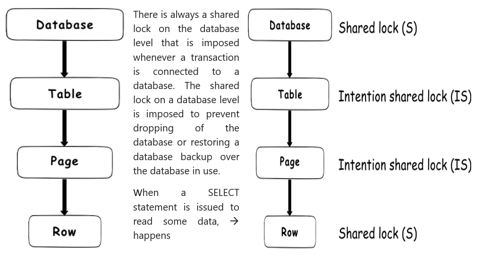
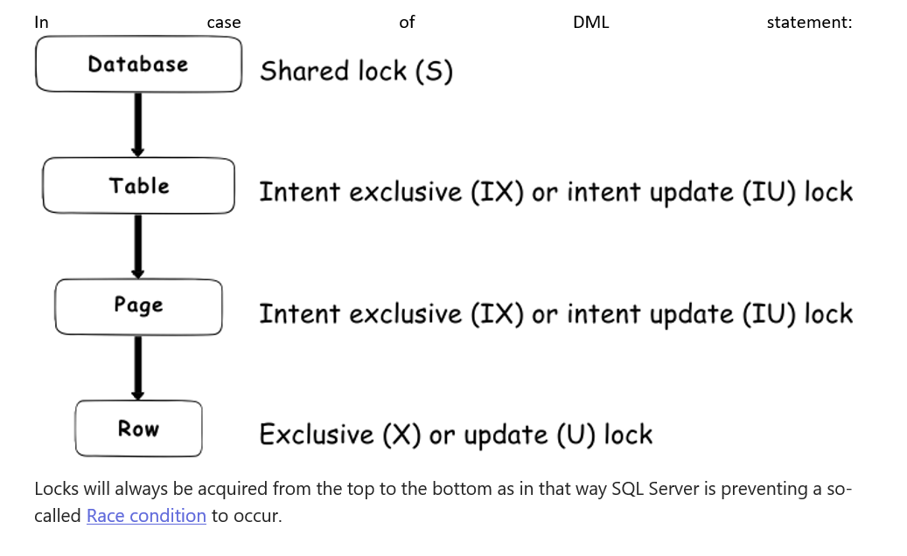
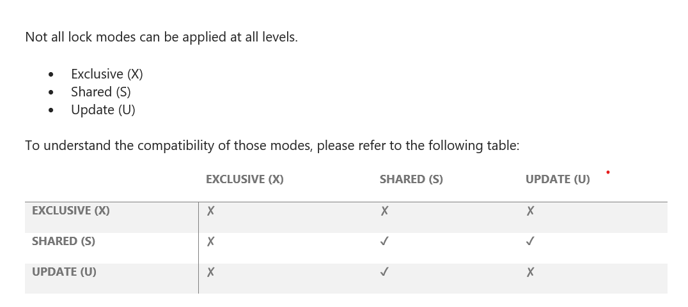
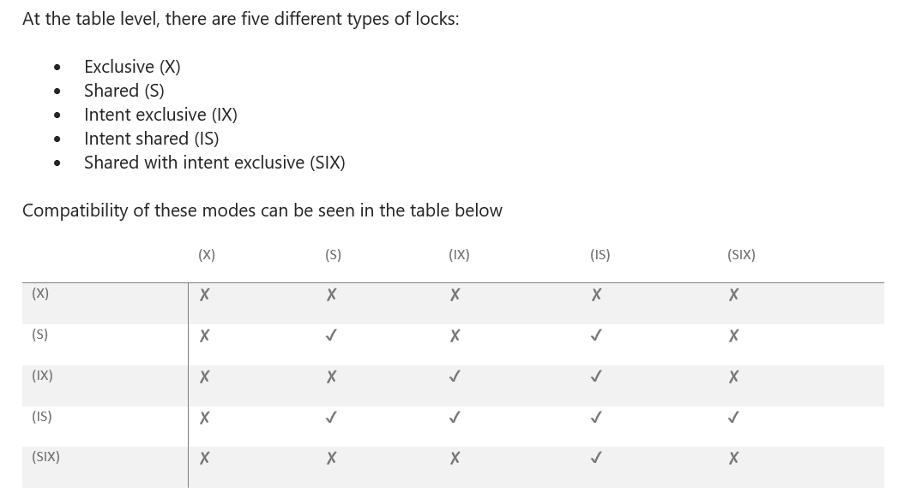
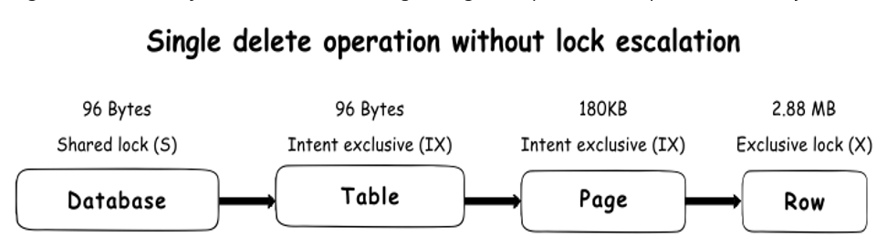
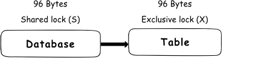

# Locking
* Locks are in-memory structures which have owners, types and the hash of the resource that it should protect. 

# ACID 
* It contains 4 requirements which all transactions needs to pass: 
    1. **Atomicity** It requires that a transaction that involves two or more discrete parts of information must commit all parts or none 
    2. **Consistency** It requires that a transaction must create a valid state of new data or it must roll back all data to the state that existed before the transaction was executed. 
    3. **Isolation** It requires that a transaction that is still running and did not commit all data yet, must stay isolated from all other transactions. 
    4. **Durability** It requires that committed data must be stored using method that will preserve all data in correct state and available to a user, even in case of failure. 
 

* SQL server locking is the `essential part of the isolation requirement`. When a transaction imposes the lock on an object, all other transactions that require access to that object will be forces to wait until lock is released. 
* Locks are defined by Lock Modes & Lock granularity: 

# Locking Mode 
## Exclusive Lock (X)
* It ensure that a page or row will reserved exclusively for the transaction that imposed the exclusive lock, as long as the transaction holds the lock. 
* The exclusive lock will be imposed by the transaction when it wants to modify the page or row data(INSERT, DELETE & UPDATE). 
* Exclusive lock can be applied on a page or row if already no other shared or exclusive lock is applied on target.
## Shared Lock (S)
* When shared lock is imposed, will reserve a page or row to be available only for reading, which means that any other transaction will be prevented to modify the locked record as long as the lock is active. 
* A shared lock can be imposed by several transactions at the same time over the same page or row and in that way several transactions can share the ability for data reading since the reading process itself will not affect anyhow the actual page or row data.
* A shared lock will allow write operations, but no DDL(Create, Drop, Alter, Truncate, Rename) changes will be allowed. 

## Update Lock (U)
* An update lock can be imposed on a record that already has a shared lock but vice versa is not possible. 
* In normal read scenarios it behaves as a shared lock. Once the transaction that holds the update lock is ready to change the data, the update lock (U) will be transformed to an exclusive lock (X). 

## Intent Lock (I)
* The purpose of such lock is to ensure data modification to be executed properly by preventing another transaction to acquire a lock on the next in hierarchy object. 
* In practice, when a transaction wants to acquire a lock on the row, it will acquire an intent lock on a table, which is a higher hierarchy object. 
* By acquiring the intent lock, the transaction will not allow other transactions to acquire the exclusive lock on that table (otherwise, exclusive lock imposed by some other transaction would cancel the row lock).

### Regular Intent Lock 
#### Intent Exclusive (IX)
* An intent exclusive lock (IX) is acquired it indicates to SQL Server that the transaction has the intention to modify some of lower hierarchy resources by acquiring exclusive (X) locks individually on those lower hierarchy resources
#### Intent Shared (IS)
* when an intent shared lock (IS) is acquired it indicates to SQL Server that the transaction has the intention to read some lower hierarchy resources by acquiring shared locks (S) individually on those resources lower in the hierarchy
#### Intent Update (IU)
* when an intent shared lock (IS) is acquired it indicates to SQL Server that the transaction has the intention to read some of lower hierarchy resources by acquiring shared locks (S) individually on those resources lower in the hierarchy. The intent update lock (IU) can be acquired only at the page level and as soon as the update operation takes place, it converts to the intent exclusive lock (IX)

### Conversion Lock 
#### Shared with intent exclusive (SIX)
* when acquired, this lock indicates that the transaction intends to read all resources at a lower hierarchy and thus acquire the shared lock on all resources that are lower in hierarchy, and in turn, to modify part of those, but not all. In doing so, it will acquire an intent exclusive (IX) lock on those lower hierarchy resources that should be modified. In practice, this means that once the transaction acquires a SIX lock on the table, it will acquire intent exclusive lock (IX) on the modified pages and exclusive lock (X) on the modified rows.
* Only one shared with intent exclusive lock (SIX) can be acquired on a table at a time and it will block other transactions from making updates, but it will not prevent other transactions to read the lower hierarchy resources they can acquire the intent shared (IS) lock on the table
#### Shared with intent update (SIU) 
* this is a bit more specific lock as it is a combination of the shared (S) and intent update (IU) locks. A typical example of this lock is when a transaction is using a query executed with the PAGELOCK hint and query, then the update query. After the transaction acquires an SIU lock on the table, the query with the PAGELOCK hint will acquire the shared (S) lock while the update query will acquire intent update (IU) lock
#### Update with intent exclusive (UIX) 
* when update lock (U) and intent exclusive (IX) locks are acquired at lower hierarchy resources in the table simultaneously, the update with intent exclusive lock will be acquired at the table level as a consequence

## Schema Lock 
* The SQL Server database engine recognizes two types of the schema locks: Schema modification lock (Sch-M) and Schema stability lock (Sch-S)
### Schema Modification Lock (Sch-M)
*	A Schema modification lock (Sch-M) will be acquired when a DDL statement is executed, and it will prevent access to the locked object data as the structure of the object is being changed. SQL Server allows a single schema modification lock (Sch-M) lock on any locked object. In order to modify a table, a transaction must wait to acquire a Sch-M lock on the target object. Once it acquires the schema modification lock (Sch-M), the transaction can modify the object and after the modification is completed and the lock will be released. A typical example of the Sch-M lock is an index rebuild, as an index rebuild is table modification process. Once the index rebuild ID is issued, a schema modification lock (Sch-M) will be acquired on that table and will be released only after the index rebuild process is completed (when used with ONLINE option, index rebuild will acquire Sch-M lock shortly at the end of the process)

### Schema Stability Lock (Sch-S)
*	A Schema stability lock (Sch-S) will be acquired while a schema-dependent query is being compiled and executed and execution plan is generated. This particular lock will not block other transactions to access the object data and it is compatible with all lock modes except with the schema modification lock (Sch-M). Essentially, Schema stability locks will be acquired by every DML and select query to ensure the integrity of the table structure (ensure that table doesn’t change while queries are running).

## Bulk Update Lock (BU)
* This lock is designed to be used by bulk import operations when issued with a TABLOCK argument/hint. When a bulk update lock is acquired, other processes will not be able to access a table during the bulk load execution. However, a bulk update lock will not prevent another bulk load to be processed in parallel. But keep in mind that using TABLOCK on a clustered index table will not allow parallel bulk importing. More details about this is available in [Guidelines for Optimizing Bulk Import](https://docs.microsoft.com/en-us/previous-versions/sql/sql-server-2008-r2/ms177445(v=sql.105)?redirectedfrom=MSDN)

# Locking Hierarchy 

# Lock Escalation 
* In order to prevent a situation where locking is using too many resources, SQL Server has introduced the lock escalation feature.
* Without escalation, locks could require a significant amount of memory resources. Let’s take an example where a lock should be imposed on the 30,000 rows of data, where each row is 500 bytes in size, to perform the delete operation. Without escalation, a shared lock (S) will be imposed on the database, 1 intent exclusive lock (IX) on the table, 1,875 intent exclusive locks (IX) on the pages (8KB page hold 16 rows of 500 bytes, which makes 1,875 pages that hold 30,000 rows) and 30,000 exclusive locks (X) on the rows itself. As each lock is 96 bytes in size, 31,877 locks will take about 3 MB of memory for a single delete operation. Running large number of operations in parallel could require some significant resources just to ensure that locking manager can perform the operation smoothly

* To prevent such a situation, SQL Server uses lock escalation. This means that in a situation where more than 5,000 locks are acquired on a single level, SQL Server will escalate those locks to a single table level lock. By default, SQL Server will always escalate to the table level directly, which mean that escalation to the page level never occurs. Instead of acquiring numerous rows and pages lock, SQL Server will escalate to the exclusive lock (X) on a table level

* While this will reduce the need for resources, exclusive locks (X) in a table mean that no other transaction will be able to access locked table and all queries trying to access that table will be blocked. Therefore, this will reduce system overhead but will increase the probability of concurrency contention	