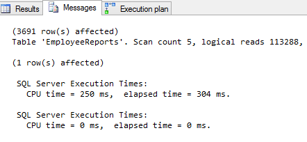
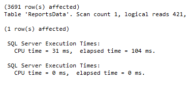
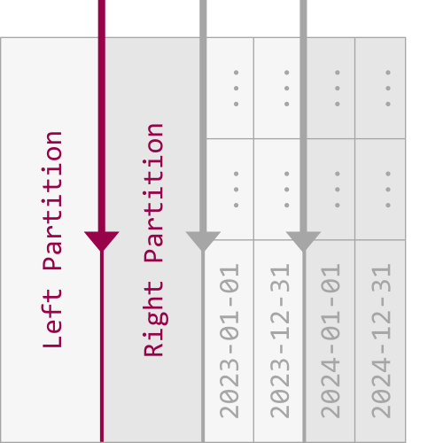

# Partitioning
* **DEIFICATION**: It is process by which a very large table is broken down into smaller tables. This can result in **faster queries** as they will have less data to scan. 
* This also **aids in maintenance of larger table** and reduce overall response time to read and load data. 

## Vertical Partitioning 
* This **increases performance** in queries which return all columns from a table that contains **a number of very wide TEXT or BLOB columns** 
* This can also be used to **restrict access to specific data such as passwords** 
* It splits table into **two or more tables** containing **different columns**
### Example of Vertical Partitioning 
* Large table of reports for employee containing 
    * Report_Name
    * Report_ID 
    * Number of Report 
    ...
    * Large columns with report description. 

* Assume **95%** search on report name and number, etc and **5%** search on report description. Now let' say each of the search will run the **clustered index scans** which reads all rows of table. Hence **performance of clustered index scan is proportional to number of rows** 
* `GOAL`: MINIMIZE IO Operation and reduce cost of each search. 

```
CREATE TABLE EmployeeReports (
    Report_ID INT IDENTITY(1,1) NOT NULL, 
    Report_Name VARCHAR(100) NOT NULL,
    Report_Number VARCHAR(20) NOT NULL, 
    Report_Description VARCHAR(MAX) NOT NULL, 
    CONSTRAINT EReport_PK PRIMARY KEY CLUSTERED (Report_ID)
)

DECLARE @i INT
SET @i = 1

BEGIN TRAN
WHILE i < 100000
BEGIN 
INERT INTO 
    EmployeeReports(
        Report_Name, 
        Report_Number, 
        Report_Description
    ) Values (
        'Report Name', 
        CONVERT(VARCHAR(20)m @i),
        REPLICATE('REPORT', 1000)
    )
SET @i = @i + 1
END
COMMIT TRAN
GO 
```
* **RUNNING AND CHECKING STATS** 
```
SET STATISTICS IO ON
SET STATISTICS TIME ON
SELECT 
    er.ReportID,
    er.ReportName, 
    er.ReportNumber
FROM 
    dbo.EmployeeReports er
WHERE 
    er.ReportNumber LIKE '%33%'
SET STATISTICS IO OFF
SET STATISTICS TIME OFF
```


* TO **REDUCE COST OF QUERYING** We will vertically partition the table

```
CREATE TABLE Report_Description(
    Report_ID INT FOREIGN KEY REFERENCES Employee_Reports (Report_ID), 
    Report_Description VARCHAR(MAX)
    CONSTRAINT PK_ReportDescription PRIMARY KEY CLUSTERED (Report_ID)
)

CREATE TABLE Report_Date (
    Report_ID INT NOT NULL, 
    Report_Name VARCHAR(100) NOT NULL, 
    Report_Number VARCHAR(20) NOT NULL 
    CONSTRAINT ReportData_PK PRIMARY KEY CLUSTERED (Report_ID)
)

INSERT INTO 
    dbo.ReportData (
        Report_ID, 
        Report_Name, 
        Report_Number
    )
SELECT 
    er.Report_ID, 
    er.Report_Name, 
    er.Report_Number
FROM 
    dbo.EmployeeReports er 
```

* Same query as previous will give better results

```
SET STATISTICS IO ON
SET STATISTICS TIME ON
SELECT 
    er.ReportID, 
    er.ReportName, 
    er.ReportNumber
FROM 
    ReportsData er
WHERE 
    er.ReportNumber LIKE '%33%'
SET STATISTICS IO OFF
SET STATISTICS TIME OFF
```



> **NOTE**: Vertical partitioning on SQL Server tables may not be the right method in every case. However, if you have, for example, a table with a lot of data that is not accessed equally, tables with data you want to restrict access to, or scans that return a lot of data, vertical partitioning can help.

## Horizontal Partitioning 
* It **divides the tables with same number of columns but lesser number of rows** 
*  Data in a partitioned table is physically stored in groups of rows called partitions and each partition can be accessed and maintained separately.
* A partitioned table behaves like one logical table. 
* **Alternative Approach to Partitioning**: Create separate table for each group of rows, and union them in view and then query the view instead of table. This is called **partitioned view**
* **EXAMPLE**: If a table has large number of reports based on month, then the table can be horizontally partitioned into tables **by year**. 
> **NOTE** The partitioning should be done in a way that quires reference as lesser tables as possible. 

* Tables are **partitioned based on a column** and define **range for each partition** 
* Usually it is **datetime** column but any column having **data type that are valid for index** columns can be used as partition columns except **timestamp** column 

### Approaches For Horizontal Partitioning
1. Create a new partitioned table and then simply copy data from old table to new table and do a table rename. 
2. Partitioning an old table by **rebuilding clustered index** on it. 

#### Approach 1: Creating new partitioned table 
##### Partition Column 
* Data is partitioned based on a single column called **partition key** 
* We can also use a **compute column** for partitioning. 
* We should use that column as a partition column which is almost every time used in query for filtering 
* When partition column is used in query filtering then SQL will access only relevant partition this is called **partition elimination**. 

##### Partition Function
* This defines how to partition data based on partition column. 
* Partition function defines boundary values. 
* **TOTAL NUMBER OF PARTITIONS = TOTAL BOUNDARIES + 1**
###### Range Left And Range Right 
* Partitions functions are created range left or range right to specify if the value belongs to left or right. 
* **RANGE LEFT** means that boundary value belongs to left of partition, it is the last value in left partition 
* **RANGE RIGHT** means boundary value belongs to right of the partition, it is the first value in right partition. 


##### partition Scheme 
* It is used to map the logical partitions to physical filegroups. 
* It is possible to map each partition to its filegroup or all partitions to one filegroup. 
* A file group contains **one or more files which can stored on one or more disks**
* Filegroups can be made **read-only, backed up and restored**. 
> **GOOD PRACTISE** Having one filegroup for each partition is good practise as less accessed data can be placed in slower disks but frequently accessed data can be placed in faster storage. 
<br />

##### Implementation Example
* To create a partitioned table for storing monthly reports we will first create additional filegroups.  
* **FILE GROUPS**: It is a logical storage unit. Every db has a primary file group that contains primary data file **(.mdf)**
* An additional **user defined file group**can be created to store secondary data **(.ndf)**. 
* We will create 12 file groups for every moths 

```
ALTER DATABASE PartitioningDB 
ADD FILEGROUP  January
GO

ALTER DATABASE PartitioningDB 
ADD FILEGROUP February
GO

ALTER DATABASE PartitioningDB 
ADD FILEGROUP March
GO

ALTER DATABASE PartitioningDB 
ADD FILEGROUP April
GO

ALTER DATABASE PartitioningDB 
ADD FILEGROUP May
GO

ALTER DATABASE PartitioningDB 
ADD FILEGROUP June
GO

ALTER DATABASE PartitioningDB 
ADD FILEGROUP July
GO

ALTER DATABASE PartitioningDB 
ADD FILEGROUP August
GO

ALTER DATABASE PartitioningDB 
ADD FILEGROUP September
GO

ALTER DATABASE PartitioningDB 
ADD FILEGROUP October
GO

ALTER DATABASE PartitioningDB 
ADD FILEGROUP November
GO

ALTER DATABASE PartitioningDB 
ADD FILEGROUP December
GO
```

* To check created and available file groups we can run following queries. 
```
SELECT 
    name AS AvailableFileGroup
FROM
    sys.FileGroups
WHERE 
    Type = 'FG'
```

* Now we will add **.ndf file to every file group**
```
ALTER DATABASE [PartitioningDB]
ADD FILE (
    NAME = [PartJan], 
    FILENAME = 'C:\Program Files\Microsoft SQL Server\MSSQL11.LENOVO\MSSQL\DATA\PartitioningDB.ndf', 
    SIZE = 3072 KB, 
    MAXSIZE = UNLIMITED, 
    FILEGROWTH = 1024 KB, 
) TO FILEGROUP[January]
```
* Same way **we will add for all the file groups**
* To Check **Files created added to the filegroups** run the following query: 
```
SELECT 
    name as [FileName],
    physical_name as [FilePath] 
FROM 
    sys.database_files
WHERE 
    type_desc = 'ROWS'
GO
```

* After creating additional filegroups for storing data we’ll create a partition function.
* **Partitioning Function**: That maps the rows of a partitioned tables into partitions based on value of partitioning columns. 
```
CREATE PARTITION FUNCTION [PartitioningByMonth] (datetime)
AS RANGE RIGHT FOR VALUES ('20140201', '20140301', '20140401',
               '20140501', '20140601', '20140701', '20140801', 
               '20140901', '20141001', '20141101', '20141201');
```

* To map the partitions of a partitioned table to filegroups and determine the number and domain of the partitions of a partitioned table we will create a partition scheme:
```

CREATE PARTITION SCHEME PartitionBymonth
AS PARTITION PartitioningBymonth
TO (January, February, March, 
    April, May, June, July, 
    Avgust, September, October, 
    November, December);
```

* Now we’re going to create the table using the PartitionBymonth partition scheme, and fill it with the test data:

```
CREATE TABLE Reports
(ReportDate datetime PRIMARY KEY,
MonthlyReport varchar(max))
ON PartitionBymonth (ReportDate);
GO
 
INSERT INTO Reports (ReportDate,MonthlyReport)
SELECT '20140105', 'ReportJanuary' UNION ALL
SELECT '20140205', 'ReportFebryary' UNION ALL
SELECT '20140308', 'ReportMarch' UNION ALL
SELECT '20140409', 'ReportApril' UNION ALL
SELECT '20140509', 'ReportMay' UNION ALL
SELECT '20140609', 'ReportJune' UNION ALL
SELECT '20140709', 'ReportJuly' UNION ALL
SELECT '20140809', 'ReportAugust' UNION ALL
SELECT '20140909', 'ReportSeptember' UNION ALL
SELECT '20141009', 'ReportOctober' UNION ALL
SELECT '20141109', 'ReportNovember' UNION ALL
SELECT '20141209', 'ReportDecember'

```

#### Partition Example 2
```
/* --------------------------------------------------
-- Create helper function GetNums by Itzik Ben-Gan
-- https://www.itprotoday.com/sql-server/virtual-auxiliary-table-numbers
-- GetNums is used to insert test data
-------------------------------------------------- */

-- Drop helper function if it already exists
IF OBJECT_ID('GetNums') IS NOT NULL
    DROP FUNCTION GetNums;
GO

-- Create helper function
CREATE FUNCTION GetNums(@n AS BIGINT) RETURNS TABLE AS RETURN
  WITH
  L0   AS(SELECT 1 AS c UNION ALL SELECT 1),
  L1   AS(SELECT 1 AS c FROM L0 AS A CROSS JOIN L0 AS B),
  L2   AS(SELECT 1 AS c FROM L1 AS A CROSS JOIN L1 AS B),
  L3   AS(SELECT 1 AS c FROM L2 AS A CROSS JOIN L2 AS B),
  L4   AS(SELECT 1 AS c FROM L3 AS A CROSS JOIN L3 AS B),
  L5   AS(SELECT 1 AS c FROM L4 AS A CROSS JOIN L4 AS B),
  Nums AS(SELECT ROW_NUMBER() OVER(ORDER BY (SELECT NULL)) AS n FROM L5)
  SELECT TOP (@n) n FROM Nums ORDER BY n;
GO

/* ------------------------------------------------------------
-- Create example Partitioned Table (Heap)
-- The Partition Column is a DATE column
-- The Partition Function is RANGE RIGHT
-- The Partition Scheme maps all partitions to [PRIMARY]
------------------------------------------------------------ */

-- Drop objects if they already exist
IF EXISTS (SELECT * FROM sys.tables WHERE name = N'Sales')
    DROP TABLE Sales;
IF EXISTS (SELECT * FROM sys.partition_schemes WHERE name = N'psSales')
    DROP PARTITION SCHEME psSales;
IF EXISTS (SELECT * FROM sys.partition_functions WHERE name = N'pfSales')
    DROP PARTITION FUNCTION pfSales;

-- Create the Partition Function 
CREATE PARTITION FUNCTION pfSales (DATE)
AS RANGE RIGHT FOR VALUES 
('2022-01-01', '2023-01-01', '2024-01-01');

-- Create the Partition Scheme
CREATE PARTITION SCHEME psSales
AS PARTITION pfSales 
ALL TO ([Primary]);

-- Create the Partitioned Table (Heap) on the Partition Scheme with SalesDate as the Partition Column
CREATE TABLE Sales (
    SalesDate DATE,
    Quantity INT
) ON psSales(SalesDate);

-- Insert test data
INSERT INTO Sales(SalesDate, Quantity)
SELECT DATEADD(DAY,dates.n-1,'2021-01-01') AS SalesDate, qty.n AS Quantity
FROM GetNums(DATEDIFF(DD,'2021-01-01','2016-01-01')) dates
CROSS JOIN GetNums(1000) AS qty;

-- View Partitioned Table information
SELECT
    OBJECT_SCHEMA_NAME(pstats.object_id) AS SchemaName
    ,OBJECT_NAME(pstats.object_id) AS TableName
    ,ps.name AS PartitionSchemeName
    ,ds.name AS PartitionFilegroupName
    ,pf.name AS PartitionFunctionName
    ,CASE pf.boundary_value_on_right WHEN 0 THEN 'Range Left' ELSE 'Range Right' END AS PartitionFunctionRange
    ,CASE pf.boundary_value_on_right WHEN 0 THEN 'Upper Boundary' ELSE 'Lower Boundary' END AS PartitionBoundary
    ,prv.value AS PartitionBoundaryValue
    ,c.name AS PartitionKey
    ,CASE 
        WHEN pf.boundary_value_on_right = 0 
        THEN c.name + ' > ' + CAST(ISNULL(LAG(prv.value) OVER(PARTITION BY pstats.object_id ORDER BY pstats.object_id, pstats.partition_number), 'Infinity') AS VARCHAR(100)) + ' and ' + c.name + ' <= ' + CAST(ISNULL(prv.value, 'Infinity') AS VARCHAR(100)) 
        ELSE c.name + ' >= ' + CAST(ISNULL(prv.value, 'Infinity') AS VARCHAR(100))  + ' and ' + c.name + ' < ' + CAST(ISNULL(LEAD(prv.value) OVER(PARTITION BY pstats.object_id ORDER BY pstats.object_id, pstats.partition_number), 'Infinity') AS VARCHAR(100))
    END AS PartitionRange
    ,pstats.partition_number AS PartitionNumber
    ,pstats.row_count AS PartitionRowCount
    ,p.data_compression_desc AS DataCompression
FROM sys.dm_db_partition_stats AS pstats
INNER JOIN sys.partitions AS p ON pstats.partition_id = p.partition_id
INNER JOIN sys.destination_data_spaces AS dds ON pstats.partition_number = dds.destination_id
INNER JOIN sys.data_spaces AS ds ON dds.data_space_id = ds.data_space_id
INNER JOIN sys.partition_schemes AS ps ON dds.partition_scheme_id = ps.data_space_id
INNER JOIN sys.partition_functions AS pf ON ps.function_id = pf.function_id
INNER JOIN sys.indexes AS i ON pstats.object_id = i.object_id AND pstats.index_id = i.index_id AND dds.partition_scheme_id = i.data_space_id AND i.type <= 1 /* Heap or Clustered Index */
INNER JOIN sys.index_columns AS ic ON i.index_id = ic.index_id AND i.object_id = ic.object_id AND ic.partition_ordinal > 0
INNER JOIN sys.columns AS c ON pstats.object_id = c.object_id AND ic.column_id = c.column_id
LEFT JOIN sys.partition_range_values AS prv ON pf.function_id = prv.function_id AND pstats.partition_number = (CASE pf.boundary_value_on_right WHEN 0 THEN prv.boundary_id ELSE (prv.boundary_id+1) END)
WHERE pstats.object_id = OBJECT_ID('Sales')
ORDER BY TableName, PartitionNumber;
```

#### Example 3
1. **creating file groups** 
```
ALTER DATABASE BloodBankManagement 
ADD FILEGROUP Report1
GO
ALTER DATABASE BloodBankManagement 
ADD FILEGROUP Report2
GO
ALTER DATABASE BloodBankManagement 
ADD FILEGROUP Report3
GO
ALTER DATABASE BloodBankManagement 
ADD FILEGROUP Report4
GO
```

2. **Verifying Created filegroups**
```
SELECT 
    name as AvailableFileGroups
FROM sys.filegroups
WHERE type = 'FG'
```

3. **Adding Data files** 
```
ALTER DATABASE [BloodBankManagement]
    ADD FILE (
        Name = [Report1],
        FILENAME = 'Path\Report1.ndf'
        SIZE = 3072KB, 
        MAXSIZE = UNLIMITED, 
        FILEGROWTH = 1024KB
    ) TO FILEGROUP [Report1]
```
* Similarly for all the reports. 

4. **Verifying NDF file got created or not** 
```
SELECT 
    Name as [FileName], 
    Physical_Name as [FilePath],
FROM
    sys.database_files
WHERE 
    type_desc = 'ROWS'
GO
```

5. **creating a partitioning function** 
```
CREATE PARTITION FUNCTION [LOCATIONS] (VARCHAR(20))
AS RANGE RIGHT FOR VALUES ('Mumbai', 'Delhi' , 'Chandigarh', 'Kolkata')

CREATE PARTITION SCHEME LocationTEST  
AS PARTITION [LOCATIONS]
TO (Churchgate, Mohali , Nizz, KKE)
```