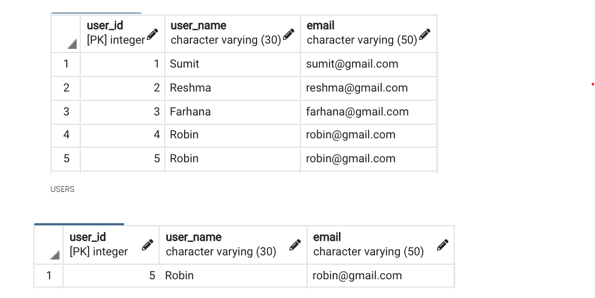
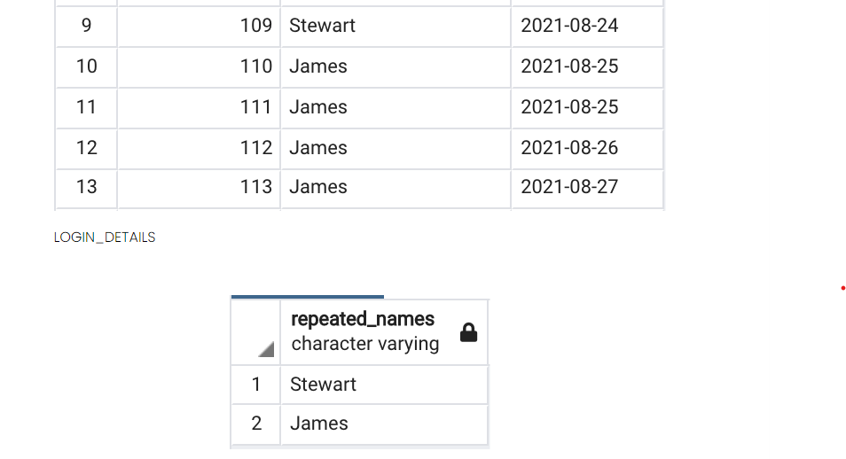
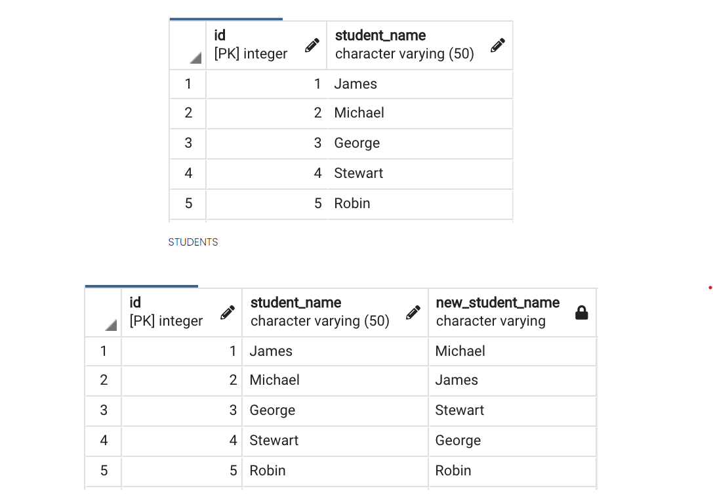

# Queries


## Duplicate Records in a Table 
```
SELECT EmpName, Salary, Count(*) As Cnt
FROM Employees 
GROUP BY EmpName, Salary
Having COUNT(*) > 1
    // OR \\
SELECT 
    *, 
    ROW_NUMBER() OVER (PARTITION BY EmpName, DeptName ORDER BY EmpId) as Rank
FROM Employee 
WHERE rank <> 1 
```

## Write a query to fetch all duplicate records from a table 

* **Approach**: Partition the data based on user name and given row number of each of the rows and then where row number is more than 1 then select that row
* [Click here for all scripts](./scripts/duplicate-rows.txt)
* **Solution 1: Using ROW_NUMBER and PARTITION BY**
```
SELECT 
    user_id, user_name, email
FROM (
    SELECT 
        *, 
        row_number() over (partition by user_name order by user_id) as row_number
    FROM
        Users u
) x 
WHERE
    x.row_number <> 1;

```


## From the doctors table, fetch the details of doctors who work in the same hospital but in different specialty.
* [Click here for script](./scripts/same-hospital.txt)
* **Solution**:
```
SELECT 
    d1.Name, 
    d1.specialty,
    d1.hospital
FROM 
    DOCTORS d1 
JOIN
    DOCTORS d2 
ON
    d1.hospital == d2.hospital 
AND
    d1.specialty <> d2.specialty
AND
    d1.id <> d2.id
```
## From the login_details table, fetch the users who logged in consecutively 3 or more times.

* **Approach**: We need to fetch users who have appeared 3 or more times consecutively in login details table. There is a window function which can be used to fetch data from the following record. Use that window function to compare the user name in current row with user name in the next row and in the row following the next row. If it matches then fetch those records.
* [Click here for script](./scripts/multiple-logins.txt)
* **Solution**: 
```
SELECT 
    DISTINCT repeated_names
FROM (
    SELECT 
        *, 
        CASE WHEN user_name = lead(user_name) over (order by login_id)
        AND       user_name = lead(user_name, 2) over (order by login_id)
        THEN username else null 
        END as repeated_names
    FROM 
        Login_details
)x
WHERE
    x.repeated_names is not null;
```

## From the students table, write a SQL query to interchange the adjacent student names.
> **Note**: If there are no adjacent student then the student name should stay the same.


* [Click here for scipts](./scripts/adjecent-user-name.txt)
* **Solution**: 
```
SELECT 
    Id, 
    Student_name, 
CASE WHEN id%2 <> 0 THEN lead(student_name,1,student_name) over (order by id)
WHEN id%2 =0 then lag(student_name) over(order by id) end as new_student_name
FROM 
    Students
```

## Generate Unique Number for each row
```
SELECT ROW_NUMBER() OVER (ORDER BY CustomerName) as OrderNumber, 
       CustomerName, 
       ProductName, 
       Amount, 
       VendorName
FROM   
    Sales
```

## Generate a Unique Number as per vendor 

```
SELECT 
    ROW_NUMBER() OVER (PARTITION BY VendorName ORDER BY CustomerName) as Num 
    CustomerName, 
    ProductName, 
    Amount, 
    VendorName 
FROM 
    Sales 

```
## Generate Same Number for Same Customer : Using Rank 
```
SELECT 
    RANK() Over (order by CustomerName) as CustomerName, 
FROM Sales
```
