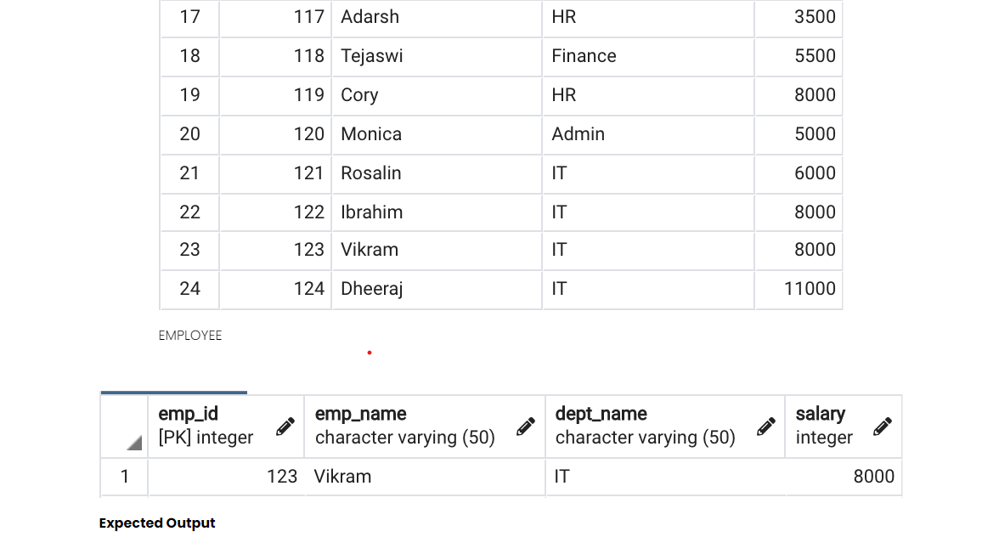
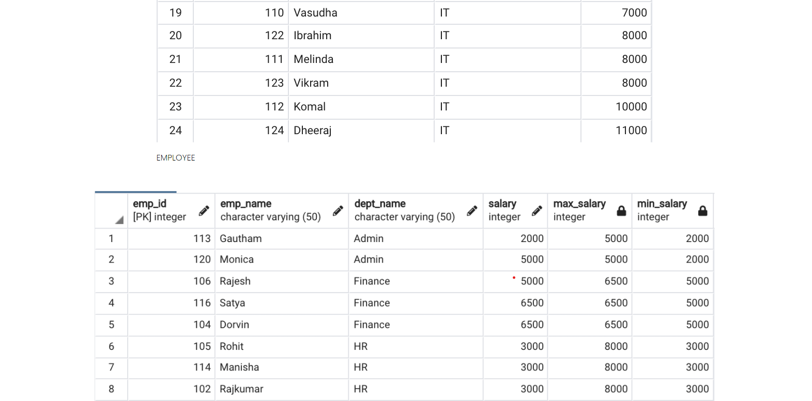

# Queries: Employees

## Find the manager name for the employee where EmpId and ManagerId are in same table 
````
SELECT e.EmpId, e.EmpName, m.EmpName
FROM Employee e
LEFT JOIN Employee m 
ON e.ManagerId = m.EmpId 
````

## Find the employee with Second Highest Salary 
```
SELECT * FROM Employee WHERE SALARY in (
    SELECT max(Salary) as Salary 
    FROM Employee 
    WHERE Salary < (SELECT Max(Salary) FROM Employee)
)
```

## Find the second highest salary 
```
SELECT MAX(Salary) as Salary
From Employee 
WHERE Salary < (Select MAX(Salary) from Employee)

// OR \\ 

SELECT * FROM (
    SELECT E-NAME, SALARY, 
           DENSE_RANK() OVER( ORDER BY SAL DESC) rank
    FROM EMPLOYEE
    )
WHERE rank = N  

```

## Write a SQL query to fetch the second last record from employee table.

* **Approach**: 
* [Click here for all scripts](./scripts/second-last.txt)
* **Solution**
```
SELECT 
    * ,
    ROW_NUMBER() over (order by EmployeeId desc) as Row_No
FROM 
    Employee e
WHERE 
    e.Row_No = 2
```

## Write a SQL query to display only the details of employees who either earn the highest salary or the lowest salary in each department from the employee table.

* [Click here for scripts](./scripts/min-max-salary.txt)
* **Solution**: 
````
SELECT 
    x.*,
FROM 
    Employee e
JOIN
    (
        SELECT 
            *, 
            max(Salary) OVER (Partition BY dept_name) as max_salary, 
            min(Salary) OVER (PARTITION BY dept_name) as min_salary
        FROM
            Employee
    ) x
ON
    e.emp_id = x.emp_id
AND (e.salary = x.max_salary or e.salary = x.min_salary)
ORDER BY 
    x.dept_name, 
    x.salary
````

## Employee Manager Hierarchy : Using Self Join
Employee (EmpId, FirstName, LastName, ManagerId)
```
Select Emp.FirstName + ' ' + Emp.LastName as Employee, 
       Mgr.FirstName + ' ' + Mgr.LastName as Manager, 
From Employee Emp 
INNER JOIN Employee Mgr 
On Emp.MgrId = Mge.Id
```

## Employee Manager Hierarchy For all level : Using recursive query; Manager > Associate Manager > ... > Employee
```
With EmpMgrCTE 
AS 
    (
        SELECT EmployeeId, EmpName, ManagerId, 0 as EmpLevel -- 0 means top level boss
        FROM Employee
        WHERE ManagerId is null
        UNION ALL 
        SELECT emp.EmployeeId, emp.EmpName, emp.ManagerId, mgr.EmployeeLevel + 1 as EmpLevel 
        FROM Employee emp
        INNER JOIN EmpMgrCTE as mgr 
        ON emp.ManagerId = mgr.EmployeeId 
    )
SELECT * FROM EmpMgrCTE
Order by EmployeeLevel

/// For an specific employee
WITH Employee_CTE(employeeid,name,managerid) AS  
(  
   SELECT employeeid,name,managerid from employee where employeeid=5  
   UNION ALL  
   SELECT e.employeeid,e.name,e.managerid  
   from employee e   
   INNER JOIN Employee_CTE c ON e.employeeid = c.managerid  
)  
SELECT * FROM Employee_CTE order by employeeid  
```