# Ranking
* it is used to rank specified field values and categorize them according to rank of each row, resulting in a single aggregated value for each partitioned row. 
* **RANKING FUNCTIONS**
    1. **ROW_NUMBER**
    2. **RANK**
    3. **DENSE_RANK**
    4. **NTILE**
    5. **PERCENT_RANK**
* All these ranking functions use Over clause that defines a **user-specific set of rows within a query result set.** . ALong with this we can also define PARTITION BY clause which defines set of rows on which windows function will do processing. 
* IN addition an order by clause can be included which defines the sorting criteria within the partitions. 

## ROW_NUMBER
* It is a windows function(refers to set of rows on which calculation will be performed. )
* **SYNTAX**
    > `ROW_NUMBER() OVER (PARTITION BY expression ORDER BY expression)`
    * ROW_NUMBER followed by parenthesis and OVER and ORDER BY is mandatory where as PARTITION BY is optional. 
    * When PARTITION BY is specified it divides the result returned by FROM clause into partitions on which ROW_NUMBER is applied. 
* This function add **virtual sequence number** to rows. It adds unique incrementing number to the result grid which is determined by **order by** expression. 
* Using a Partition BY clause makes this incrementing number reset once it crosses the partition. 
* Depending on **PARTITION BY** this sequence can be **restarted multiple times** 
> **NOTE** There is no guarantee that row number returned by sql will be same for every execution. 
* ROW_NUMBER and RANK are similar, both start at 1 but RANK can repeat in CASE of ties. 

### **Example 1**
```
SELECT 
    sc.[EnglishProductSubCategoryName],
    [c].[EnglishProductCategoryName],
    [RwCnt] = ROW_NUMBER() OVER (ORDER BY [sc].[EnglishProductSubCategoryName]),
    [RwCntPerCategory] = ROW_NUMBER() 
        OVER 
            (PARTITION BY c[EnglishProductCategoryName]
             OREDER BY sc.[EnglishProductSubCategoryName])
FROM
    [dbo].[DimProductSubCategory] sc
JOIN 
    [dbo].[DimProductCategory] c
ON
    [c].[ProductCategoryKey] = [sc].[ProductCategoryKey]
ORDER BY 2, 1;
```

* The above query calculates a general row_number and a row_number which is reset every category. 


### Example 2: Removing Duplicates Using Row_Number
* When you have true duplicates where all column values are exactly same they can be easily deleted using `DISTINCT or GROUP BY`
* ROW_NUMBER can be used to remove duplicates in business sense. 
```
WITH cte_source AS (
    SELECT 
        Id, 
        EmployeeKey, 
        EmployeeName, 
        InsertDate, 
        RowId = ROW_NUMBER() 
            OVER 
                (PARTITION BY EmployeeKey ORDER BY InsertDate)
    FROM
        [dbo].[Employees]
)
DELETE FROM cte_source WHERE RowId > 1

```

---

* **SAMPLE T_SQL SCRIPT** 
```
CREATE TABLE StudentScore
(
  Student_ID INT PRIMARY KEY,
  Student_Name NVARCHAR (50),
  Student_Score INT
) 

GO

INSERT INTO StudentScore VALUES (1,'Ali', 978)
INSERT INTO StudentScore VALUES (2,'Zaid', 770)
INSERT INTO StudentScore VALUES (3,'Mohd', 1140)
INSERT INTO StudentScore VALUES (4,'Jack', 770)
INSERT INTO StudentScore VALUES (5,'John', 1240)
INSERT INTO StudentScore VALUES (6,'Mike', 1140)
INSERT INTO StudentScore VALUES (7,'Goerge', 885)
```

## RANK()
* It returns a **unique rank for each distinct row within partition according to specified column values**
* This  behaves similar to ROW_NUMBER but for the same values it will give the same rank but this leads to gap in rank. 
```
SELECT 
    RANK() OVER (ORDER BY STUDENT_SCORE) AS StudentRANK 
FROM
    StudentScore
```

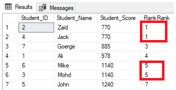

* RANK PARTITION BY Example 
```
SELECT 
    RANK() OVER (PARTITION BY STUDENT_SCORE ORDER BY STUDENT_SCORE)
FROM
    StudentScore
```


<br/>

## DENSE_RANK()
* The DENSE_RANK() is similar to RANK() **except it leaves no RANK** 

```
SELECT 
    DENSE_RANK() OVER (ORDER BY StudentScore) As StudentRank
FROM
    StudentScore
```
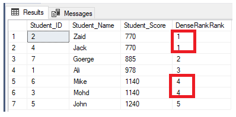

* The DENSE_RANK with PARTITION BY will have same result for the previous query in RANK section. The rank will have no meaning. 

## NTILE()
* It is used to distribute rows in row set into specified number of groups, providing each row in the row set with a unique group number starting with number 1 that shows group this row belongs to, Where N is positive number which defines number of groups you need to distribute the set of rows into. 

* To get the number of rows in each group divide number of rows by number of groups if the answer is not whole number then SQL will apply rounding off. Like 7 / 4 = 1.75 then first three groups will have 2 rows each where as last one will have one row. 

```
SELECT *,  NTILE(4) OVER( ORDER BY Student_Score) AS NTILERank
FROM StudentScore
```

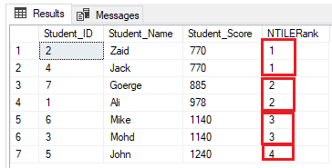

* When we also use PARTITION BY clause then the rows will be divided into N groups for each partition

```
SELECT *, 
    NTILE(4) OVER(PARTITION BY Student_Score  ORDER BY Student_Score) AS RowNumberRank
FROM 
    StudentScore
```

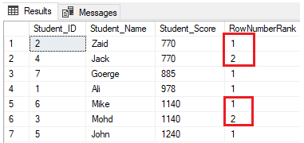


## ALL RANKING FUNCTION IN ONE QUERY EXAMPLE
```
SELECT *, 
    ROW_NUMBER() OVER(PARTITION BY CLASS ORDER BY Student_Score) AS RowNumberRank,
    RANK ()  OVER(PARTITION BY CLASS ORDER BY Student_Score) AS RankRank,
    DENSE_RANK ()  OVER(PARTITION BY CLASS ORDER BY Student_Score) AS DenseRankRank,
    NTILE(7) OVER(PARTITION BY CLASS ORDER BY Student_Score) AS NTILERank
FROM 
    StudentScore
GO
```

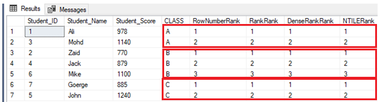

## PERCENT_RANK()
* It calculates **relative rank** SQL percentile of each row. 
* it returns values greater than 0 but less than equals to 1.
* It does not count any null values. 
* **SYNTAX** 
```
PERCENT_RANK() OVER (
    [PARTITION BY expression]
     ORDER BY sort_expression [ASC | DESC]
)
```
    * By default SQL SERVER treats whole data as single data but we can specify the PARTITION BY clause to divide that data into multiple sets. 

### Example 1: Calculate SQL Percentile using the PERCENT_RANK function in SQL Server
```
WITH Student --cte1
       AS (SELECT Marks
           FROM(VALUES(75), (59), (69), (88), (72), (86), (60), (67), (49), (81), (93)) Val(Marks)),
       Percentiles --cte2 referencing cte1
       AS (SELECT Marks, 
                  PERCENT_RANK() OVER(
                  ORDER BY Marks) AS Percent_Rank
           FROM Student)
       SELECT *
       FROM Percentiles;

```
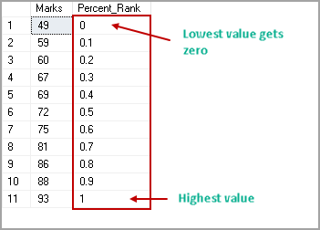

### Example 2: PERCENT_RANK function with to calculate SQL Percentile having NULL values
```
WITH Student
       AS (SELECT Marks
           FROM(VALUES(75), (59), (69), (88), (72), (86), (60), (67), (49), (81), (93),(NULL)) Val(Marks)),
       Percentiles
       AS (SELECT Marks, 
                  PERCENT_RANK() OVER(
                  ORDER BY Marks) AS Percent_Rank
           FROM Student)
       SELECT *
       FROM Percentiles;
```
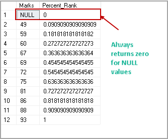

### Example 3: PERCENT_RANK function to calculate SQL Percentile having duplicate values
* Suppose multiple students are having similar marks, and we want to calculate the percent rank. It is important to know that the function will return the same or different rank for a student with similar marks.
```
	WITH Student
	     AS (SELECT Marks
	         FROM(VALUES(75), (59), (69), (88), (72), (86), (60), (67), (49), (81),(81), (93)) Val(Marks)),
	     Percentiles
	     AS (SELECT Marks, 
	                PERCENT_RANK() OVER(
	                ORDER BY Marks) AS Percent_Rank
	         FROM Student)
	     SELECT *
	     FROM Percentiles;
```
* We have two students with marks 81. In the following example, we can see that percent_rank function returns the same value.
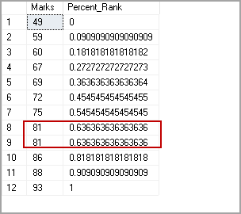

* Here is a catch, Let’s say two students have got the highest marks 93 and we want to calculate the percent_rank for these.
```
WITH Student
       AS (SELECT Marks
           FROM(VALUES(75), (59), (69), (88), (72), (86), (60), (67), (49), (81),(93), (93)) Val(Marks)),
       Percentiles
       AS (SELECT Marks, 
                  PERCENT_RANK() OVER(
                  ORDER BY Marks) AS Percent_Rank
           FROM Student)
       SELECT *
       FROM Percentiles;
```
In this example, we have the highest marks 93, and two students have the same marks. Previously, we get percent rank 1 for the highest rank. Now, we do not get the rank 1, and it calculates the percent rank according to the similar highest marks.

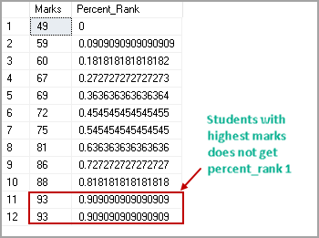

# Example 4: PERCENT_RANK function for SQL Percentile with PARTITION BY clause
In the previous example, we did not use the PARTITION by clause to divide the data into multiple small data sets.
Suppose we want to check the Percent_Rank of an employee pay rate per the department name from the AdventureWorks sample database. In the following query, we use PARTITION BY Department, ORDER BY Rate to define partition on the department as per the rates in the ascending order.
````
SELECT Department, 
         Firstname, 
         Rate, 
         PERCENT_RANK() OVER(PARTITION BY Department
         ORDER BY Rate) AS PctRank
  FROM HumanResources.vEmployeeDepartmentHistory AS edh
       INNER JOIN HumanResources.EmployeePayHistory AS e ON e.BusinessEntityID = edh.BusinessEntityID
  WHERE Department IN(N'Engineering', N'Finance')
  ORDER BY Department, 
           Rate DESC;
````
In the following image, we have two departments group, Engineering and Finance.

* For the Engineering group, Terri has the highest pay rate, and its percent_rank is 1
* Rob has the lowest pay rate, and it gets percent_rank zero in the engineering group
* In another group, Finance, Laura gets percent_rank 1 and David gets percent_rank zero according to their pay rates
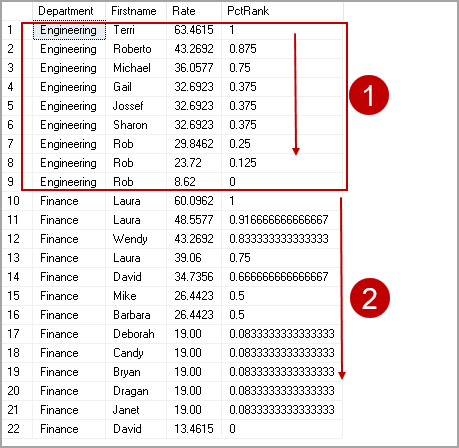

* If we do not want to have partitions, remove the PARTITION BY clause and it treats the input as single data set.
```
SELECT Department, 
         Firstname, 
         Rate, 
         PERCENT_RANK() OVER(
         ORDER BY Rate) AS PctRank
  FROM HumanResources.vEmployeeDepartmentHistory AS edh
       INNER JOIN HumanResources.EmployeePayHistory AS e ON e.BusinessEntityID = edh.BusinessEntityID
  WHERE Department IN(N'Engineering', N'Finance')
  ORDER BY Department, 
           Rate DESC;
```

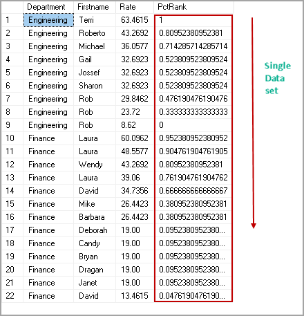