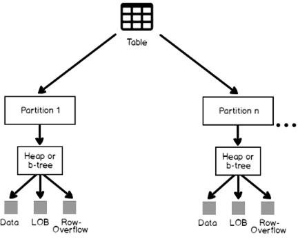

# Table
[Read About Table Structure In Depth](https://www.sqlshack.com/sql-server-table-structure-overview/)
## SQL Server Table Structure 
* These are db object which act like container for data. 
* They have no column order; allows us to mention row order while retrieving 
* SQL provides following special tables.
    1. **Temporary Table** 
        1. **Local Temporary Table** 
        2. **Global Temporary Table** 
    2. **Wide Table** 
    3. **System Table** 
    4. **Partitioned Table** 


## CTE - Common Table Expression 
* Introduced in SQL Server 2005 
* **Temporary result set** and typically a result of complex sub query 
* Lifetime is limited to current query .
* Define using **WITH** statement. 
* CTE always beings with a ; **semicolon** 
* It is used to create Recursive query or storing result of complex sub query. 

```
;With CTE1(Address, Name, Age)--Column names for CTE, which are optional
AS
(
SELECT Addr.Address, Emp.Name, Emp.Age from Address Addr
INNER JOIN EMP Emp ON Emp.EID = Addr.EID
)
SELECT * FROM CTE1 --Using CTE 
```

## Temporary Table 
* Created at runtime and we can perform any action on these tables as we do on normal table 
* It exists in tempdb 
* Automatically deleted when the created session is closed. 
* The name of the table start with Single # 

```
CREATE TABLE #LocalTemp
(
 UserID int,
 Name varchar(50), 
 Address varchar(150)
)
GO
insert into #LocalTemp values ( 1, 'Shailendra','Noida');
GO
Select * from #LocalTemp

```

### Global Temporary Tables 
* It is available to all SQL Server sessions/Connections i.e. all end users. 
* They are deleted when all connection to SQL Server close. 
* The name starts with ## symbol 

```
CREATE TABLE ##GlobalTemp
(
 UserID int,
 Name varchar(50), 
 Address varchar(150)
)
GO
insert into ##GlobalTemp values ( 1, 'Shailendra','Noida');
GO
Select * from ##GlobalTemp
```

## Wide Table 
* the Sparse Column to for optimized storage for the NULL values, reducing the space consumed by the table and increasing the number of columns allowed

## System Table 
* It is a table in which sql server engine has information about sql server instance config and object information. It can be queries using system views. 

## Partitioned Table
* Tables in which the data will be divided horizontally into seperate unites in the same filegroup or different filegroups based on a specific key, to enhance the data retrieval performance. 
> **NOTE**: Filegroups are the physical files on your disc volumes that hold SQL Server's data and can be used for backup and administrative management purposes. 
* Partitioning is where large tables are divided into multiple smaller parts. by splitting a large table into smaller, individual tables, queries that access only a fraction of the data can run faster because there is less data to scan. The main of goal of partitioning is to aid in maintenance of large tables and to reduce the overall response time to read and load data for particular SQL operations. The partitioning can be done vertically or horizontally. (https://www.sqlshack.com/database-table-partitioning-sql-server/)

### Physical Implementation 
* Tables are stored in sets of 8KB pages. Table pages are stored by default in a single partition that resides in the PRIMARY default filegroup.  A table can be also stored in multiple partitions, in which each group of rows will be stored in a specific partition, in one or more filegroups, based on a specific column. 



## Table Variable 
* Act as a variable and exists for a batch of query execution
* It gets dropped when we come out of that batch 
* Allows us to create a PK 

```
GO
 DECLARE @TProduct TABLE
 (
 SNo INT IDENTITY(1,1),
 ProductID INT,
 Qty INT
 ) 
 --Insert data to Table variable @Product 
 INSERT INTO @TProduct(ProductID,Qty)
 SELECT DISTINCT ProductID, Qty FROM ProductsSales ORDER BY ProductID ASC 
 --Select data
 Select * from @TProduct
 
 --Next batch
 GO
 Select * from @TProduct --gives error in next batch
```