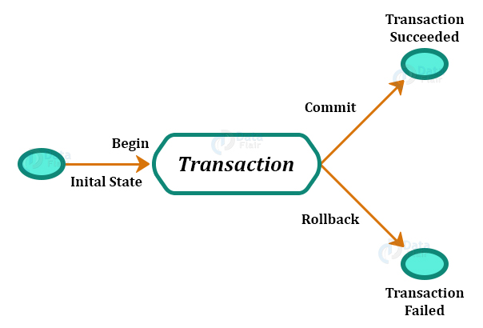

# Transactions 
* It is a set of tasks into a single execution unit. If any task fails then the entire transaction is reversed. 

* **Properties**: `Atomicity, Consistency, Isolation, Durability`

## Implementations 
* This can be used **DML Commands** (INSERT, UPDATE & DELETE)
<br/>

1. **BEGIN TRANSACTION**: Indicates start point of an **explicit or local transaction** 
```
BEGIN TRANSACTION transaction_name
```
2. **SET TRANSACTION**: Places a name on a transaction. 
```
SET TRANSACTION [READ WRITE | READ ONLY]
```

3. **COMMIT**: If everything is in order with all statements within a single transaction, all changes are recorded together in the database is called committed. It saves all the transactions to the db since the last **COMMIT** or **ROLLBACK** command. 
```
COMMIT;
```

4. **ROLLBACK**: If any error occurs with any of SQL grouped statements, all changes need to be aborted. The process of reversing changes is called **rollback**. This command can only be used to undo transactions since the last COMMIT or ROLLBACK command was issued. 
```
ROLLBACK;
```

5. **SAVEPOINT**: It creates points within the groups of transactions in which to ROLLBACK. A SAVEPOINT is a point in a transaction in which you can roll the transaction back to a certain point without rolling back the entire transaction. 
```
SAVEPOINT SavePoint_Name;
```
```
ROLLBACK TO SavePoint_Name;
```
**Example**
```
SAVEPOINT SP1; 
//SavePoint Created 
DELETE FROM Student WHERE AGE = 20; 
//deleted 
SAVEPOINT SP2; 
// SavePoint Created.
ROLLBACK TO SP1
//Rollback Completed.
```

6. **RELEASE SAVEPOINT**: it is used to remove a SAVEPOINT that you have created. 
```
RELEASE SAVEPOINT SavePoint_Name; 
```

