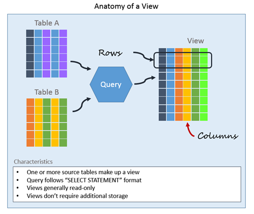

# Views 

* **Why Views**: If we execute a query on multiple tables and get the result set, now next time we want to get same data we need tgo store that query somewhere and execute it again. SQL server provides a functionality called **view** for it. 

* **Definition**: A view is **named query** that is stored in database catalog and can be referred later. 
* Views do not store data except for **indexed view**. Helps abstract complex query and achieve abstraction. 
* It is like a **virtual table** which doesn't exist physically. 
* It can contain tables for single as well as multiple databases. 


**ADVANTAGE OF VIEWS** 
1. **Security**: We can restrict direct access of whole table and provide only subset of data. Data is stored in virtual table and not permanently. We can give **user permission for the view and restrict the permission for the tables and columns** 
2. **SIMPLICITY**: It hides the complex logic and joins from a query and directly changes to SELECT format. 
3. **REUSABILITY** 
<br/>


**CREATING VIEWS** 
* Syntax
```
create view viewName as 
select column1, column2 ... columnN from tables 
where conditions
```
* Once the view is created we get data from view as `select * from viewName`
* We can use `Sp_helptext [viewname]` to retrieve view definition. 

> **NOTE**: Suppose we created a view to fetch data from Employee table and after creating the view we altered the table for eg added a column then our view will not return that column as the SQL doesn't refresh the metadata & schema of view. We have to explicitly do this by executing: ** sp_refreshview viewName. **This may cause problems in production environment so to avoid this we can create view with SCHEMABINDING**
```
create view demoView 
with schemabinding 
as 
    select tableId, foreignId, value, codeOne 
    from [dbo].[MyTable]
```

* One thing to notice here is that when we create a view with schemabinding then we cannot so SELECT (*), once the view is created after that we try to alter the tables present in that view then alter statement will result in the error. 
<br/>

**SQL View Encryption**
* This can be achieved using **WITH ENCRYPTION**. When we execute the Sp_helptext on that view it will result in error. 

```
create view demoView 
with encryption 
as 
    select tableId, foreignId, Value, CodeOne
    from [dbo].[MyTable]
```
<br/>

**SQL View with CHECK Option** 
* We can use **With Check** option to check the conditions in VIEW are inline with the DML statements. 
    * It prevents to insert rows in the table where the condition in the where clause has not satisfied. 
    * If the condition does not satisfy, we get an error message in the insert or update statement. 
* In the following query, we use the CHECK option, and we want only values starting with letter F in the [Codeone] column.
```
CREATE VIEW DemoView
AS
     SELECT *
     FROM [dbo].[MyTable]
     WHERE [Codeone] LIKE 'F%'
WITH CHECK OPTION;

```

## Indexed View 
* To enhance the performance of such complex queries, a unique clustered index can be created on the view, where the result set of that view will be stored in your database the same as a real table with a unique clustered index. The good thing here is – the queries that are using the table itself can benefits from the view’s clustered index without calling the view itself. Maintaining the clustered index of the view to be unique, the data changed on the source table will be easily found and the change will be reflected to the view. Changing the data directly from the indexed view is possible but shouldn’t be done. Also, it is possible to create non-clustered indexes on a view, providing more possibilities to enhance the queries calling the view.
You can benefit from indexed views if its data is not frequently updated, as the performance degradation of maintaining the data changes of the indexed view is higher than the performance enhancement of using this Indexed View. Indexed views improve the performance of queries that use joins and aggregations in processing huge amount of data and are executed very frequently. 
There are some limitations when you create an indexed view. You can’t use EXISTS, NOT EXISTS, OUTER JOIN, COUNT(*), MIN, MAX, subqueries, table hints, TOP and UNION in the definition of your indexed view.  Also, it is not allowed to refer to other views and tables in other databases in the view definition. You can’t use the text, ntext, image and XML, data types in your indexed views. Float data type can be used in the indexed view but can’t be used in the clustered index. If the Indexed view’s definition contains GROUP BY clause, you should add COUNT_BIG(*) to the view definition

