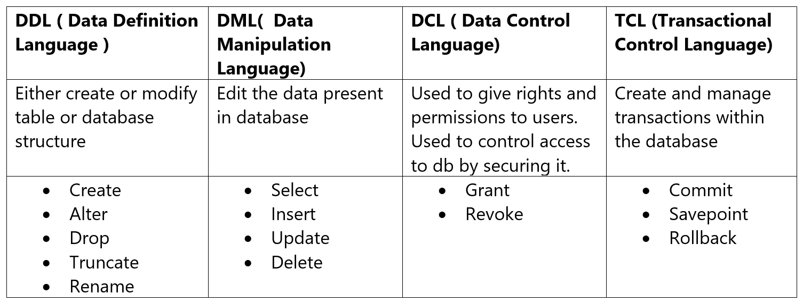

# Index
[All SQL Doc Link](https://www.techonthenet.com/sql_server/index.php)
[SQL Indexes](https://www.sqlshack.com/top-10-questions-answers-sql-server-indexes/)
 

## History Of Data 
*	Database is collection of data and methods for accessing and manipulating data. 
*	Before disk memory we used to store data in drum memory that’s why database icon is cylindrical for historical reason. 
*	**DBMS**: Program used to manage the databases which gets instructions and executes on DB. There are 13 rules of CODD for designing DBMS. 
*	**RDBMS**: Subset of dbms
*	**SQL**: Helps to interact with the databases. It’s a standardization which is implemented across many databases. 
*	Before DBs we had file processing system where each file was stored but there was no relationship between the data. 

## Types of Database 
*	**Relational**: ACID, Transactions, Works very well with SQL,
*	**Document**: MongoDb, CouchDB, Firebase – data is in a document. Very scalable
*	**Key Value**: Redis, dynamo, - Key value pair of data
*	**Graph**: Neo4j – Use a graph model, good for connected data. 
*	**Wide Columnar** – Apache Casandra 
Future Read: https://www.ibm.com/cloud/blog/brief-overview-database-landscape 

## SQL Fundamentals 
*	**SQL Playground**: https://www.db-fiddle.com/ 
*	**SQL**: It’s a programming language to write instructions to be executed upon a database system. 
*	**Query**: It’s an instruction aka SQL Statement
*	**Declarative Programming**: What will happen – like select * from users, eg: SQL 
*	**Imperative Programming**: How it will happen – where we code each step.eg: JAVA
*	**Database Model**: A way to store and manage data. 
 

### Relational Model
*	**Relational Schema**: Link relationship between various schema of data 
*	**Attribute**: Columns with constraints. 
*	**Degree**: Collection of the columns. 
*	**Cardinality**: collection of rows and tuples. 
*	**Tables**: Representation of object which represents some data. It has multiple columns & rows. 
*	**Column**: It stores a specific type data. 
*	**Domain/Constraint**: What type our column can store
*	**Rows/Tuple**: A single row of data and these have to follow column constraints
*	**Primary Key**: helps to uniquely identify each and every row. 

## OTLP vs OLAP
*	**OTLP**: Online transaction Processing captures and maintain transactional data in a database. Here the emphasis is on fast processing as OLTP databases are read/updated frequently. In cases of failures we have to handle data integrity. 
*	**OLAP**: Online Analytical Processing  applies complex queries on large amounts of historical data, aggregated from OLTP databases and other sources such as mining etc. 

## Commands Classification
