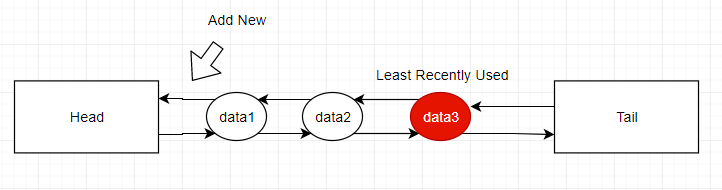

# LRU Cache using Doubly Linked List
## Basic Requirements
* Fixed & limited capacity
* Constant time complexity to access data stored in cache given a key
* constant time complexity O(1) for data storage

## ICache Interface 
```
namespace data_structure.LRU_Cache
{
	public interface ICache
	{
		// return the value if key exists in cache, or -1 if not. 
		int Get(int key);

		// add a new data entry to cache
		void Add(int key, int value);
	}
}
```

## Cache system with LRU 
* It refers to algorithm which selects entries for replacement which were least recently used. 
* **Requirements & Design of LRU**
    1. To enable fast data access O(1) we can use dictionary. 
    2. To track most recently used we need to design data structure, whenever a data is access it would be placed at top of list. The complexity of Adding and removing should be O(1). This can be done with **doubly linked list** 
    

## Implementation of LRU 
* We create a LRU NOde which contains Data, Key & Link to previous and next nodes. 

```
namespace data_structure.LRU_Cache
{
	public class LRUNode
    {
		public int Key { get; set; }
		public int Value { get; set; }
		public LRUNode Previous { get; set; }
		public LRUNode Next { get; set; }
		public LRUNode() { }
		public LRUNode(int k, int v)
		{
			this.Key = k;
			this.Value = v;
		}
	}
}
```

* Now we can implement **Double-Linkedlist** for implementing LRU policy, which has two dummy nodes **head & tail**, three methods with O(1) time complexity:
    1. **AddToTop(LRUNode node)**: Add new node to top of llist.
    2. **RemoveNode(LRUNode node)**: Remove a node from double-linked list 
    3. **RemoveLRUNode()**: Remove least recently used node. 
```
namespace data_structure.LRU_Cache
{
	public class LRUDoubleLinkedList
	{
		private LRUNode Head;
		private LRUNode Tail;

		public LRUDoubleLinkedList()
		{
			Head = new LRUNode();
			Tail = new LRUNode();
			Head.Next = Tail;
			Tail.Previous = Head;
		}

		public void AddToTop(LRUNode node)
		{
			node.Next = Head.Next;
			Head.Next.Previous = node;
			node.Previous = Head;
			Head.Next = node;
		}

		public void RemoveNode(LRUNode node)
		{
			node.Previous.Next = node.Next;
			node.Next.Previous = node.Previous;
			node.Next = null;
			node.Previous = null;
		}

		public LRUNode RemoveLRUNode()
		{
			LRUNode target = Tail.Previous;
			RemoveNode(target);
			return target;
		}
	}
}
```

* Implement LRU Cache class: 
```
using System.Collections.Generic;

namespace data_structure.LRU_Cache
{
	public class LRUCache : ICache
	{
		private int capacity;
		private int count;
		Dictionary<int, LRUNode> map;
		LRUDoubleLinkedList doubleLinkedList;
		public LRUCache(int capacity)
		{
			this.capacity = capacity;
			this.count = 0;
			map = new Dictionary<int, LRUNode>();
			doubleLinkedList = new LRUDoubleLinkedList();
		}

		// each time when access the node, we move it to the top
		public int Get(int key)
		{
			if (!map.ContainsKey(key)) return -1;
			LRUNode node = map[key];
			doubleLinkedList.RemoveNode(node);
			doubleLinkedList.AddToTop(node);
			return node.Value;
		}

		public void Add(int key, int value)
		{
			// just need to update value and move it to the top
			if (map.ContainsKey(key))
			{
				LRUNode node = map[key];
				doubleLinkedList.RemoveNode(node);
				node.Value = value;
				doubleLinkedList.AddToTop(node);
			}
			else
			{
				// if cache is full, then remove the least recently used node
				if (count == capacity)
				{
					LRUNode lru = doubleLinkedList.RemoveLRUNode();
					map.Remove(lru.Key);
					count--;
				}

				// add a new node
				LRUNode node = new LRUNode(key, value);
				doubleLinkedList.AddToTop(node);
				map[key] = node;
				count++;
			}

		}

	}
}
```