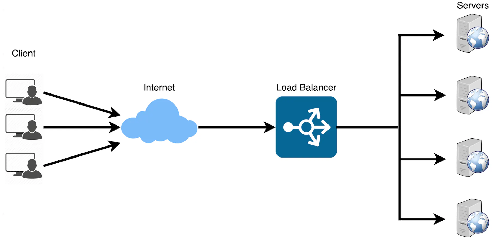
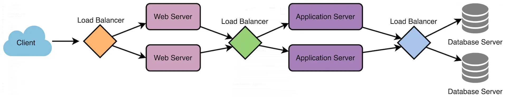

# Load Balancer
* Distributes incoming requests and traffic evenly across multiple servers.
* **Main Goals**: High Availability, Reliability, Making system performant by avoiding overloading a single server.
* **Place**: Between Client & server to distribute load across multiple backend components. 
* **Mitigates** Single point of failure by distributing load. 

* **Where to place load balancers**:
    1. Between User & web Server
    2. Between web servers & internal platform layers like app servers or cache servers , network links.
    3. Between internal platform layer and database

## Terminologies
1. **Load Balancer**: A device or software that distributes traffic based on predefined rules and templates.
2. **Backend Servers**: The servers that receive and process request forwarded by load balancers aka **server pool or server farm**
3. **Load Balancing Algorithm**: Used by LB to determine how to distribute incoming traffic.
4. **Health Checks**: Periodic tests performed by the load balancer to determine the availability and performance of backend server. Unhealthy services are removed from pool until they recover.
5. **Session Persistence**: It is used to ensure **subsequent requests from same client goes to the same backend server**. Maintaining a session state to provide consistent user experience. 
6. **SSL/TLS Termination**: It is used to decrypt SSl/TLS encrypted  traffic at LB to offload decryption burden from backend servers allowing centralized SSL/TLS management. 

## How load balancers works?
1. Step 1:LB receives a request from client or user. 
2. Step 2: LB evaluates the incoming request and determine which server or resources should handle it. This uses **pre-defined algorithms** which factors in **server capacity, response time, number of active connections and geographic location**
3. Step 3: LB forwards the incoming traffic to selected server or resource.
4. Step 4:New Request is processed and response is sent back to load balancer.
5. LB forwards the request to client. 

## Uses of load balancer
1. **Improving website performance**: Like an e-comm website experiences a sudden surge of traffic in sale and it is distributed across servers to ensure that each server handles a manageable number of requests resulting in faster page load times for user. 
2. **Ensuring high availability and reliability**: If one server fails or experiences an issue, the LB can redirect traffic to other available servers, maintaining uptime and minimizing service disruptions. Like in a banking application this can be critical to ensure good performance for users.
3. **Scalability**: LB allows organizations to easily scale their infrastructure as traffic demand increases. Additional servers can be added to server pool to accommodate increase demand. A video streaming platform sees a steady increases in users as it gains popularity. New servers added to LB pool.
4. **Redundancy**: It can be used to maintain redundant copies of data and services across multiple servers, reducing risk of data loss or service outages due to **hardware or device issues.**. Like online file storage services uses LB to maintain multiple copies of user data across different servers. So in situation of failure user can access files from redundant servers.
5. **Network Optimization**: LB can help optimize network traffic by distributing across multiple paths or links, reducing congestion and improving overall network performance. 
6. **Geographic distribution**
7. ion**: For global organizations, load balancing can be used to distribute traffic across data centers in different geographic locations. This is to ensure **users are directed to the nearest or best performing data center** reducing latency and improving user experience. 
8. **Application Performance**: It ensures that each application or services the necessary resources to perform optimally. In an enterprise app we can have a suite of apps including email, file storage and collaboration tools. A LB would assign each their dedicated resources to perform optimally.
9. **Security**: LBs can help protect from *DDoS* as due to distribution it would be more difficult to overwhelm a single target.
10. **Cost Saving**: Due to distributed load we can use resources more efficiently to save **money on hardware and infrastructure and also reduce energy consumptions.
11. **Content Caching**: some LBs can cache static content like images or videos. This would be served directly form LB reducing the demand on server. Like in  Netflix a lot of content is cached at LB to drastically reduce load on main servers.

## Load Balancing ALgorithms
* Factors under consideration: Server capacity, active connections, response times and server health. etc.
### Round Robin - The Simplest
* It distributes the requests sequentially to available servers in *circular order*. 
* Pros
  * Easy to understand and implement
  * Works well when servers have **similar capacities**
* Cons
  * May not perform when servers have different capacities or varying workloads.
  * No consideration of **server health or response times**

### Least Connections
* Directs request to server with lowest number of active connections. This accounts for varying workload.
* Pros
  * Adapts to differing server capacities and workloads.
  * Best for requests that take **variable amount of time to process**
* Cons
  * Increased complexity due to tracking of number of active connections
  * Doesn't factor response time or server health.

### Weighted Round Robin
* This algo assigns **weights to server** based on their capabilities. The requests are distributed proportionally to these weights.
* Pros
  * Accounts for different server capabilities 
  * Simple implementation
* Cons
  * weights must be assigned and maintained manually.
  * No consideration for server health or response time.
  
### Weighted Least Connections
* Least Connection + weighted Round Robin
* **RULE**: Request sent to lowest ration of **active connections to assigned weights**
* Pros
  * Factors in server capabilities and  active connections.
  * Adapts to varying server workload.
* Cons
  * complexity due to tracking of active connections and maintaining server weights.
  * No consideration for server health or response times.

### IP hashing
* This algo determines the server to which a request should be sent based on source/destination IP.
* Maintains **session persistance, ensuring traffic is sent to same server always from specific users**
* Pros
  * Due to session persistance it can be used for apps requiring constant connections.
  * Can distribute load evenly when using well-designed hashing function.
* Cons
  * May not be effective with small number of clients with many requests
  * No consideration for server health response time or varying capabilities.

### Least Response Time
* Directs incoming request to the server with **the lowest response time and fewest active connections.**
* Optimizes for user experience by **prioritizing faster performing servers**
* Pros
  * Accounts for server response times, improving user experience
  * Considers both active connections and response times.
* Cons
  * Complexity - monitoring & tracking **server response times & active connections**
  * Server health or varying capacities is not factored in.

### Custom Load
* Administrators to create their own load balancing algorithm based on specific requirements or specific requirements or conditions.
* This may include server health, location , capacity and more.
* Pros
  * Highly customizable allowing for tailored load balancing.
  * Can consider multiple factors.
* Cons
  * requires custom development and maintenance, which can be time consuming and complex.
  * May Require Extensive testing to ensure optimal performance.
* **Example**: An organization with multiple data centers around a world develops a custom load balancing algo that factors health , capacity and geographic locations. This ensures that users are directed to nearest healthy center.

### Random
* Requests are sent to randomly Selected servers from the server pool. 
* This is useful when all servers have similar capabilities and no session persistence is required.
* Pros
  * Simple
  * Can be effective for servers with similar capabilities
* Cons
  * No consideration for server health, response times etc
  * May not be suitable for apps requiring session persistence.
* Example:: A static cdn uses random algo to distribute requests for js files, css and images among multiple servers.

### Least Bandwidth
* Sends request to server with least amount of current bandwidth consumption. 
* It ensures servers are not overwhelmed by network traffic.
* Pros
  * Considers network bandwidth usage which is useful for network resources.
  * Provides effective load balancing for servers with varying capabilities
* Cons
  * Complexity due to tracking and monitoring of bandwidth
  * Doesn't factor server health, response times, or active connections.
* **Example**: A file hosting service may use this to ensure that servers with high traffic are not overwhelmed wand the file downloads are fast and reliable. 

