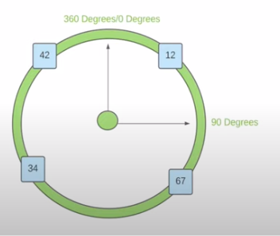
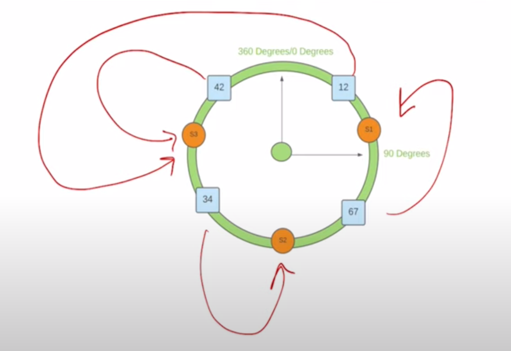
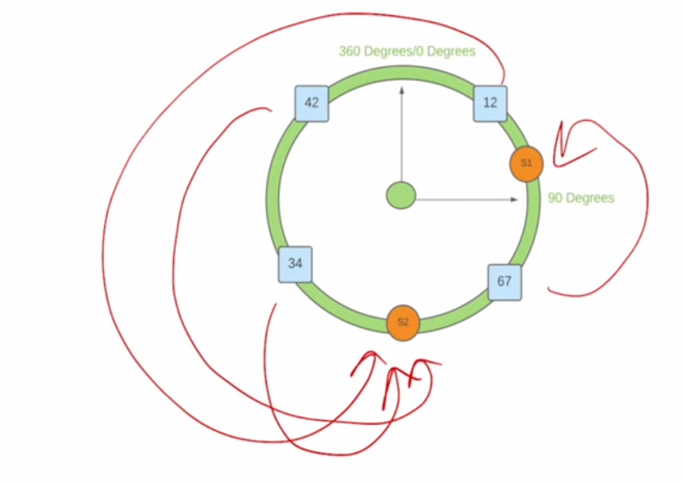

# Consistent Hashing
> **CODE IMPLEMENTATION**: [Here](https://gist.github.com/VarunVats9/5b785b7aed29eddfaf3436f16f607bcc)
* This is most commonly used to **distribute load evenly in stateful services**. This distribution scheme is independent of number of servers.
* Another approach for this would be **modulo hashing** but problem is whenever we add/remove a new server, a majority portion of key needs to be re-hashed. 

## HOW TO 
* We try to put hash generated value on our circle(hash ring)
* Let Say: 
    * Hash Output range: [0-100]
    * Angle on circle: [0-360]
    * Hash of values to store: [12, 42, 34, 67] - These values need to be mapped on the circle. 
    
* Now to map which server these values should go to: 
    * **CONCEPT**: Using a hashing function, Server needs to mapped on the same circle. The server hash should also lie in same hash output range. 
* Mapping of values to server. 
    * We can either go clock wise or anti clockwise. 
    * Every values will sit on the next server it finds in clockwise/anti clockwise direction. 
    
* **Removing Servers** 
    * Lets say we remove a server from the circle. So more request will map to the first mapping server. There will re-mapping of keys required but it will lesser compared to other approaches. 
    
* **Problem with this- Un Even Distribution of Keys**
    * Some servers may get overloaded when a server is removed due to uneven distribution of keys. 
* **Solution**
    * Creating replicas of server
    * This will also solve the problem of re-mapping. 

## LINKS
[Further Reading](https://www.toptal.com/big-data/consistent-hashing)
[2](https://www.youtube.com/watch?v=bBK_So1u9ew)