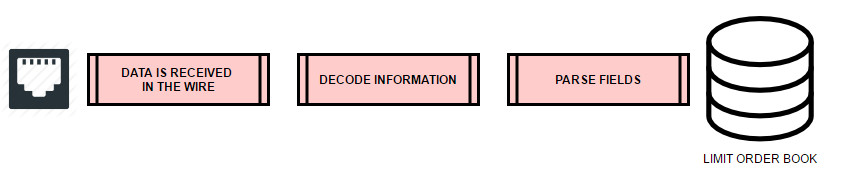
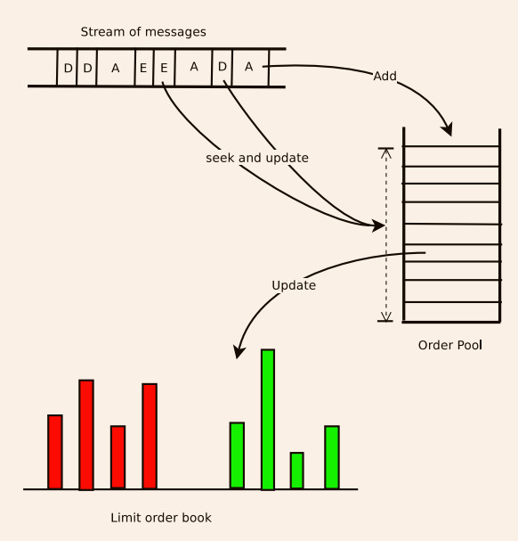
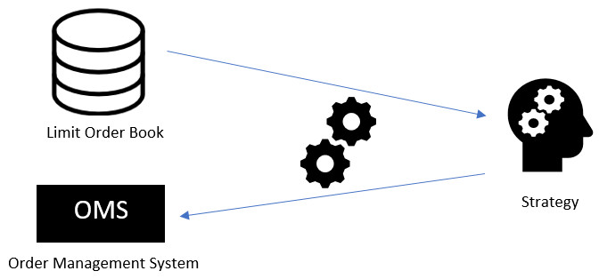
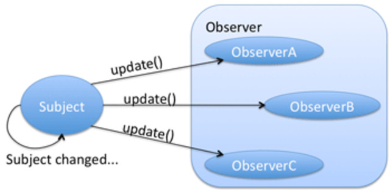
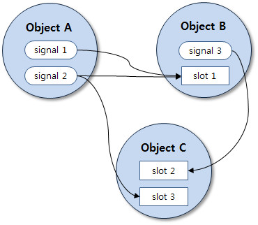
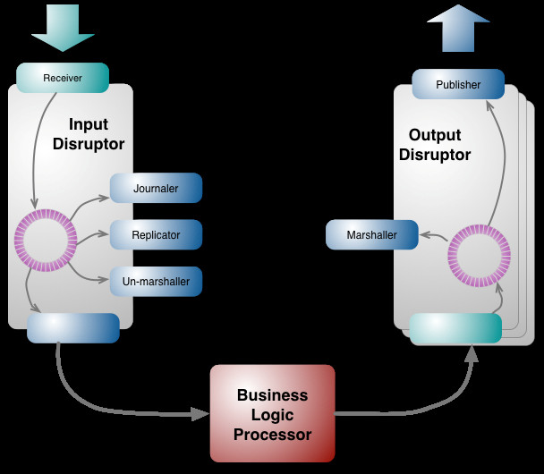

# Low latency Trading System
## Key factors 
* Handle big amounts of incoming information 
* response time to external events
* internal response times
* highest throughput and lowest latency

## Challenges 
* system should not under perform when new strategies are added
* Order book re-construction from different venues , we should be able to handle data from different sources which may follow different protocols and aggregate them into an internal data structure 
* Apart from network and communication latency there will decode/parse latency. Parsing is string manipulation hence will be very expensive from CPU cycles and memory point of view. 

## DATA FEED HANDLER 
* Without accurate data feeding no algorithm will be able to make correct decisions 
* **RESPONSIBILITIES** : capture market data from different venues and keep a representation of venues limit order book 

* **NOTE**: The link between venues and your system is usually made using FIX protocol, so we have to put a FIX engine, in order to communicate with them (receive and send messages) and provide the core infrastructure that interfaces and manages the connectivity into the venues using FIX protocol.
* We will receive market information and strategies will send orders. 
* We can have our own FIX engine or use commercial engines but big orgs/banks prefer own as to have complete code ownership
* **NOTE**: FIX trading has become slower so we use binary protocols like **FAST, ITCH/OUTCH**

## Limit Order Book 
* once we have connectivity with the venues, we need to **update all the events reported by them(order update add and deletion)**
* For each event we generate we need to make changes to internal order book. 
* Choice of data structure is important here because at scale we need fast searches and deletions/updates

* Use array one for bids and one for asks and pre-allocate as much memory as you can as dynamic allocation is expensive. 

## Order management systems: OMS
* this module will manage all orders sent to the venues, based on signals generated by your strategy 
* handle **sending,cancelling, replacing orders as well as accessing information about executed order, including pending and open orders.**
* We must send these orders in a very efficient and cost-effective manner, routing each order, depending on one or more of the following:
  *  the signal strategy
  *  venue costs
  *  latencies between venues
  *  best prices available
  *  shares or contracts available on each venue
* it should also be smart enough to know when an order was: 
    * Rejected or canceled by the venue
    * Partially filled 
    * Fully filled

## Strategies 
* Strategies take limit order book from ech venue and make defined decisions based on different parameters and values. 
* Some strategies need to analyze the entire depth of books, others just top of the book prices, that is the best bid and best ask 
* **Simple latency strategy** each venue recieves market information at different times, and if our system can be faster enough we can take advantage of that price gaps. Usually these discrepencies last no more than 500 microseconds, and after that all market participants balance themselves. 
* **'triangular arbitrage'** - this is an arbitrage where there are price discrepancies between 3 currency pairs. Forex is traded in pairs, i.e. EUR/USD EUR/GBP EUR/CHF. What can happen during a big market event, for example, a failed coup in Turkey as an extreme example, EUR/USD will move faster than it should have to keep in ratio with the rate of EUR/GBP. That can be just a market function, traders sell EUR/USD before EUR/GBP without algorithms. Or, large orders can cause the difference between EUR/USD and EUR/GBP to be off slightly. Even if only off by a fraction of a dollar, this can lead millions in profits if you are fast enough.

## Software architecture 
* basic architecture looks like this : 

* we can use various software design patterns: 
### Observer design patterns 
* in this an object, called the **subject** maintains a list of its dependents called **observers** and notifies them automatically of any state change 
* This is fine but if you have multiple strategies running on the same system, the notification process will be processed one by one. Meaning the subject will first notify strategy1 to do its calculations, send orders if some criteria are met, and then continue strategy2 again do the calculations and see if some criteria are met. This is **Sequential process**

* Here observer is the **Strategy** where as subject is **the order book**
* The order book will send notification once any price has changed, so all strategies can receive it and act on it. if the strategy is met creteria , will trigger order to update. 

### signals and slots pattern 
* it is used for communication between objects or processes. The underlying implementation is similar to the observer pattern and 
* Its **concept** is that **observer can send signals containing event information which can be received by others using special function known as **slots****

* All types of event/messaging/signal patterns are kind of observer pattern, so is not suitable for my purposes of low latency

### Ring buffer pattern very performance effective and is implemented in various low level application
* It is a circular queue data structure 
* it has FIFO characteristics 
* It has **two indices** which represent from where the process can read and where the process can write 
* **No Collisions** will happen, which means **no need for synchronization** 
* this type of data structure is called **lock free** and performance is beyond other patterns.

### Busy/Wait or spinning 
* this is not categorized patterns it is considered anti-pattern, but when designing ultra low latency system we dont care about best practices 
* The process wil be tight loop waiting for something that loop will consume 100% of CPU cycles 
* in our case we will be reading market data from our limit order book modules and if we meet certain strategy creteria, we will send specific orders to execute that trade, this will be fastest way to get data to modules 
* But not only that, having this kind of process, we mostly will be avoiding cache misses and CPU’s context switching.
* **NOTE** Using this type of methods, threading model, I/O model and memory management should be designed to collaborate with each other to achieve best overall performance. This goes against the OOP concept of loose coupling, but it’s necessary to **avoid runtime cost of dynamic polymorphism**.

## Position & Risk Management 
* All orders sent by the strategy should be consolidated in positions, so you can keep track of your open/close orders and most important, how your exposure to the market is.
* Ideally your strategy should keep a flat exposure 
* from havin stop loss per position or overall exposure to portfolio managemnt, the risk module is an import piece that will interact with your strategy and will be monintoring in real time all open positions 
* **the popular risk management rules**
    1. **Position Limit**: Control upper limit of positins 
    2. **single order limit**: control the upper limit of volumes of single order 
    3. **money control** control the margin of all positions not to exceed the balance of the account
    3. **illegal price detection** ensure the orders from different stragies will not cause posibility of trade between them 
    5. **Self trade detection**
    6. **order cancellation rate** calcute the order cancellation situation and ensure it does not exceed the limitation of exchange 

## monitoring systems
* system that must be able to open and close position within milliseconds