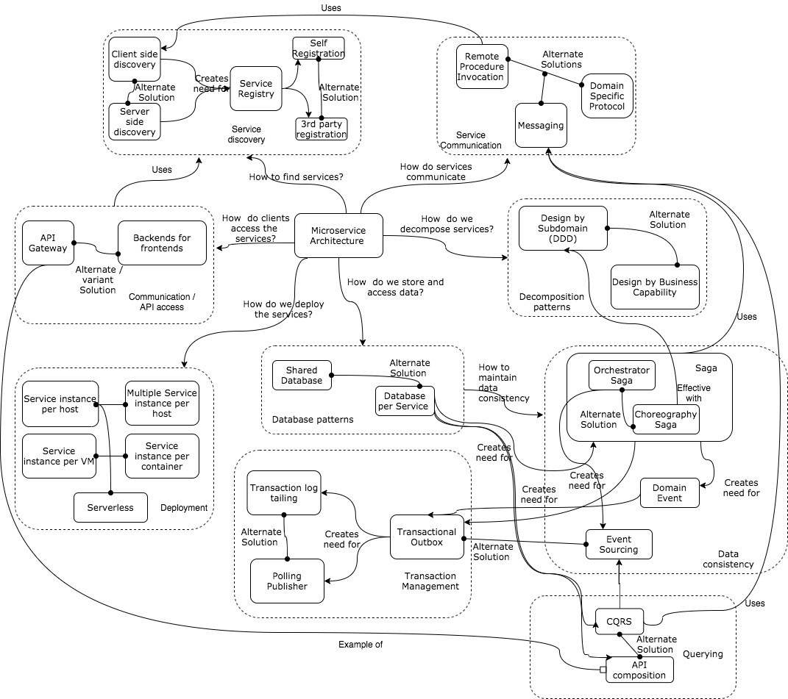
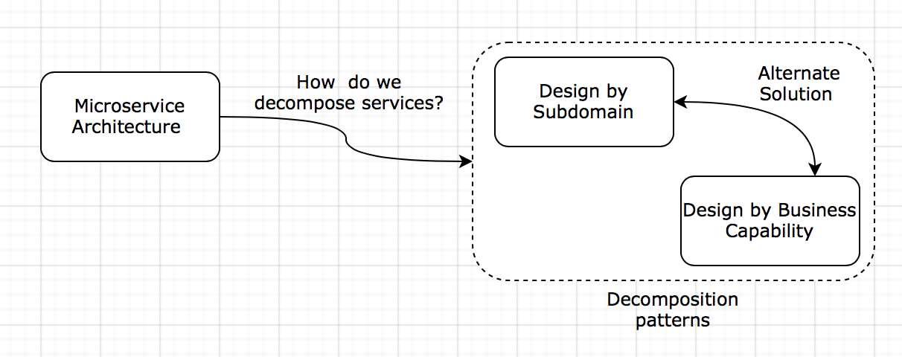
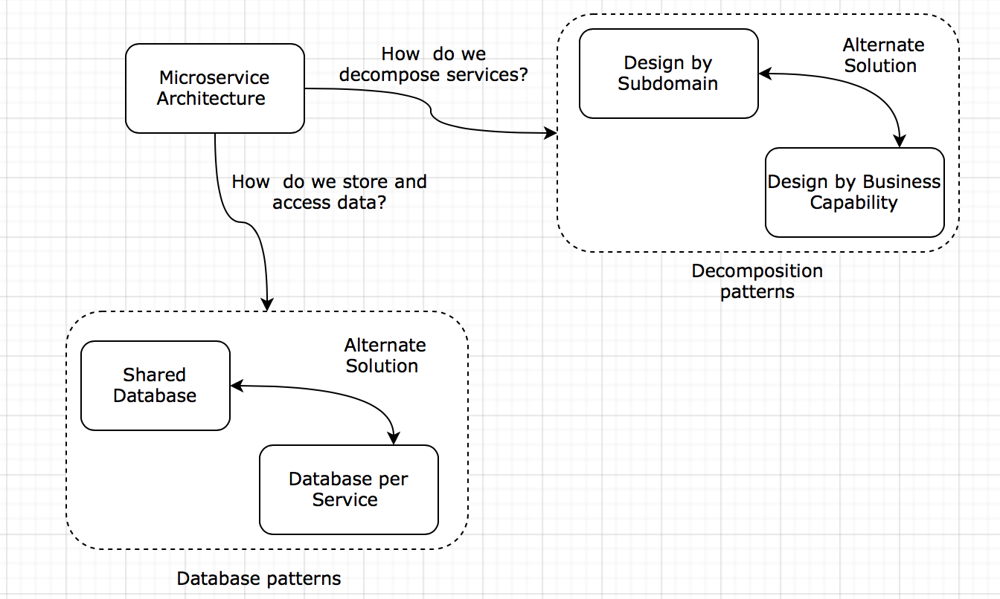
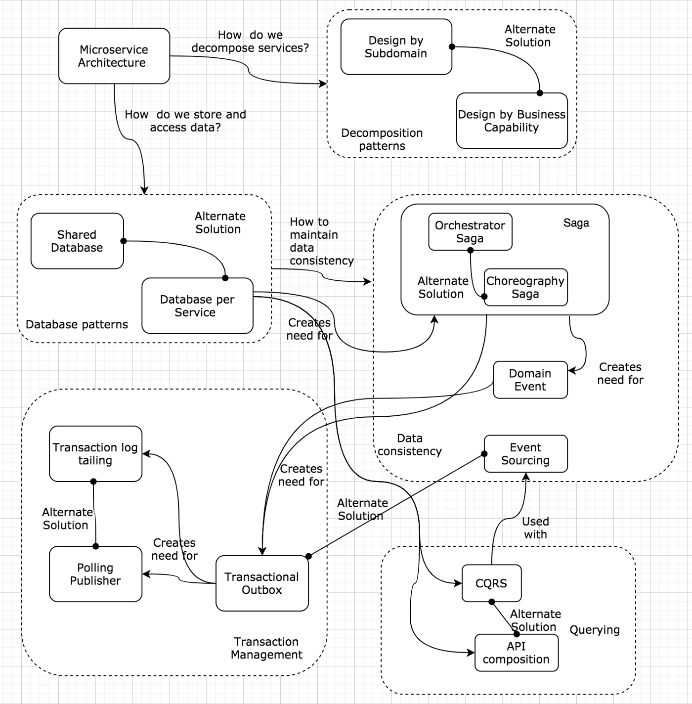
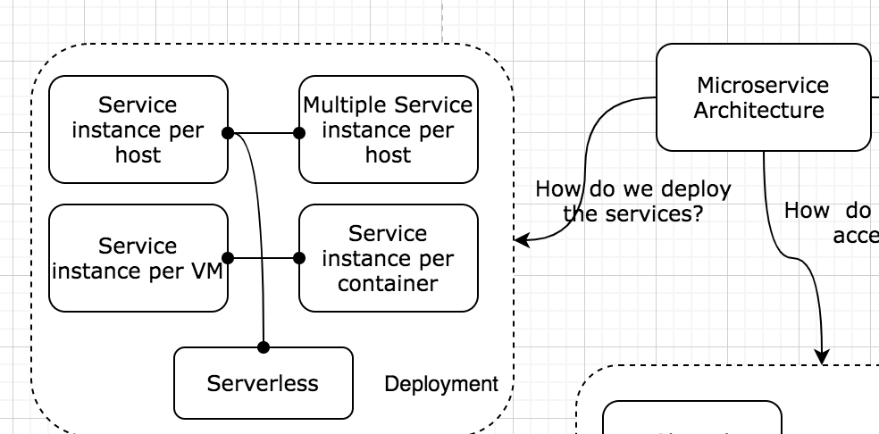
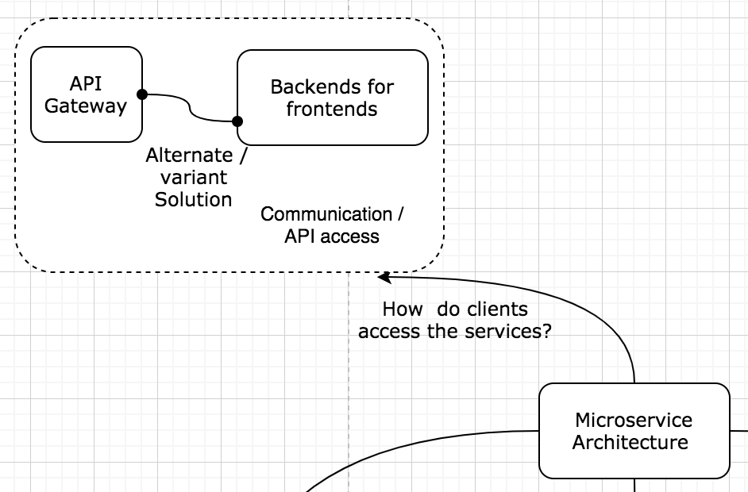
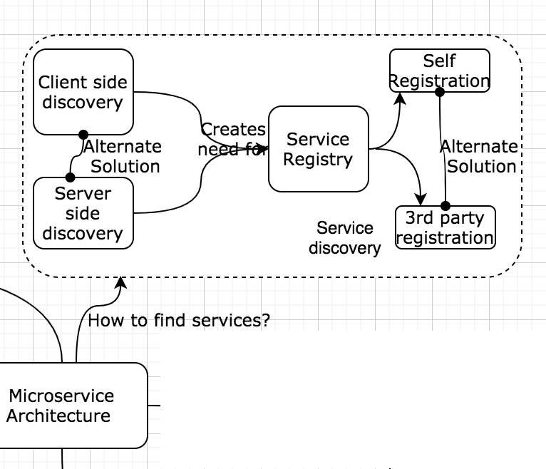
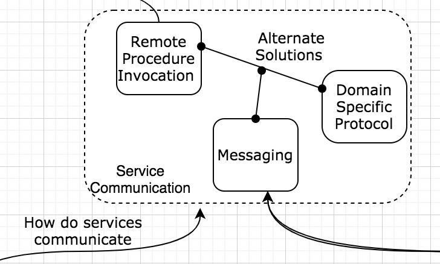

# Mind Mapping Microservice Design Patterns

## MIND MAP 

## How to decompose the application into microservices?
* Monolith to microservices: Decompose applications into smaller components.
* **Challenge**: Define boundaries for this microservices.
#### Guidelines for Cohesive & Loosely coupled System
1. **Single Responsibility Principle(SRP)** 
2. **Common Closure Principle (CCP)**: All classes need to change for a business reason, are part of same package. 

## Decomposition Design Pattern 
#### Decomposition by sub-domain (DDD Principle)
* modeling the software services as per the domains and sub-domains of the business and evolve the software as an understanding of the domain evolves and changes.
* business domain & services follow **Common Language**
* **Challenge**: defining the subdomains and requires an understanding of the business
#### Decomposition by business Capabilities
* Modeling services as per the capabilities supported by the business groups. 
* As business capabilities are relatively stable, so arch is also stable 
* It could be similar to **grouping them by sub-domains** 

## Database Architecture
#### Shared Database
* Microservices may continue to use shared databases but data should maintain **ACID Properties** to keep data consistent across different services. 
* Simpler to manage & **sufficient if appln is smaller** 
* multiple services can have shared data model. 

#### Database per services 
* Keep each services data in it's database. 
* The data will be private to the service.
* This data schema can change on it's own will + each appln can chose database based on its own need. 
* **Challenge**: Combining data from multiple services for end user can be challenging. 

## Data Consistency Pattern
#### SAGA Pattern
* Used to maintain data consistency without using distributed transactions. 
* In this a series of transactions are involved hence the name SAGA
* **A transaction in one services updates the database, ad trigger actions to notify next service about their transaction** 
* 2 Popular way to communicate transaction b/w services 
1. **Choreography/Events** 
    1. One transaction in service publishes events that trigger the transaction(s) in other service(s)
    2. Each service produces and listens to the other service’s events and decides to take appropriate action
2. **Orchestrator/Command**
    1. A coordinator service is responsible for centralizing the saga’s decision making and sequencing of business logic.

*  if a transaction fails; then the saga executes a series of compensating transactions to rollback the changes made by the previous transactions, which makes the implementation complicated.
*  decompose the micro-services based on DDD and organize the business logic of service as a collection of DDD aggregates which omit domain events. These domain events are published by service and consumed by other services.

##### Factors for success of Orchestrator based SAGA 
* for success its important that database update and publish of events/messages to be an atomic transaction. 
* Distributed transactions cannot update database & broker atomically. There are two patterns to achieve same 
###### Transactional Outbox
* Instead of directly sending the message to the message broker, the message is saved in the first service’s database as part of the current transaction. This achieves internal consistency within the service. If the transaction is unsuccessful and rolled, then no message is saved in the outbox table; thereby avoiding any “ghost” messages being sent.
*  separate message relay can be used to forward the message stored in the outbox by publishing them as events to the message broker
* 2 Mechanism to build message relay: 
    1. **Transaction Log tailing**
        * Tail db transaction log (commit log) 
        * The committed inserts into the database OUTBOX table are recorded into the database transaction log which can be tailed/read and each change is published as an event to the message broker.
    2. **Polling Publisher**
        * This solution publishes messages by polling the database’s outbox table. This option works with any SQL database but may not work with all NoSQL databases where the query pattern is more complex.

###### Event Sourcing 
* The basis of this pattern is that when you do something to a domain entity; that can be treated as a domain event. Event sourcing persists the state of each domain entity as a sequence of state changes/domain events. Every time the state changes, a new event is appended to the list of events. This list can be replayed to identity the current state of the entity. These events are persisted in an event store, which acts as a database of events. This is a reliable audit log of the changes made to a business entity.

## Data Querying Patterns
* In case of database/service, querying data is complex where joint data is needed from multiple services. 
* Implementing queries that span multiple services are supported by 2 known approach: 
    1. **CQRS**
        * Seperates responisibility of read and writes into seperate models. 
        *  **Commands** (write operations) should ideally be done as task-based and can be placed in a queue for synchronous operations. 
        * **Queries** (read operations) do not modify the database, they just read the data from a consolidated view. 
        * For greater isolation, the read and write data can be physically separated and that would require the write model to publish an event to update the read store. 
        * When this model is used with event sourcing patterns, the store of the event is the write model and a replay of those events works for the read queries as well where applications use queries to reconstruct the state of the entity.
    2. **API Composition**
        * Implement queries by defining **API composer** 
        *  This invokes the individual services that own the data and does an in-memory join of the data to form the end result. 
        * **API Gateway** is a classic example of this pattern
    

## Service Deployment
### Service Instance per Host 
* Purest form of **isolation/segregation** 
* No possibility of any resource conflict among services and each service can use maximum resources available on host. 
* Easy to manage monitor and change deployment 
### Multiple Service Instance per Host 
* More **efficient** as multiple services run on single physical or virtual machine.
* Introduces some **risk of conflicting resources and limit of resources** for each instance. 
* hard to monitor resource utilization of each service.
### Service Instance per VM 
* Developers can choose to bundle/package their applications as a VM image and then deploy the VMs on the cloud environment using only the bare/compute instances of the cloud environments. 
### Service Instance Per Container 
* deploy each service instance as a container. 
* multiple mechanism to manage and orchestrate these containers like kubernetes, mesos, etc
* each service is **isolated within container and have resource limits**
### Serverless 
* The developers just need to package their code and upload it to the cloud along with the desired performance requirements. Each cloud provider has its own mechanism of running the code as a service instance.

## Accessing API clients
* mservices provide functionality through fine-grain APIs, the client may need to interact with multiple services to get the business response. 
* Types of client may be different but still need to work in same fashion. 
### API Gateway 
* service becomes the entry point for all calls coming from external clients and it can then route the requests to the other services by simply proxying/routing the request to a specific service or by fanning out the request to multiple services.
* It could provide different type of API for each different client. 
### Backend for Frontend 
*  Instead of having a single service/gateway to handle different types of clients by providing different APIs, this pattern defines a separate API gateway that provides a single API for each different type of client.

## How gateway will find other services?
* In **monolith**,  it is easy to find other components/services as they are part of the same application and the applications are hosted on machines with a dedicated IP address and port.
* In **microservices**, the independent services can be deployed separately and may be running in containerized or virtualized environments or the VMs may be assigned IP addresses dynamically. In such cases, the location of the service is not so well-known.
* **Clients** can use **client-side discovery** or **service-side discovery** to find location of the services using any of discovery platforms. 
### Service Registry
* Database of services with their location and instance details. 
* Service can register on startup and deregister on shutdown. 
* Clients or other services needed to use a service will lookup the Service registry to find the coordinates of the needed service
* **Example**: Apache Zookeeper 
* Services can register themselves with the service registry using a **self-registration pattern** or a 3rd party can register service instances with the service registry using a **3rd party registration pattern**.
### Client Side Discovery
* the logic of searching for the service location in the registry needs to be on the client-side. 
* Requires much lesser network hops to find service 
### Server-side discovery
* Instead of the client directly accessing the service registry as mentioned above; the client just calls an intermediate router like the load balancer which in turn invokes the service registry to get the service instance location. The router then forwards the request to the service instance found. The client code is much lighter in this case as it does not need to have the logic of accessing the service registry.

## How services Communicate with each other?
* **synchronous communication** introduces tight coupling between services 
### Remote Procedure Invocation
* REST is one technology which follow this pattern 
* Client uses request reply model
* NO intermediary or Broker so client needs to locate the service on its own so client side service discovery. 
### Domain specific protocol 
* The services can use protocol specific to their function to connect with each other. e.g. email services can use SMTP/IMAP
### Messaging 
* The messaging pattern could follow the standard request/response model where the sender expects a reply, a notification model where the sender just sends a message without expecting any reply and also a publish/subscribe model where the sender sends the message to a common location without knowing who the receivers of the message would be
