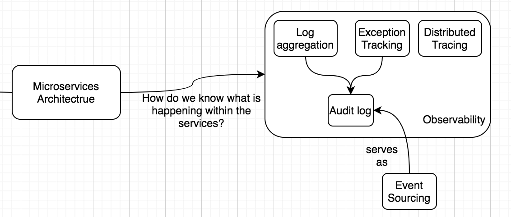
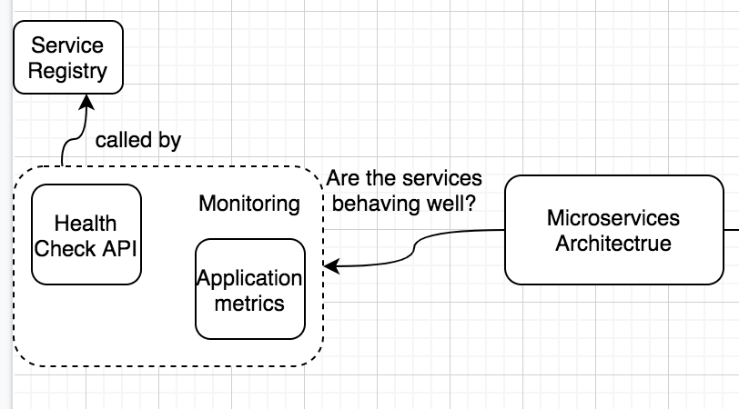

# Mind Mapping Microservice Design Patterns Part 2

## What is happening within services?
* Post successful deployment which was discussed in part1, while running, we need **observability** which can be **queried & analyzed** later. 
* For **Distributed Systems**, all services need to be able to write the logs into a common location or a **central logging system** where the **logs are aggregated**.
* **Exception Tracking**, the exception needs to be logged in a central service and de-duplicated to avoid noise.
* To **different logs** between requests, we need to **instrument the services code to add a unique ID** for each external request and this request ID should be passed on all downstream services to include this ID in the log messages for this request operations. This enables **distributed tracing**
* **User performed operations** needs to be tracked. **user behavior** needs to be tracked as an **audit log**. 
* **event sourcing** can also serve as **audit logs**

## Are services behaving well?
* In previous step, we got to know **what's happening in the system?** using which we can determine **health & performance of system**
* Using **observability Information** we can check is **thresholds are getting breached**
* **Health Check API** : This can tell us about health of system, using which we can determine running service instance can handle request. 
    * **Network connection to system**
    * **Physical Status of Host** 
    * **some specific aspect of application running**
* **Health Check API** can be called by **service registry / load balancer/ dedicated monitoring service** 
* **Monitoring** also relates to knowing **the expected levels of service are being met** by collecting **application metrics** about individual operations. 
* This **metrics** can be used for **alerting / reporting** by using either **pull/push** model. 

## How to make services more resilient?
* Services proactively made more resilient to be able to gracefully handle the error and/or recover from the failure themselves.

### Bulk Head 
* A ship has bulkheads or partitions that prevent the entire ship from drowning by letting the water fill in only in the damaged sections
* This patterns **isolates services into pool** so if few services fail, it only impacts that pool. So, the application can continue to run in **another pool**
* Services instances could be partitioned on basis of: 
    * **Consumer Load** 
    * **Availability Requirements** 
    * **Business Needs** 
    * It is also good to **partition resources** like connection pools along with services. 
* VMs and containers offer a good deployment mechanism when partitioning services 
 

* A lot of times errors can be **transient** so instead of isolation on first failure we can add **retry pattern**
* **Retry Strategies**: 
    * **Retry**: 
        *  helpful if the failure detected is unusual or rare
        * Done when immediately retrying the same operation on same service is likely to result in success. 
    * **Retry after delay**: 
        *  if the failure detected is due to an issue that may likely get resolved in some time like connectivity issues or busy services. The application should wait for a suitable (potentially configurable) amount of time and retry the operation.
    * **Cancel**: 
        * helpful in cases where the **failure doesn’t seem to be transient or unlikely to succeed on a retry**
* Depending on the service and the failure, the application could specify the retry strategy, the number of retry attempts, and/or the time gap between retries.
* the retry operations should use the **Idempotency** pattern to avoid the same action being performed twice.
* **NOTE**: If the request fails for a certain number of times, it is best to take that service/pool of services out of operation and prevent the requests from going to that service. A **mechanism should be decided to bring back the service to action** 
 

* **Circuit Breaker**: It can be combined with retry pattern
* This pattern, tried to prevent operation from happening which is likely to fail. 
* This helps save **CPU cycles** when appln failures is likely to **take some time to get fixed** 
* Once the failures reach a certain threshold, the circuit breaker **trips**, and further calls to the operation result in an error.
*  The proxy object waits for a **timeout period** (the logic is customizable) and beyond that point, if the failure appears to be resolved, it will allow the application to invoke the operation.
* We should have retry logic with circuit breaker to make system more efficient. 

* **QUEUE BASED LOAD LEVELING SYSTEM**: This helps defend our service with sudden **flood of requests** by converting it of manageable load. The service can pull message from this queue @rate it can process. 
* 