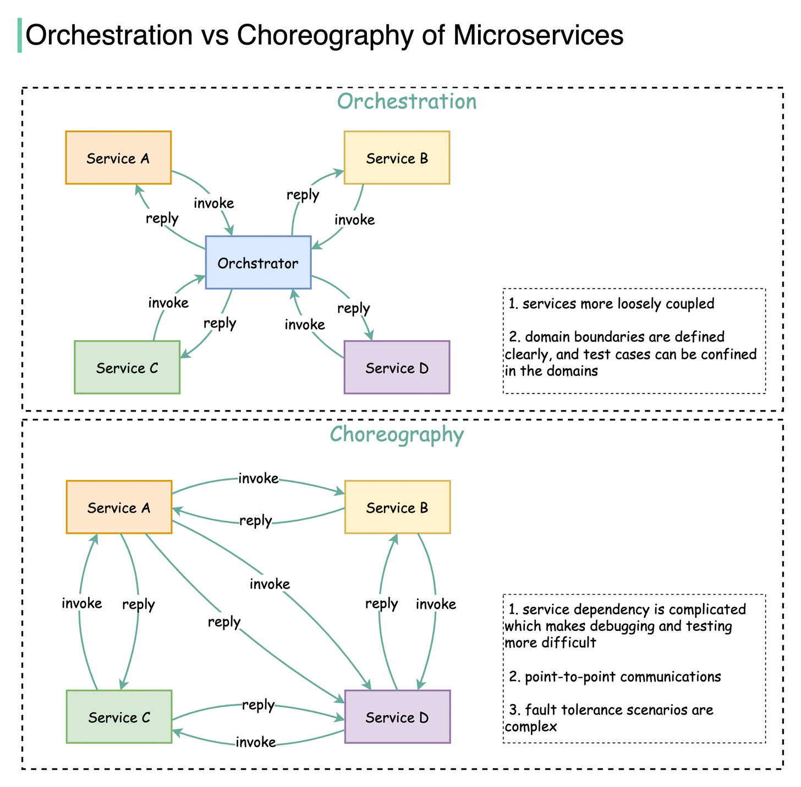

# Orchestration and choreography

## Orchestration 
* Orchestration promotes a centralized approach in which a controller process calls each of the services involved in the transaction, monitors the results and then either calls the next service or performs a rollback
*  When the orchestrator aggregates a series of lower-level calls to help build a webpage, it's called the **back ends for front ends pattern.**
*  If one service in the chain fails, then the process fails and must start over. 
* if the orchestrator goes down, the whole process fails.
### Disadvantages
* Interactions are occurring across the network, invocations take longer and can be impacted by downstream network and service availability.
* **Tight Coupling**: 
* **Reliance on RESTful approach**
## Choreography 
* This is another way to solve saga problem. 
* web service simply drops a request on the event bus and the bus distributes work between the connected components of an application. Each service works independently and consumes the data that relates to it to perform its task.
* Choreography can be more complex and difficult to understand than orchestration, because of its decentralized approach
### Advantages
* Loose service coupling for agility and fault tolerance 
* Adding and removing services is much simpler
* Faster, more agile environments 
* more consistent, efficient applications 

## Finding when to use what?
*  Orchestration typically works best for services that are transactional or dependent on others to complete a task successfully
* choreography is a good fit for work that is asynchronous, runs independently and can be decoupled.
* We can consider hybrid approach 
