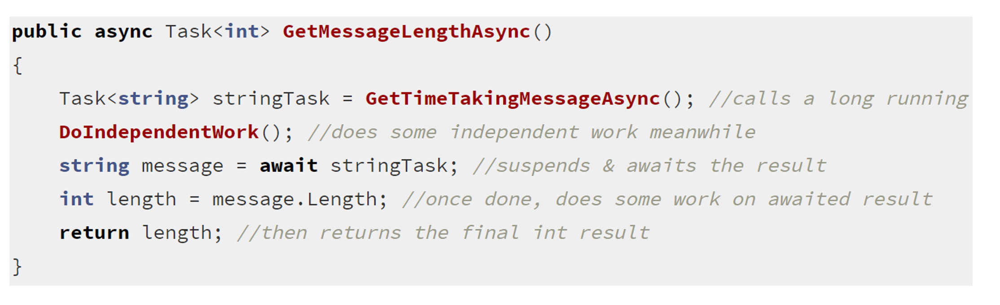
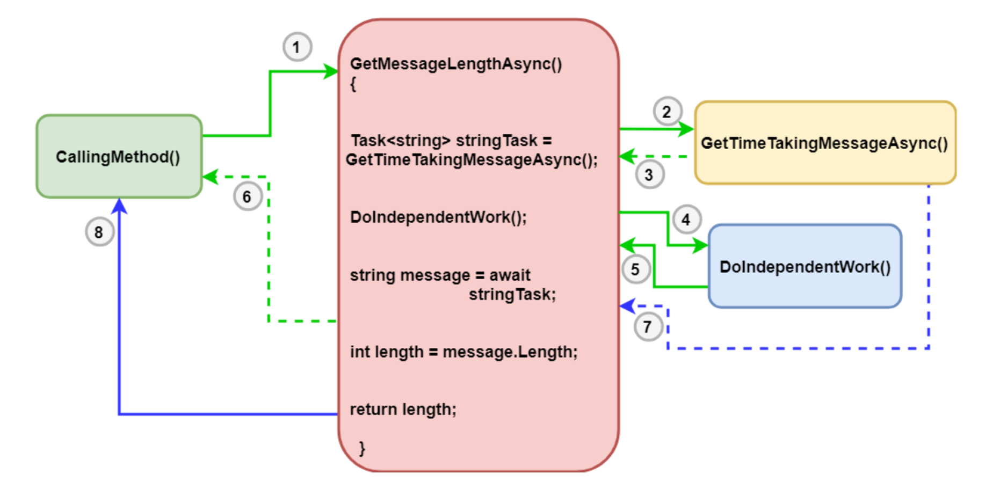

# Async And Await 
* Introduces in **C# 5**
* The code is written like sync programming but doesn't keep **calling thread busy**
* Method Signature is marked **async**
* Method uses **Await**on a **Task** to get result
* Return type i **Task\<T>** or **Task** instead of void
* Method name is suffix with **Async**

## What happens with Awaited Code? 
* First check **work is already complete** 
    * If yes: coe continues executing synchronous code blocks 
    * If No: The current thread **suspends the workflow of the metho, captures the current context and returns from the method to the calling method**
* Current thread continues with other task from calling method. 
* Once that task completes, the **method resumes from the await point on the captured context.**

## Example 


* GetMessageLengthAsync() calls **long running task** GetTimeTakingMessageAsync() and get Task\<string> 
* While async task is running method calls **DoIndependentWork()**
* When execution comes @ await, the metho suspends the current workflow and waits for long-running task to complete asynchronously without **blocking calling thread**

* Now, the thread that originally had called GetMessageLengthAsync(), gets free at this point, leaves the method and gives control back to the original calling location. Once the Task is completed, it continues execution from this point, does some processing dependent on the Task result (int length = message.Length) and finally returns the int result

## Detailed Explanation


1. First an external method, say **CallingMethod()** calls our **GetMessageLengthAsync()** method. Let’s call the thread that makes this call as the **main thread**(the green lines)

2. GetMessageLengthAsync() makes a call to another async method on the same thread, just like any normal code execution
3. Now, this method GetTimeTakingMessageAsync() being an async method, **returns control immediately**, leaving the work of getting message to be done in background
4. Now, GetMessageLengthAsync() continues its execution normally and makes a call to a method called DoIndependentWork() that does not depend on the message result from GetTimeTakingMessageAsync(). This is called **synchronously on the main thread**
5. After DoIndependentWork() completes, control of execution comes back to GetMessageLengthAsync()
6. Now the execution hits the line with the await keyword, which instructs the method to **wait asynchronously (not block) for the message**. At await, the main thread suspends the work on this method, and returns to CallingMethod() where it is free to do other stuff. Just before this,** CLR captures what is called the synchronization context** 
7. At a later point of time, when the message is fully received, the continuation of the rest of the code is invoked. Now **depending on the captured context**, **the rest of the code might run on the same main thread, or another thread**
Finally, the rest of the code is executed and upon completion the final result is returned to CallingMethod()

## Threads in Async Await , CPU-bound & I/O bound 
* **QUESTION 1** Important question is **Is any new threads create for an async process to execute?** Answer is no - but if it requires additional threads they are taken from **managed thread pool**
* **QUESTION 2**--- **When is a thread from thread pool used? if a thread pool thread is not used, how does the async work complete without a thread?** TO answer this we need to different between **two types of work** done async:   
    * **CPU Bound**
        * Work which requires heavy computation. It uses a **dedicated thread from thread pool** 
        * For this await operation is started on a **background thread** with Task.Run method**
        * If a work is appropriate for **concurrency and parallelism** consider using **Task parallel library** 
        > **NOTE** Keep in mind to measure execution of your code, if CPU bound task is *not costly enough** compared with *overhead of context switches when multi-threading**
    * **I/O Bound** - work which depends on outside CPU tasks. It may not need dedicated thread but only **time slices of thread(s) is required** for start/stop/progress notifications
        * For this the await operation return Task or Task\<T> 

## Deep Dive Task and Task\<T> for an I/O-Bound Operation
* A key takeaway for I/O Bound task is there is no dedicated thread for running the task. No thread is waiting for data to comeback. 
* Lifetime: 
    * Time spent on everything until async method arrives at an await & yields control back to its caller. 
    * Time spent on IO with no CPU cost. 
    * Time spent for passing control back to the async method, at which point it continues its execution sync
* For a server scenario, this means that,**because there are no threads dedicated to blocking on unfinished tasks, the server thread pool can service a much higher volume of web requests.**
* For a client scenario, this means **increased responsiveness by not blocking the UI thread until a specific operation is complete.**

## Deep Dive Task and Task\<T> for a CPU-Bound Operation
* In the context a CPU-Bound operation, because the work is done on the CPU, there's no way to get around dedicating a thread to the computation.
* The use of async and await provides you with a clean way to interact with a background thread and keep the caller of the async method responsive.
> **NOTE**: This does not provide any protection for shared data. If you are using shared data, you will still need to apply an appropriate synchronization strategy.


## Blocking vs Non Blocking Code 
* **Blokcing Code** is code which blocks execution of the current thread for a specified amount of time untill another operation is completed. 
* The Thread waits synchronously
```
System.Threading.Thread.Sleep(1000);
var myTask = client.GetStringAsync("url");
myTask.GetAwaitter().GetResult();
myTask.Wait();
```
* **Non Blocking Code**: The current thread is free to do other things during waiting. This means the developer can provide work to original thread while awaiting is task. 
* This means the **UI Thread** can remain responsive to other user interactions. 
* Without no GUI also we get **greater stability, allowing a single server to handle more request concurrently. 

## Blocking && Non Blocking Excercize
```
void OnButtonClick(){

    DownloadAndBlur("url")
    ShowDailog("Success")
}

DownloadAndBlur(string url){
await DownloadImage(url);
await BlurImage(...);
await SaveImage(...);
}

```
* The success dialog will be displayed before the download/blur operation completes. 

## Demystified Async Await 
* let say you want to do GetDataASync and then with Task you get you want to do PutDataAsync() passing result of GetDataAysnc() which return a task and then we can print done. Code: 
```
Task<int> t = GetDataAsync();
t.ContinueWith(a => {
    var t2 = PutDataAsync(a.Result);
    t2.ContinueWith(b => Console.WriteLine("done"));
});
```
* the begining of async methods runs like any other method untill await is encountered(or exception is thrown).
* 

### Synchronization context 
* On Await, the awaitable will capture the current **captured context** and later apply it to the remainder of the aysnc method. 
* **Captured Context**: CLR remembers the execution context before suspending the work at await at tried to re-apply it on the continuation. 
* For UI it will run on same UI thread, for ASP net core it will run get to same HTTPContext/previous context. 
> For application with no context such as console, the continuation runs on any ThreadPool thread. 
* For cases where you dont need to go back to old context you can do this by calling **ConfigureAwait** and passing false. 

### Awaiter Pattern
* Await operation is just a syntactical sugar: 
* For a type to be awaitable: 
    * it needs to have following method: **INotifyCompletion GetAwaiter()**
    * The return type of GetAwaiter method needs to have:: 
        * IsCompleted property of type bool 
        * GetResult() which returns void 

### Behind the compiler scenes
* At some point, after an await is encountered, a method needs to **wake up** and complete that code after await 
* If you see call stack you would see: 
    * **AsyncStateMachineBox.MoveNext()**
    **AsyncTaskMethodBuilder.SetResult()**
* This means compiler is building lot of code behind our back to kep **track of execution state**
* Whenever the compiler sees an **async method in our code, it turns it into a state machine** which is actually a class. 
* The compiler generated class **implements IAsyncStateMachine interface** . it encapsulates all variables of your method as fields and splits your code into sections, that are executed as **state machine transaction between states**. 
* This is done to ensure **a thread can leave method and when ti comes back, the state is intact** 
* This class has methods: 
    * **MoveNext** - Moves the state machine to next state
    * **SetStateMachine(IAsyncStateMachine)** - Configures the state machine with **heap allocated replica** 