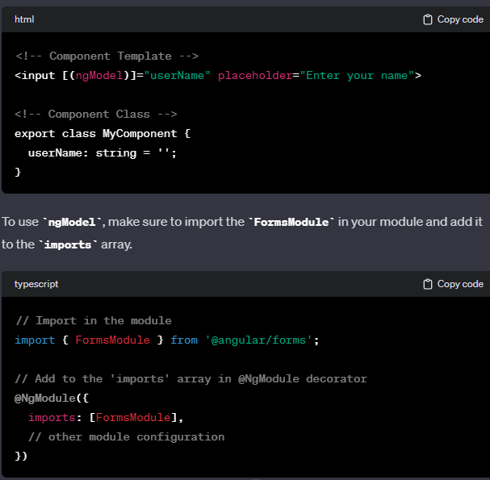

- [Angular Cheat Sheet](#angular-cheat-sheet)
  - [Creating a new Project](#creating-a-new-project)
  - [Angular Fundamentals](#angular-fundamentals)
  - [Modules](#modules)
  - [Template](#template)
  - [Directives](#directives)
  - [Decorators](#decorators)
  - [Data Binding](#data-binding)
  - [Sharing data between components](#sharing-data-between-components)
  - [Angular Forms](#angular-forms)
  - [Pipes](#pipes)
  - [Service \& Dependency Injection](#service--dependency-injection)
  - [Routing](#routing)

# Angular Cheat Sheet
* Used to build SPAs(web applications that load a single HTML page and only a part of the page instead of the entire page gets updated with every click of the mouse)
* Changes static HTML to dynamic HTML
* Supports dynamic binding and dependency injection. 
* It is a `component based application design framework`
* Codes are organized in `modules`
* Prerequisites: `NPM` and Angular CLI

## Creating a new Project
* Installing Angular CLI: `npm install -g @angular/cli`
* Checking node & angular CLI versions: `node -v && ng -v`
* Create a new Application: `ng new Project-name`
* Running the project: `ng server --open`
* Basic Angular App:
  * **app.component.html**
    ```html
    <div> 
    <h1>{{name}}</h1> 
    <h3>{{details}} </h3> 
    </div> 
    ```
  * **app.component.css**
    ```css
    div { 
    text-align: center; 
    font-family: Arial, Helvetica, sans-serif; 
    } 
    h1 { 
    color: green; 
    }
    ```
  * **app.component.ts**
    ```ts
    import { Component } from '@angular/core'; 
    @Component({ 
    selector: 'app-root', 
    templateUrl: './app.component.html', 
    styleUrls: ['./app.component.css'] 
    }) 
    export class AppComponent { 
    name = 'GeeksforGeeks'; 
    details = 'A Computer Science portal for geeks'; 
    }
    ```
  * **app.module.ts**
    ```ts
    import { NgModule } from '@angular/core'; 
    import { BrowserModule } from '@angular/platform-browser'; 
    import { AppComponent } from './app.component'; 
    @NgModule({ 
    declarations: [ 
    AppComponent 
    ], 
    imports: [ 
    BrowserModule 
    ], 
    providers: [], 
    bootstrap: [AppComponent] 
    }) 
    export class AppModule { }
    ```
## Angular Fundamentals
* **COMPONENT**
  * **Component**: Basic building blocks for developing UI for any angular app(contains tree of Angular Component)
  * **Directives**: Subsets of components
  * Component should be associated with template. 
  * The component should belong to the `NgModule`
  * Component should be listed in `declarations field` of the NgModule meta data.
  * **Component Creation**: `ng generate component <component-name> or ng g c <component-name>`
<br/>

* **Lifecycle Hooks of Component**:
  * Angular instantiates the particular component class that renders the component view along with the child view.
  * Timed methods that runs on different occasions
  * Triggered with the change detection
  * Angular constantly check when data bound props changes & update view and component instances.

| Method | Description | Syntax | 
| :---: | :---: | :---: | 
| `ngOnChanges()` | When angular set or reset the data-bound input properties & property value for the current & previous objects. Called before `ngOnInit()` | ```lifecycleCount: number = 20;ngOnChanges() {this.lifecycleCount–;}``` | 
| `ngOnInit()` | Used to initialize component or directive after angular sets the initial display of data-bound properties. This method will only be called once. | ```export class AppComponent implements OnInit {@Input() geeks: string;lifecycleCount: number = 20;ngOnInit() {this.lifecycleCount–;}}``` | 
| `ngDoCheck()` | Immediately after every changecomponents detected by the ngOnChanges method and also immediately after initial execution | ```ngDoCheck() { console.log(++this.lifecycleCount)}```  | 
| `ngAfterContentInit()` | Used to render the external data onto component;s view or render it into the view. | ```ngAfterContentInit() {}``` | 
| `ngAfterContentChecked()` | This method will be used once angular detects the data that is rendered into the component. It will be called after `ngAfterContentInit()` and every subsequent `ngDoCheck()`| | 
| `ngAfterViewInit()` | THis method will be used once angular initializes the component's view and child views or the view that contains the directive. It will be called once after the first `ngAfterContentChecked()` | |  
| `ngOnDestroy()` | Used to clean up just before Angular destroys the directive or component. Unsubscribe observables and detach event handlers to avoid memory leaks. | | 

<br/>

## Modules
* Every angular app contains root module which acts as the container for cohesive block of code. 
* It consists of 
  * Components
  * directives
  * pipes
  * Services
  * other code files. whose scope is decided by `NgModule`
* Primary module is a `root-module`
* `NgModule` is a decorator function that is used to define a module.  It receives one metadata object. 

* Basic Structure of a module
  ```ts
    import { NgModule } from '@angular/core';
    import { CommonModule } from '@angular/common';
    import { MyComponent } from './my-component.component';

    @NgModule({
    declarations: [
        MyComponent,
        // other components, directives, and pipes
    ],
    exports: [
        // it is a subset of declarations, which will be visible & usable in the component templates of other NgModules.
    ]
    imports: [
        CommonModule,
        // other modules
       // it can contain other modules whose exported components, directives or pipes are needed by the component in this module.
    ],
    providers: [
        // services
        // services from both this module or other module.
    ],
    bootstrap: [
        // components to be bootstrapped (only used in the root module)
    ]
    })
    export class MyModule { }
  ```
* **ROOT MODULE**: This is typically names `AppModule`

## Template
* It is a blueprint of angular application that will be rendered in UI
* For any angular app `app.component.html` is the default template that will contain  the HTML code.
* Template syntax helps control UX/UI by coordinating the data between the class and the template. 

| Templates | Description | Syntax | 
| :---: | :---: | :---: | 
| Text Interpolation | It is one way data binding, It is used to display a component property in the respective view. | `class={{variable_name}}`| 
| Text Interpolation | Property Binding `[property]="expression"` | `` . `export class MyComponent { imageUrl = 'path/to/image.jpg'; }` | 
| Two way data binding | Using `ngModel ([(ngModel)])` - ngModel is a directive in angular that provides two way data binding for form elements|  | 
| Template Statement | It is a method or property that can be used in the HTML code, in order to respond to specific user events. It also helps the user to engage through actions, like submitting the form data or displaying the dynamic content, etc. | `<element type=”button” (click)=”ChangeData()”>Delete</element>` | 
| Binding | Helps to create the connection between the HTML template & the model, along with synchronizing the view with model. | `<element [(expression)]=”ClassName”></element>` |
| Pipes | It is used to transform the strings, currency amounts, data and other data without affecting the actual content | `{{Expression \| data}}` | 

## Directives
* Built in class that is used to modify the appearance or change the behavior of DOM elements & components in Angular
* 2 Types of Directives:
  * **Attribute Directives**
    * Used to modify the appearance or change the behavior of DOM elements & components in Angular 
    
    | Directives | Descriptions | Syntax | 
    | :---: | :---: | :---: |
    | `ngClass` | Used to specify CSS classes on HTML elements & it is used to dynamically bind classes on an HTML element| `<element [ngClass]="expression>Content...</element>` | 
    | `ngStyle` | Directive is used to manipulate styles for the HTML elements. It is a set of one or more style properties. | `<element [ngStyle]="typescript_property">` |
    | `ngModel` | It binds the form to the given form value | `<input [(NgModel='name')]>` | 
  * **Structural Directives**: 
    * Used to change the structure of the element or the component i.e used for modifying the structure of the DOM by applying or removing the elements from the DOM. 
      * ngIf: `<element *ngIf=’condition’></element>`
      * ngFor:`<element *ngFor=’condition’></element>`
      * NgSwitch:`<element *NgSwitch=’condition’></element>`
  
## Decorators
* functions are prefix with @ symbol. 
* It facilitates the metadata for configuration that decides how the components , function or class are to be processed, instantiated & utilized. 
* Two types of Decorator:
  * **Class Decorator**: 
    * `import`: this is usually used to import the directive from @angular/core
    * `@Directive`: used to define the class as the directive & provides its meta data
    * `@Pipe`: Used to define class as pipe
    * `@Injectable`: Used to declare the class to be injected.. When this is injected somewhere the compiler can't generate sufficient metadata that allows for creation of the class appropriately without this decorator
  * **Class Field Decorator**
    * **Property Decorator**: like @ReadOnly('check')
    * **Method Decorator**: like @HostListener('click', ['$event'])
    * **Param Decorator**: @inject
<br/>

## Data Binding
* Used to synchronize the data between the model and view components. 
  * **One Way Binding**:
    * Unidirectional
    * flow of data from component -> view or vice versa
      * **Attribute Binding**
      * **Class & Style Binding**
      * **Event Binding**
      * **Property Binding**
  * **Two Way Binding**
    * Flow of data is bidirectional, 
    * Achieved using `ng-model` directive. 

## Sharing data between components
* **Parent to child**
  * Using `@Input` Binding.
    * **parent.component.ts**
        ```js
        import { Component } from '@angular/core';

        @Component({
        selector: 'app-parent',
        template: `
            <app-child [dataFromParent]="parentData"></app-child>
        `
        })
        export class ParentComponent {
        parentData = 'Data from parent';
        }
        ```
    * **child.component.ts**
        ```js
        import { Component, Input } from '@angular/core';

        @Component({
        selector: 'app-child',
        template: `
            <p>{{ dataFromParent }}</p>
        `
        })
        export class ChildComponent {
        @Input() dataFromParent: string;
        }
        ```
* **Child to Parent Communication**
  * Using `@Output` and `EventEmitters`
    ```js
    //child.component.ts
    import { Component, EventEmitter, Output } from '@angular/core';

    @Component({
    selector: 'app-child',
      template: `
        <button (click)="sendDataToParent()">Send Data to Parent</button>
    `
    })
    export class ChildComponent {
    @Output() dataToParent = new EventEmitter<string>();

    sendDataToParent() {
        this.dataToParent.emit('Data from child');
    }
    }

    //parent.component.ts

    import { Component } from '@angular/core';

    @Component({
    selector: 'app-parent',
    template: `
        <app-child (dataToParent)="receiveDataFromChild($event)"></app-child>
        <p>{{ dataFromChild }}</p>
    `
    })
    export class ParentComponent {
    dataFromChild: string;

    receiveDataFromChild(data: string) {
        this.dataFromChild = data;
    }
    }

    ```
* **Siblings**
  * Using Shared service
    ```js
    //shared.service.js
    import { Injectable } from '@angular/core';
    import { BehaviorSubject } from 'rxjs';

    @Injectable({
    providedIn: 'root',
    })
    export class SharedService {
    private dataSubject = new BehaviorSubject<string>('Initial data');
    public data$ = this.dataSubject.asObservable();

    updateData(data: string) {
        this.dataSubject.next(data);
    }
    }

    //sibling1.component.ts
    import { Component } from '@angular/core';
    import { SharedService } from './shared.service';

    @Component({
    selector: 'app-sibling1',
    template: `
        <p>{{ sharedServiceData }}</p>
    `
    })
    export class Sibling1Component {
    sharedServiceData: string;

    constructor(private sharedService: SharedService) {
        this.sharedService.data$.subscribe(data => {
        this.sharedServiceData = data;
        });
    }
    }

    //sibling2.component.ts
    import { Component } from '@angular/core';
    import { SharedService } from './shared.service';

    @Component({
    selector: 'app-sibling2',
    template: `
        <input [(ngModel)]="newData" placeholder="Enter data" />
        <button (click)="updateData()">Update Data</button>
    `
    })
    export class Sibling2Component {
    newData: string;

    constructor(private sharedService: SharedService) {}

    updateData() {
        this.sharedService.updateData(this.newData);
    }
    }
    ```
<br/>

## Angular Forms
* Collection of control for an input field, buttons, checkboxes, etc
* Two different approaches for form
  * **Template Driven Approach**
    * Conventional form
  * **Reactive Form**
    * Firn facilitates the model-driven approach, in order to handle the various form inputs whose values vary with time. 
    ```ts
    // Import necessary modules
    import { Component, OnInit } from '@angular/core';
    import { FormBuilder, FormGroup, Validators } from '@angular/forms';

    @Component({
    selector: 'app-login',
    templateUrl: './login.component.html',
    styleUrls: ['./login.component.css']
    })
    export class LoginComponent implements OnInit {
    // Declare a form group
    loginForm: FormGroup;

    // Inject FormBuilder in the constructor
    constructor(private fb: FormBuilder) { }

    ngOnInit(): void {
        // Initialize the form group with email and password fields
        this.loginForm = this.fb.group({
        email: ['', [Validators.required, Validators.email]],
        password: ['', [Validators.required, Validators.minLength(6)]]
        });
    }

    // Function to handle form submission
    onSubmit() {
        // Check if the form is valid
        if (this.loginForm.valid) {
        // Perform the login logic here
        console.log('Form submitted:', this.loginForm.value);
        }
    }
    }


    <form [formGroup]="loginForm" (ngSubmit)="onSubmit()">
        <!-- Email input -->
        <label for="email">Email:</label>
        <input type="email" id="email" formControlName="email" required>
        <div *ngIf="loginForm.get('email').hasError('email') && loginForm.get('email').touched">
            Please enter a valid email address.
        </div>

        <!-- Password input -->
        <label for="password">Password:</label>
        <input type="password" id="password" formControlName="password" required>
        <div *ngIf="loginForm.get('password').hasError('minlength') && loginForm.get('password').touched">
            Password must be at least 6 characters long.
        </div>

        <!-- Submit button -->
        <button type="submit" [disabled]="!loginForm.valid">Login</button>
    </form>

    ```

## Pipes
* It is used to transform the content without changing the actual data. 
* Simple functions that can be used with interpolation  in order to accept the input value & return transformed data.
  * **Built-In Pipes**
    * Date : {{value | date}}
    * Decimal: {{value | number}}
    * Percent: {{value | percent [digitsInfo [: locale]]}}
    * Uppercase : {{value | uppercase}}
    * lowercase: {{value | lowercase}}
    * currency: {{value | currency}}
  * **Custom Pipe**: Can be used for formatting phone number, highlighting search results, returning square of number
    * **Pure Pipe**: It is executed when it detects a pure change in input value. A pure change is when the change detection cycle detects change .
    * Impure Pipes: Runs on impure change. A impure change is when the change detection cycle detects a change to composite objects such as adding an element to the existing array. 
```ts
import { Pipe, PipeTransform } from '@angular/core';

@Pipe({
  name: 'phoneNumber'
})
export class PhoneNumberPipe implements PipeTransform {
  transform(value: string): string {
    // Check if the input value is empty or null
    if (!value) {
      return '';
    }

    // Remove non-numeric characters from the input value
    const numericValue = value.replace(/\D/g, '');

    // Check if the numeric value is empty
    if (!numericValue) {
      return '';
    }

    // Format the numeric value into a specific phone number format
    const formattedNumber = `(${numericValue.slice(0, 3)}) ${numericValue.slice(3, 6)}-${numericValue.slice(6)}`;
    
    return formattedNumber;
  }
}

// Declare the custom pipe in your module:
// Import necessary modules
import { NgModule } from '@angular/core';
import { PhoneNumberPipe } from './phone-number.pipe';

@NgModule({
  declarations: [
    PhoneNumberPipe
  ],
  exports: [
    PhoneNumberPipe
  ]
})
export class PipesModule { }

// Using it in component

import { Component } from '@angular/core';

@Component({
  selector: 'app-phone',
  template: `
    <div>
      Original Phone Number: {{ phoneNumber }}
      <br>
      Formatted Phone Number: {{ phoneNumber | phoneNumber }}
    </div>
  `,
})
export class PhoneComponent {
  phoneNumber = '1234567890';
}


```

## Service & Dependency Injection
* Service is a class having a narrow, well-defined purpose.
* It is used to organize and share the main application logic data or functions and models, in order to accomplish the requirement-specific task. 
* Service is a typescript class that has a @Injectable decorator in it. 
* The Components are singleton, i.e., the single instance of the Service will be created only, & the same instance will be utilized by every building block in the Angular application.

<br/>

* **Dependency Injection**: Dependencies are received by class from external sources, instead of creating them itself.   
```ts
// Import necessary modules
import { Injectable } from '@angular/core';

@Injectable({
  providedIn: 'root',
})
export class ItemService {
  private items: string[] = []; // Example list of items

  getItems(): string[] {
    return this.items;
  }

  addItem(item: string): void {
    this.items.push(item);
  }

  removeItem(item: string): void {
    const index = this.items.indexOf(item);
    if (index !== -1) {
      this.items.splice(index, 1);
    }
  }
}
```

## Routing
* Angular provides module `@angular/router`. There are several types of routing in angular. 
  * **Basic View(Single View)**: Single view that gets loaded when app starts.
  * **Multi-View**: 
  * **Child Routes**: 
  * **Lazy Loading**: Modules are loaded when thier associated components only when they are needed.
1. **Configuring Routes**: This can be done in `app.module.ts` or a separate routing module file, configure the routes using RouterModule.
```ts
// app-routing.module.ts

import { NgModule } from '@angular/core';
import { RouterModule, Routes } from '@angular/router';

import { HomeComponent } from './home/home.component';
import { ProductListComponent } from './product-list/product-list.component';
import { ProductDetailComponent } from './product-detail/product-detail.component';

const routes: Routes = [
  { path: '', component: HomeComponent },
  { path: 'products', component: ProductListComponent },
  { path: 'products/:id', component: ProductDetailComponent },
];

@NgModule({
  imports: [RouterModule.forRoot(routes)],
  exports: [RouterModule],
})
export class AppRoutingModule {}


```
2. Adding router outlet: in app.component.html add <router-outlet>
3. Passing Param
    ```ts
    export class ProductListComponent {
    products = [
        { id: 1, name: 'Product 1' },
        { id: 2, name: 'Product 2' },
        // ...
    ];

    constructor(private router: Router) {}

    goToProductDetail(productId: number): void {
        this.router.navigate(['/products', productId]);
    }
    }
    ```
4. Accessing Param:
    ```ts
    export class ProductDetailComponent implements OnInit {
    productId: number;

    constructor(private route: ActivatedRoute) {}

    ngOnInit(): void {
        this.route.paramMap.subscribe((params) => {
        this.productId = +params.get('id');
        });
    }
    }
    ```