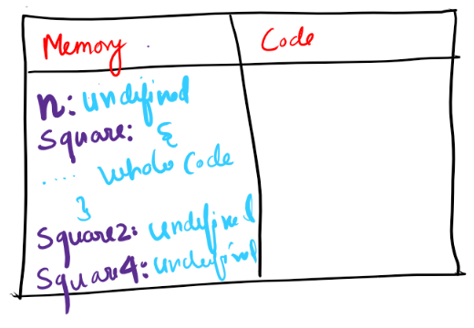
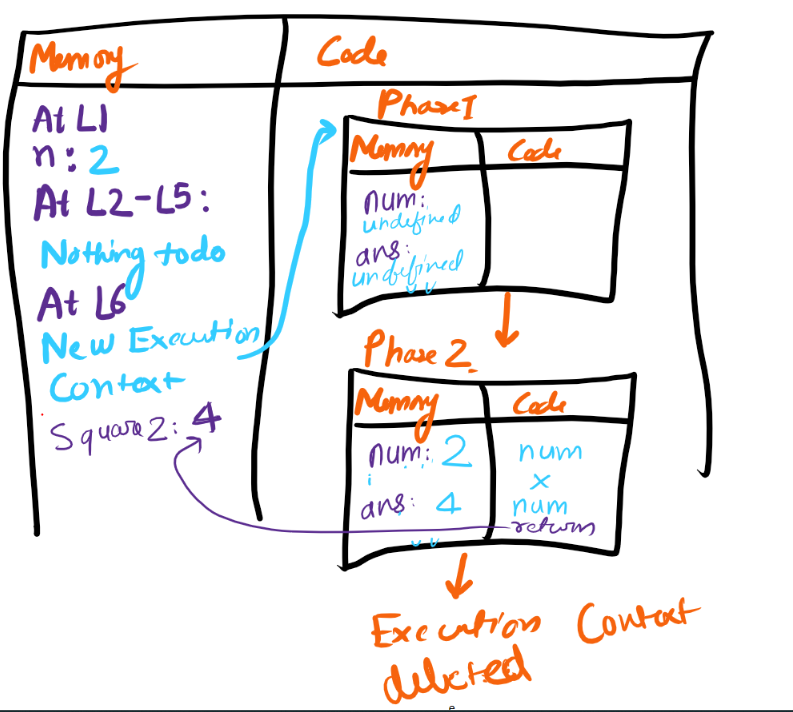

# Execution Context
* An Execution context ix created when a JS program is run
```js
Var n = 2
Function square(num){
	Var ans = num * num;
	Return ans;
	}
Var square2 = square(n)
Var square4 = square(4)
```

## Phase 1: Memory Creation Phase of Execution Context
* EC has 2 Parts Memory & Code. In this phase the variable and memory are put to memory part.
* Variables are assigned `undefined` 
* for function the whole function body is being assigned. 
* This is done by line by line scanning the code. 


## Phase 2: Code Execution Phase
* At L1 value is assigned to var n as 2
* At L2-L5 nothing happens as it is just function declaration
* At L6 Function is executed so a EC is created and n=2 is passed to num. 
* Return keyword tells to return the control of program where the function was invoked from 
* After this return the Square2 gets assigned and whole execution context is deleted
* L7 runs and new EC is created.


# Call Stack
* JS has it's own call stack which stores the execution contexts and pops it out
When the execution is done
* Call stack maintains the order of execution context
* Call Stack aka Execution context stack or program stack or machine stack


