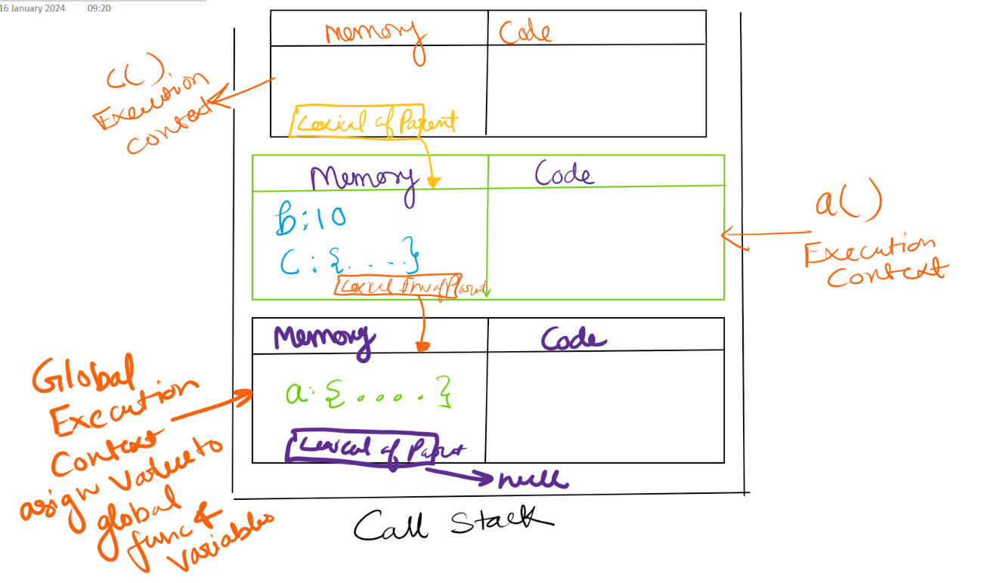

# Scope Chain

* Scope in JS is related to `lexical` environment. 

```js
function a() {
    var x = 10;
    console.log(b) //10
    c() //10
    function c() {
        console.log(b); 
    }
}
var b = 10;
a();
console.log(x); // not defined
```
* When js react `console.log(b)` , js will try to find b exists in local memory space of a() execution context. 
* Scope is where can you access something, or is some var or function inside scope 
* Consider below program 
```js
function a() {
    var b = 10;
    c();
    function c() {
        console.log(b);
    }
}

a();
console.log(b)
```



* **IMPORTANT**
* Wherever a execution context is created then lexical environment is also created
* Lexical env is local memory along with lexical environment of parent. 
* Lexical as term means hierarchy
* Function a() is lexically inside a() function
* Lexical env of c() is memory of a plus lexical environment of parent. 
* When console.log(b) is executed then b is found in local memory
* If not found then It will go to lexical env of a where it is found and used. 
* But if b was not even there it would have gone to lexical parent of a which is GEC
* And if there also not found then it will go to lexical parent of GEC which is null where the search ends and b is not defined comes.
* This way of finding is known as **Scope Chain**. When not found go to next scope chain. 
