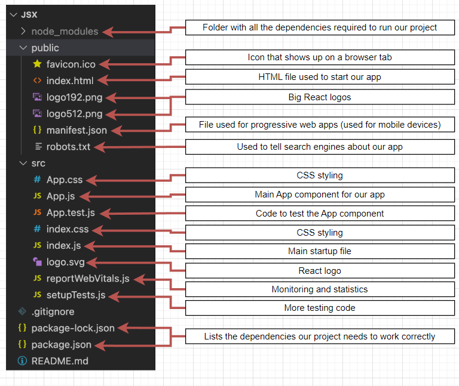

# React

* React displays HTML and changes that HTML when the user does something. 
* Function returning JSX tells react what to show on screen.

## Project 1: Language Translator
* Initial Code URL: https://codesandbox.io/p/sandbox/react-pibc94
* Completed Code: URL: https://codesandbox.io/p/sandbox/react-forked-zhm6cc?file=%2Fsrc%2FApp.js%3A9%2C33 

### React Components
* Components are Functions that return JSX. 
  * JSX tells to create a normal html element. like `<h1>Hello!</h1>` - Those with small letter.
  * or it may tell react to show another component. `<ContactList />` - Those with caps letter.
* Tells react what to show on the screen.
* A Project can have many components that work together.
* App components cordinates all other components. 

### React App Startup
* All of your project's JS files are `bundled` together into a single file, then placed onto a server aka `app bundle`
* User makes a request to the server gets an HTML file + the Bundle
* First Index.Html loads then Script tag loads the js for actual react app then in index.html there is a single div with id `root` then in index.js file is first file to be executed, then react takes control of root element div and tell react to get  JSX from the App components, turn it into HTMLand show it in the root element. 
* **index.html**
```html
    <div class="container" id="root"></div>
```
* **index.js**
```js
import { StrictMode } from "react";
import { createRoot } from "react-dom/client";

import App from "./App";

const rootElement = document.getElementById("root");
const root = createRoot(rootElement);

root.render(
  <StrictMode>
    <div className="wrapper">
      <App />
    </div>
  </StrictMode>
);

```

### React useState
* `useState` is a function that works with React's `state` system
* State is like a `variable` in React
* State is used to store data that changes over time. 
* Whenever state changes, React automatically updates content on the screen. 

### Creating first local react app
* Create: **npx create-react-app <project_name>**
* Start: **npm start**
* ctrl + C to Stop

### Create React App
* index.js & App.js - has JSX - JSX is not valid Js code. 
* reportWebVitals.js
* JSX is `transpiled` into valid JS
* React Dev Server internally runs tools :
  * Babel : Tool to turn JSX into JS
  * Webpack: Tool to merge all projects files into single file. 
