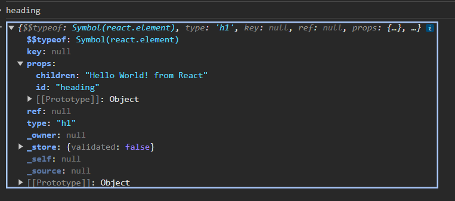
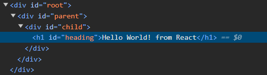
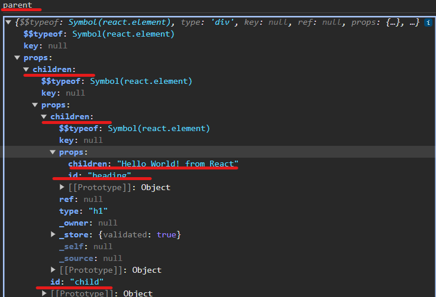

# Namaste React

## TIPS
* Make your own notes
* Use your Laptop and try to code parallel
* Maintain a Github Repo
* **Browser**: Google Chrome

## First Hello World App(Css, Html , Js Refresher)
* **VS Code Emmets** - `html:5` - Basic structure of Html Page.
* browsers have a JS engine in it which helps us gets the document and related methods.
```html
<!DOCTYPE html>
<html lang="en">

<head>
    <title>Namaste React</title>
</head>

<body>
    <div id="root">
    </div>

    <!-- JS for our App -->
    <script>
        // 1) Create a H1 element and set innerHtml
        const heading = document.createElement("h1");
        heading.innerHTML = "Hello World! from JavaScript";

        // 2) Getting root el and appendChild Heading
        const root = document.getElementById("root");
        root.appendChild(heading); //Adding Heading Child to the root element
    </script>
</body>

</html>
```

## Adding React to our project Via CDN
* CDN Links to add react to our project.
> <script crossorigin src="https://unpkg.com/react@18/umd/react.development.js"></script>
> <script crossorigin src="https://unpkg.com/react-dom@18/umd/react-dom.development.js"></script>
* Within the CDN links code for react. If we try `React` in console then we get output, this means React is now available for us to use. 
* Why we need 2 CDN Links?
  * `react.development.js` : Core react file 
  * `react-dom.development.js` : React Library useful for DOM(Document Object Model) manipulation. 
* Both imports were not combined because react works on both web browsers, mobile(react native), react 3D, etc.
* The 2nd CDN script file we got `ReactDOM`
* `createElement`- (arg1: "tag", arg2: {attributes}, arg3: innerElement/s)

```html
<!DOCTYPE html>
<html lang="en">

<head>
    <meta charset="UTF-8">
    <meta name="viewport" content="width=device-width, initial-scale=1.0">
    <title>Namaste React</title>
</head>
<body>
    <div id="root"></div>
    <script crossorigin src="https://unpkg.com/react@18/umd/react.development.js"></script>
    <script crossorigin src="https://unpkg.com/react-dom@18/umd/react-dom.development.js"></script>

    <script>
        // 1) Creating a h1 tag by using core React APIs
        //   {} -- Place to give attributes to the tags
        const heading = React.createElement("h1", {id: "heading"}, "Hello World! from React")

        //2) Creating the root element.
        const root = ReactDOM.createRoot(document.getElementById("root"));

        //3) Rendering the heading inside root
        root.render(heading);
    </script>
</body>
</html>
```

## Writing all React Code in a JS File
* Create a new file `App.js` move all code inside script tags to this new file and reference this new file by pass it in `src` attribute of script tag.
* Most expensive operation is DOM node manipulation. React provides APIs to make DOM manipulations more efficient.
* **App.js**
```js
// 1) Creating a h1 tag by using core React APIs
const heading = React.createElement("h1", {id: "heading"}, "Hello World! from React");
//2) Creating the root element.
const root = ReactDOM.createRoot(document.getElementById("root"));

//3) Rendering the heading inside root
root.render(heading);
```

* **Index.html**
```html
<!DOCTYPE html>
<html lang="en">
<head>
    <meta charset="UTF-8">
    <meta name="viewport" content="width=device-width, initial-scale=1.0">
    <title>Namaste React</title>
</head>
<body>
    <div id="root"></div>
    <script crossorigin src="https://unpkg.com/react@18/umd/react.development.js"></script>
    <script crossorigin src="https://unpkg.com/react-dom@18/umd/react-dom.development.js"></script>

    <script src="./App.js"></script>
</body>
</html>
```
* **Adding Css** : `index.css`
    ```css
    #heading {
        color: red
    }
    ```
    * **Linking Style Sheet**: Using `Link` Tag
  ```html
    <link rel="stylesheet" href="./index.css" />
  ```

> **NOTE**: React.createElement - returns an object which is a react h1 element. A react element is normal js object. It has something known as `props` which have **children(goes inside tags)** and attributes also comes. 


* **render**: method is responsible for converting heading obj to h1 tag and putting up on dom. 

## Creating Nested elements structure in React
* We can use `React.createElement` to create the nested structure of elements.
```js
const heading = React.createElement(
  "h1",
  { id: "heading" },
  "Hello World! from React"
);
const child = React.createElement("div", {id: "child"}, heading);
const parent = React.createElement("div", {id: "parent"}, child)

const root = ReactDOM.createRoot(document.getElementById("root"));
root.render(parent);
```



## Adding Siblings
* To add siblings the 3rd arg of React.createElement should be array of components. 
* This will give a warning like `Warning: Each child in a list should have a unique "key" prop.`
    ```js
    const heading = React.createElement(
    "h1",
    { id: "heading" },
    "Hello World! from React"
    );

    const paragraph = React.createElement("p", {id: "paragraph"}, "I am a paragraph")
    const child = React.createElement("div", {id: "child"}, [heading, paragraph]);
    ```
* Creating more complex structures of DOM will me complex using this approach . Hence we use JSX to create complex DOM structures.

## Order of Imports/Files in index.html
* Always react import should be before importing App.js as it is using it. 

## `root.render()`
* It puts element in root div. If the root div will have something then the existing html inside root div will be replaced by whatever is inside root.render().
* At high speed, the initial content inside root div will come but suddenly replaced with content `root.render()`
* What ever is outside of root div, will stay the same, react will be only working div id root. 

## Library vs Framework
* React can be applied to a small portion of page also like only in header, footer, any specific element.
* Framework comes with a lot of other stuff and applied to entire app.
* React can be applied to existing apps as well where as other js projects cannot behave like this. 


# Homework 3 Why Script tag is in body , can it be in head tag?
  * Placing <script> in the <head>:
    * If script contains code that needs to be executed before the page content is rendered or manipulated, it should be placed in head. 
    * Placing scripts in head can be seen as best practice to avoid rendering delayes.
  * Placing <script> in the <body>:
    * Faster page rendering: Allows browser to render the HTML content first and then load and execute scripts. 
    * Browser can do parallel loading
  * `Async` Approach:
    * Allows a script to be downloaded async while not blocking html parsing. `<script src="example.js" async></script>`
  * `defer` Approach:
    * Deffers the execution of the script until after the HTML document has been parsed. `<script src="example.js" defer></script>`

# Homework 4 Can we have 2 root and render different things?
  * Yes but this is not required.