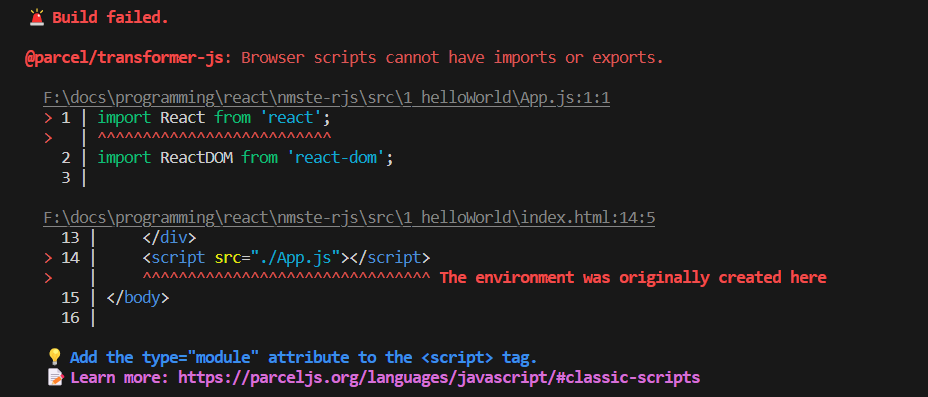

# Igniting our App 🚀

* **Agenda**: Making our app production ready
* The scaffolded react app is already production ready, but in this lecture we will make everything from scratch. 

## npm 
* Standard repository for all the packages. 
* Command: `npm init`
  * package name
  * version
  * description
  * entry point
  * test command: jest
  * git repository:
  * keywords:
  * author
  * license
* `package.json` - all the config for our npm. This contains the dependencies. 
* Most important package is bundler. 

## Bundler
* **Bundler**: All the code & different code needs to be bundled, cleaned, minified, cached. This is job of bundler.
  * Webpack , parcel are bundlers.
  * the create-react-app behind the scene uses webpack bundler & babel. 
* Installing **[`Parcel`](https://www.npmjs.com/package/parcel)**
  * Command: `npm install -D parcel` //-D tells us it is dev dependency
<br/>

* **Two Types of App dependencies**:
  * Dev Dependencies: It is generally required during our development phase
  * Normal Dependencies: It is also during production phase as well as development phase

* In this `"parcel": "^2.11.0"` ^ - known as caret.  We can also put ~ tilde over here
* ^ Caret means automatically be upgraded to a newer minor version
* ~ Tilde means automatically be upgraded to a newer major version
> Always it is safe to put Caret(^) to avoid breaking changes

## package-lock.json
* Package-lock.json - keeps a track of exact version being used. Where as package.json keeps approximate version. 
* This locks the version and keeps a record of it. 
* It stores integrity which is a hash to verify the current deployed version on production is same or not. 

## dir node_modules
* Node modules contains all the code fetched from npm. 
* Node modules is like db of dependencies. 
* 😂 Heaviest objects in universe : Sun < Neutron Star < Black Hole < Node Modules
* While installing parcel, npm also fetches the dependencies of parcel as well. and even those dependencies can have own dependencies and this is known as **transitive dependencies**.
* Parcel needs babel, browserList, etc
* We have many many package.json. Every dependency will have it's own package.json.
> node_modules should not be pushed to production or git because this files can be re-generated using the package.json & package-lock.json.

## Building our App using Parcel
* **Build & Run**: `npx parcel index.html`
* **npx**: executing a package.
* Parcel created a server for us and gives us a localhost address.

## Adding react through NPM
* Fetching from CDN is costly operation due to a network call to the domain, rather it is suitable to have it in our node modules. 
* Also if newer version comes we have to go upgrade CDN links. 
* **Command**: `npm install react` 
* **Command**: `npm install react-dom`
* now from our `index.html` we can remove the script tag for cdn links but we need to import it in `App.js`
```js
import React from 'react' // refers to react with in our node modules.
import ReactDOM from 'react-dom'
```
* But this will give us error: `@parcel/transformer-js: Browser scripts cannot have imports or exports.`

* This error is because in our HTML we inject App.js using script which is treated as normal js file/browser script but our App.js is not normal js file. SO in script tag we mention that it is a module by 
```html
    <script type="module" src="./App.js"></script>
```
* **Warning: You are importing createRoot from "react-dom" which is not supported. You should instead import it from "react-dom/client"** - Simply import from react-dom/client
```js
import ReactDOM from 'react-dom/client';
```

## Parcel Features Parceljs.org
* When we make changes and saves our files and changes reflect in browser because of parcel is doing HMR.
* This happens parcel uses a file watching algorithm written in C++ 
* Subsequent build times reduces because parcel is caching things for us. The things are cached in `.parcel-cache` dir.
  * **Dev Build**
  * **Local Server**
  * **Hot Module Reload**
  * **File watching algorithm**
  * **Caching**
  * **Image Optimization**
  * **Minification**
  * **Bundling**
  * **Compress**
  * **Consistent Hashing**
  * **Code Splitting**
  * **Differential Bundling**:  Our app can be opened within older version of browser, or any other browser, parcel takes care of all that and make sure app runs on older browser. **Need extra configuration**
  * **Diagnostic**
  * **Error Handling**
  * **HTTPS support**
  * **Tree Shaking**: In our code 100s of function are there and we will be using 3-4 function, parcel will remove un-used for us. 
* Bundlers also contribute to the performance of react apps.
* **Transpilation**
* **Different build for dev & production**: `npx parcel build index.html` - for prod build - this will give error as in our package.jsn main which is entry point as App.js so we can remove this.
* All these also make dev experience better and react app faster.
* The production build files will go to `dist` directory. When we do `npx parcel index.html` it generates dev build and puts up under dist folder. On page refresh dist & .parcel-cache is used for HMR. The output of production build is 
  * index.html
  * index.css
  * index.js

## making our app compatible with older versions of browser.
* Using browserslist - npm package, it needs the configurations [`BrowserList`](browserslist.dev)
* Inside `package.json`
```json
  "browserslist": [
    "last 10 Chrome version",
    "last 2 Firefox version",
    "last 2 versions" // This will do last 2 versions of all browser.
    "cover 99.5% in US"
  ]
```
* It means it may or may not work with other versions but definitely work with the mentioned version. 