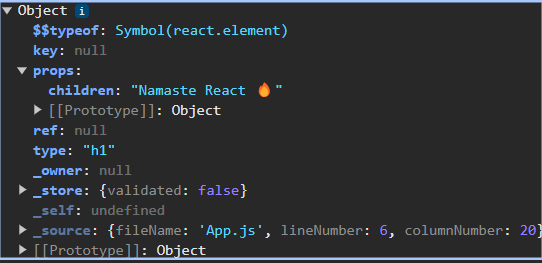

# Laying the Foundation
* NPM Scripts: in `package.json` under `scripts` section we can add custom scripts.
  * Start & Build(Prod) Commands
    ```json
    "scripts": {
        "start": "parcel index.html",
        "build": "parcel build index.html"
    }
    ```
    * To run these scripts: `npm start` and `npm run build`
<br/>

* **HACK** Index.html
```html
    <div id="root">
        <!-- As a Hack Not rendered will display when react fails to render root else if root is rendered then everything within this 
        will be replaced with react dom element-->
        <h1>Not Rendered</h1>
    </div> 
```

## JSX
* Fb developers created a Javascript syntax which is easier to create react element.
* JSX is a convention where we merge HTML & JS together. JSX is not HTML is in Javascript. JSX is HTML **Like** syntax not HTML
```js
// JSX -(Babel)-> Transpiled to React.createElement -> ReactElement(JS object) => HTMLElement(render)
const jsxHeading = <h1 id='heading'>Namaste React🔥</h1>
const reactElementHeading = React.createElement("h1", {id: "heading"}, "Namaste React🔥")
```
* The jsxHeading & reactElementHeading are same, we can verify it in console.log()

* JSX is independent of react. JSX is make development of react apps simpler.
* JS Engine only understand ECMA Scripts and not even JSX.
* For browser to understand our JSX **parcel** is transpiling the code. 
* Parcel uses **Babel** for transpiling.  Babel is JS Compiler and transpiler
* jsxHeader is converted to below code using Babel
* If we write {} anywhere in JSX we can write any JS code
```js
const jsxHeading = /*#__PURE__*/REACT.createElement("h1", {
  id: "heading",
  children: "Namaste React\uD83D\uDD25"
});
```

* If JSX is in single line it is valid, but it we have to write it in multiple lines when we have to wrap it in parenthesis for babel to understand where is JSX starting and ending. 

## React Components
* Everything is a component in react. 
* 2 Types of Components
  * **Class Based Component**: OLD Way
  * **Function Based Component**: Latest Way
### Function Based Component
* Just a normal Java script function which returns some JSX, 
* Name it with a capital letter always.
```js

//React Element
const headingComponent = (
  <div id="container">
    <h1>Namaste React Functional Component🔥</h1>
  </div>
);

// React Functional Components without Return
const HeadingComponent = () => (
  <div id="container">
    <h1>Namaste React Functional Component🔥</h1>
  </div>
);

// React Functional Component with Return
const HeadingComponent2 = () => {
  return <h1>Namaste React from Functional Component🔥</h1>;
};
const root = ReactDOM.createRoot(document.getElementById("root"));
root.render(<HeadingComponent />);

/*
    This will fail because this is how we pass React Elements however it is a functional component so we have to do it like above.
    root.render(HeadingComponent)
*/ 
```
<br/>

* Component Composition: **Rendering a component inside another component**
```js
const Title = () => (
  <div id="container" className="head">
    <h1>Namaste React Functional Component🔥</h1>
  </div>
);

// Component Composition: Rendering a React Functional Component with in another component
const HeadingComponent = () => (
  <div id="container">
    <Title />
    <h1>Namaste React Functional Component🔥</h1>
  </div>
);

const root = ReactDOM.createRoot(document.getElementById("root"));
root.render(<HeadingComponent />);
```
*
* **Using function keyword to create functional component**
```js
const Title = function () {
  return (<div id="container" className="head">
    <h1>Namaste React Functional Component🔥</h1>
  </div>)
};
```

* **Putting element inside React Component**
* {} within this in JSX we can put any JS code. even like console.log()
* We can add element within element using {}

```js
// React Element
const elem = (<span>React Element</span>)
// Adding React element with another element
const subTitle = (<h2>{elem} Namaste React from Subtitle</h2>)

// Rendering a React Functional Component with in another component
const HeadingComponent = () => (
  <div id="container">
    <Title />
    <Title></Title>
    {Title()}
    <h2>{number*2}</h2>
    {subTitle}
    <h1>Namaste React Functional Component🔥</h1>
  </div>
);
```

* Here is number is coming from API which for some reason sent some malicious JS code which may get executed. and number is executing here {}. This is known as **Cross Site Scripting**. But JSX will take care of this attack. 
* We can call Functional Components within the {} like `{Title()}`