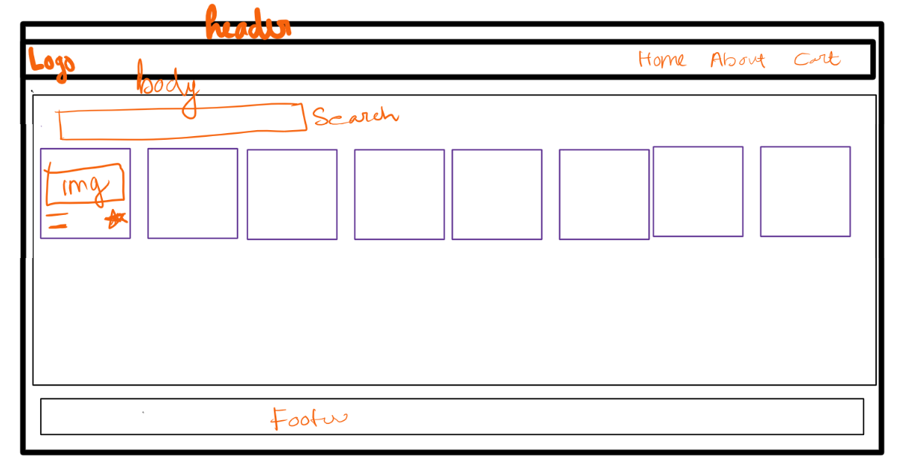
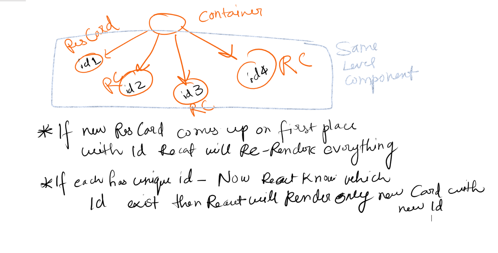

# Talk is cheap , Show me the code
* FIrst Step for building an App is to plan.
* Planning
  * Know what you are going to build
  * UI Design, Layout, Mock, WireFrame
    * 
  * **Components**
    * Header
      * Logo
      * Nav Items
    * Body
      * Search
      * RestaurantContainer
        * RestaurantCard
          * Img
          * Name of Rest
          * Star Rating 
          * Cuisine
          * delivery Time
    * Footer
      * Copyright
      * Links
      * Address
      * Contact

## props
* Properties. Which can be passed to the component. 
* Props are normal arguments to a function. 
* Passing props to to a component is like passing args to a function
```js
  <RestaurantCard resName="Meghana" cuisine="Burger, Fast Food"/>
```
* Receiving the props:
```js
const RestaurantCard = (props) => {
    return (
        <div className="res-card">
            
            <h3>{props.resName}</h3>
            <h4>{cuisine}</h4>
            <h4>4.4 Stars</h4>
            <h4>38 mins</h4>
        </div>
    )
}
```

* We can de structure it on the fly
```js
const RestaurantCard = ({resName, cuisine}) => {
    return (
        <div className="res-card">
            
            <h3>{props.resName}</h3>
            <h4>{cuisine}</h4>
            <h4>4.4 Stars</h4>
            <h4>38 mins</h4>
        </div>
    )
}
```

* [].join(', ') ; to join array elements with ,

* To display a list of elements on Ui based on a data list. 
* We can use for loop or better way is using map. Each child in list should have a unique `key` property. 
* This `key` is required 
* React itself says never use index as keys if the order of objects may change
* Not using Keys (not acceptable) <<<<<<<< Using index as keys <<<<<<<< Unique Ids as Keys(Best practice)
```js
  {
resList.map((restaurant, index) => <RestaurantCard resData={restaurant} />)
  }

```


## Config driven UI
* When website is driven by data and config, backend APIs returns the data and config to control the UI elements. 
* Cloudinary -CDN