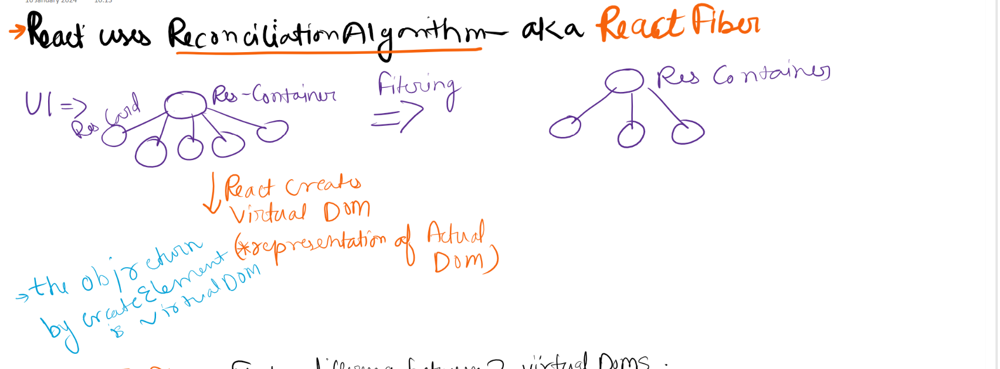
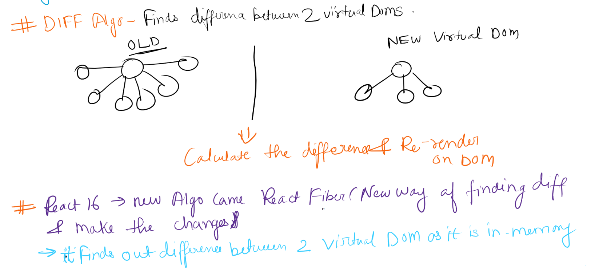
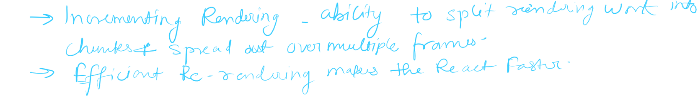

# Lets get Hooked
* In this lecture we are going to cover react hooks.
* Read more about folder structure: Official React website has a File Structure documents.
* Name you component File name matching the component name.
* File extensions can be .jsx or .js
* To **Export our component**
  * export default <component_func>
  * Named export : export {Name, Component} or export const Header = () => (<h1>Hello</h1>)
* To **Import our component**
  * import <Component> from 'path_of_file'
  * import Header from './components/Header.js' -- even if we don't put extension then react will treat this as JS file by default so we can skip it. 
* Never ever keep hard coded data in component folder. 
* Never keep URLs in component file like img src etc
* We should keep it inside separate file `utils.js`, `config.js` or `constants.js` in utils or common folder.
* In a file we can have 1 default export and multiple named exports `export {Logo_Url}`

## React Hooks
* Feature: Button as filter for top rated restaurant. 
* Adding Event Listener:
    ```js
        <button className="filter-btn" onClick={() => {console.log("Button Clicked!")}}>Top Rated Restaurants</button>
    ```
* Now to do this filter directly it will not work. So we use Hook which is **like utility function given to use by react.**
  * Normal JS Utility Functions by react.
    * **useState**: State Variables. Import from React like named import
      * It will give us a state variable which is recieved within an array
      * Whenever state variable changes react is re-rendering he component . This change can happen from anywhere.
        * To modify state variable is done by a function
        * Header will re render the entire component.
        * **We need an extra function to update state because it acts like a trigger to start the diff alogrithm which uses react fiber.**
        ```js
        <button className="filter-btn" onClick={() => {
            const filteredList = restaurants.filter((res) => res.rating > 4);
            setRestaurants(filteredList);
        }}>
          Top Rated Restaurants
        </button>
        ```

    * **useEffect**:

## React Fiber


