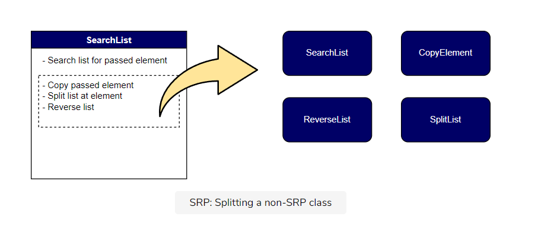
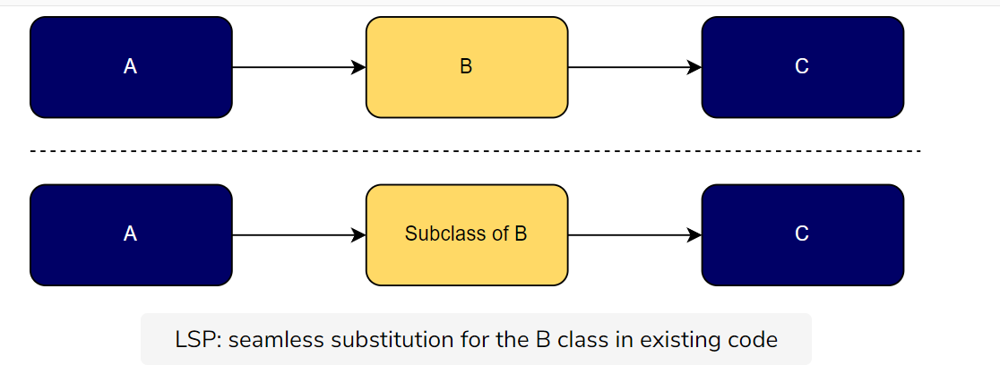
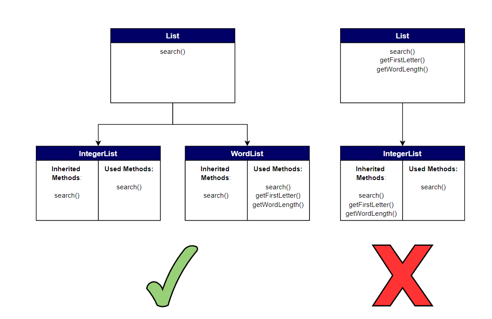
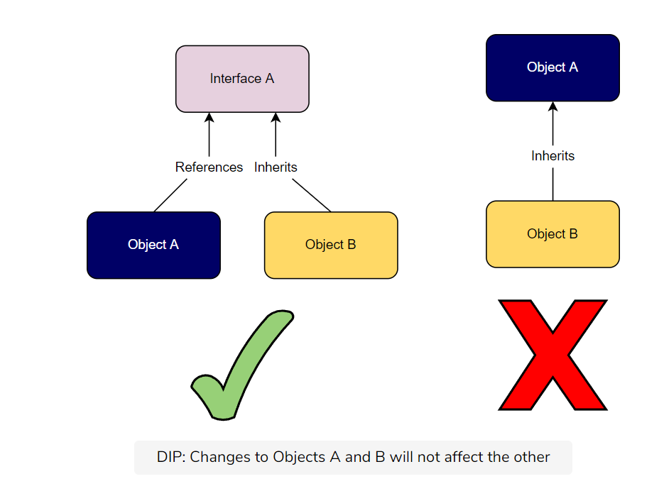

# SOLID Principles 
. Developed by **Uncle Bob** in early 2000 
* SOLID programs **scale better, cost less time to work with, and can more easily respond to change.**

1. **S** : Single-Responsibility Principle
2. **O** : Open-Closed Principle
3. **L** : Liksov Substitution Principle
4. **I** : Interface Segregation Principle
5. **D** : Dependency Inversion Principle 

## **S** Single-responsibility principle 


> **DEFINITION**: A class should have only a single responsibility, that is, only changes to one part of software's specification should be able to affect the specification of other class. 

* A class should contain variables and methods relevant to its functionality. 
* Classes can work together to complete a big complex task but all class must complete a function from start to finish before passing the output to another class. 
<br/>

* A class should have only **one reason to change**
> Therefore we could change all but one class in the program without breaking the original class. 

* This also promotes **encapsulation** - as it's easy to hide data if all data and methods for a job is in single class. 

* if a single functionality breaks, you know where the bug will be in the code and can trust that only that class will break.

### Implementation

1. **Wrong Implementation** : below class performs 3 actions: register user, insert into db, send email

```
// does not follow SRP
public class RegisterService
{
    public void RegisterUser(string username)
    {
        if (username == "admin")
            throw new InvalidOperationException();

        SqlConnection connection = new SqlConnection();
        connection.Open();
        SqlCommand command = new SqlCommand("INSERT INTO [...]");//Insert user into database. 

        SmtpClient client = new SmtpClient("smtp.myhost.com");
        client.Send(new MailMessage()); //Send a welcome email. 
    }
}
```
2. **Correct Implementation**: 

```
public void RegisterUser(string username)
{
    if (username == "admin")
        throw new InvalidOperationException();

    _userRepository.Insert(...);
    
    _emailService.Send(...);
}
```
---
## O: Open-closed Principle

> **DEFINITION**: Software entities... should be open for extension but closed for modification.

* OCP calls for entities that can be widely adapted but also remain unchanged. This leads us to create **duplicate entities with specialized behavior through polymorphism**  

* We can extend our parent entity to suit the needs of the child entity while leaving the parent intact. 

* Our parent entity can act as **abstract base class** that can be used with **specializations through inheritance** 

> It minimizes program risk when we **add new uses for an entity**  as instead of re-working base class to fit a WIP feature, we can create separate derived class.

### Implementation
1. **Wrong Implementation** 
* This program does not follow OSP because Area() is not open to extension and can only ever handle Rectangle and Circle shapes. If we want to add support for Triangle, we’d have to modify the method, so it is not closed to modification.

```
// Does not follow OSP
public double Area(object[] shapes)
{
    double area = 0;
    foreach (var shape in shapes)
    {
        if (shape is Rectangle)
        {
            Rectangle rectangle = (Rectangle) shape;
            area += rectangle.Width*rectangle.Height;
        }
        else
        {
            Circle circle = (Circle)shape;
            area += circle.Radius * circle.Radius * Math.PI;
        }
    }

    return area;
}

public class AreaCalculator
{
    public double Area(Rectangle[] shapes)
    {
        double area = 0;
        foreach (var shape in shapes)
        {
            area += shape.Width*shape.Height;
        }

        return area;
    }
}
```

2. **Correct Implementation** 
```
public abstract class Shape
{
    public abstract double Area();
}

public class Rectangle : Shape
{
    public double Width { get; set; }
    public double Height { get; set; }
    public override double Area()
    {
        return Width*Height;
    }
}

public class Circle : Shape
{
    public double Radius { get; set; }
    public override double Area()
    {
        return Radius*Radius*Math.PI;
    }
}

public double Area(Shape[] shapes)
{
    double area = 0;
    foreach (var shape in shapes)
    {
        area += shape.Area();
    }

    return area;
}
```
<br/>

---

## L: Liskov Substitution Principle 



> **DEFINITION** - Objects in a program should be replaceable with instances of their subtypes without altering the correctness of that program. 
* This talks about **subtyping relation**
* Any class must be replaces by any of its subclasses without error. 
* **Any subclass must maintain all behavior of the base class along with any new behaviors.**
* Child class must be able to process all the same requests and complete all the same tasks as its parent class. 
* You can trust that all newly created subclasses will work with the existing code.

> Some critics argue that this principle is not consistent with all program types since abstract supertypes that have no implementation cannot be replaced by subclasses that are designed for implementation.

### Implementation 
1. **Wrong Implementation**: This does not follow LSP because the Orange class could not replace the Apple class without altering the program output. The GetColor() method is overridden by the Orange class and therefore would return that an apple is orange.

```
namespace SOLID_PRINCIPLES.LSP
{
    class Program
    {
        static void Main(string[] args)
        {
            Apple apple = new Orange();
            Debug.WriteLine(apple.GetColor());
        }
    }
    public class Apple
    {
        public virtual string GetColor()
        {
            return "Red";
        }
    }
    public class Orange : Apple
    {
        public override string GetColor()
        {
            return "Orange";
        }
    }
}
```
<br/>

2. **Correct Implementation** : we’ll add an abstract class for Fruit that both Apple and Orange will implement

```
namespace SOLID_PRINCIPLES.LSP
{
    class Program
    {
        static void Main(string[] args)
        {
            Fruit fruit = new Orange();
            Debug.WriteLine(fruit.GetColor());
            fruit = new Apple();
            Debug.WriteLine(fruit.GetColor());
        }
    }
    public abstract class Fruit
    {
        public abstract string GetColor();
    }
    public class Apple : Fruit
    {
        public override string GetColor()
        {
            return "Red";
        }
    }
    public class Orange : Fruit
    {
        public override string GetColor()
        {
            return "Orange";
        }
    }
}
```
<br/>

---
## I Interface Segregation principle 


> **Definition**: Many client specific interfaces are better than one-general-purpose interface. 

* Class should not include any behavior which they dona use. 

> Any unused part of the method should be removed or split into a separate method.

* It makes the program **easier to debug** 
    1. less code carried between classes, less code means fewer bugs
    2. single method is responsible for smaller variety of behaviors. 
    3. If a general method with multiple behaviors is passed to a class that doesn’t support all behaviors (such as calling for a property that the class doesn’t have), there will be a bug if the class tries to use the unsupported behavior.

### Implementation 
1. **Wrong Implementation** : This program does not follow ISP because the FullTimeEmployee class does not need the CalculateWorkedSalary() function, and the ContractEmployeeClass does not need the CalculateNetSalary().

```
// Not following the Interface Segregation Principle  
  
  public interface IWorker  
  {  
      string ID { get; set; }  
      string Name { get; set; }  
      string Email { get; set; }  
      float MonthlySalary { get; set; }  
      float OtherBenefits { get; set; }  
      float HourlyRate { get; set; }  
      float HoursInMonth { get; set; }  
      float CalculateNetSalary();  
      float CalculateWorkedSalary();  
  }  
  
  public class FullTimeEmployee : IWorker  
  {  
      public string ID { get; set; }  
      public string Name { get; set; }  
      public string Email { get; set; }  
      public float MonthlySalary { get; set; }  
      public float OtherBenefits { get; set; }  
      public float HourlyRate { get; set; }  
      public float HoursInMonth { get; set; }  
      public float CalculateNetSalary() => MonthlySalary + OtherBenefits;  
      public float CalculateWorkedSalary() => throw new NotImplementedException();  
  }  
  
  public class ContractEmployee : IWorker  
  {  
      public string ID { get; set; }  
      public string Name { get; set; }  
      public string Email { get; set; }  
      public float MonthlySalary { get; set; }  
      public float OtherBenefits { get; set; }  
      public float HourlyRate { get; set; }  
      public float HoursInMonth { get; set; }  
      public float CalculateNetSalary() => throw new NotImplementedException();  
      public float CalculateWorkedSalary() => HourlyRate * HoursInMonth;  
  }
```
<br/>

2. **Correct Implementation** : we’ve split the general interface IWorker into one base interface, IBaseWorker, and two child interfaces IFullTimeWorkerSalary and IContractWorkerSalary. 
```
// Following the Interface Segregation Principle  
  
    public interface IBaseWorker  
    {  
        string ID { get; set; }  
        string Name { get; set; }  
        string Email { get; set; }  
         
         
    }  
  
    public interface IFullTimeWorkerSalary : IBaseWorker  
    {  
        float MonthlySalary { get; set; }  
        float OtherBenefits { get; set; }  
        float CalculateNetSalary();  
    }  
  
    public interface IContractWorkerSalary : IBaseWorker  
    {  
        float HourlyRate { get; set; }  
        float HoursInMonth { get; set; }  
        float CalculateWorkedSalary();  
    }  
  
    public class FullTimeEmployeeFixed : IFullTimeWorkerSalary  
    {  
        public string ID { get; set; }  
        public string Name { get; set; }  
        public string Email { get; set; }  
        public float MonthlySalary { get; set; }  
        public float OtherBenefits { get; set; }  
        public float CalculateNetSalary() => MonthlySalary + OtherBenefits;  
    }  
  
    public class ContractEmployeeFixed : IContractWorkerSalary  
    {  
        public string ID { get; set; }  
        public string Name { get; set; }  
        public string Email { get; set; }  
        public float HourlyRate { get; set; }  
        public float HoursInMonth { get; set; }  
        public float CalculateWorkedSalary() => HourlyRate * HoursInMonth;  
    }  

```
<br/>

## D - Dependency Inversion Principle


> **DEFINITION** : One should depend upon abstractions, [not] concretions

* **TWO IMPORTANT PARTS** 
1. High-level modules should not depend on low-level modules. Instead, both should depend on abstractions (interfaces)
2. Abstractions should not depend on details. Details (like concrete implementations) should depend on abstractions.

> Without DIP programmers often construct programs to have high-level (less detail, more abstract) components explicitly connected with low-level (specific) components to complete tasks.

* the abstraction is not affected if the details are changed
* This also makes the code easily re-factorable