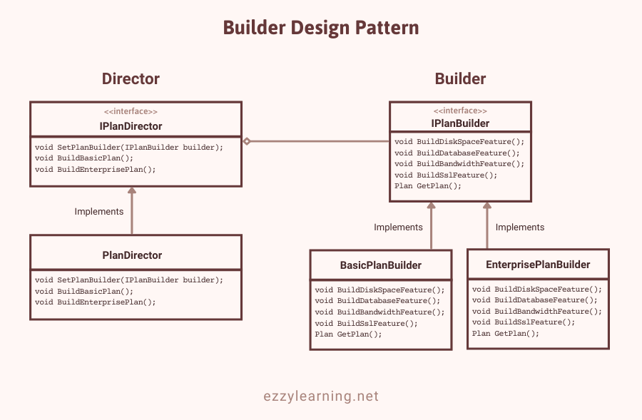

# Builder Pattern 

## Intent 
* Separate construction of **complex object from its representation** so that the same construction process can create **different representation.** 
* It is good choice when designing classes whose constructor or static factories would have **more than a handful of parametrs**. 

## Why use builder Pattern? 
* Unlike creational patterns that construct products in one shot, the Builder pattern constructs the product step by step under the control of the "director".

#### Telescoping Constructor Pattern 
```
Pizza(int size) { ... }        
Pizza(int size, boolean cheese) { ... }    
Pizza(int size, boolean cheese, boolean pepperoni) { ... }    
Pizza(int size, boolean cheese, boolean pepperoni, boolean bacon) { ... }
```
* The problem here is that it is **difficult to remember order of parameters** + which constructor to use when. 

#### JavaBean Pattern 
* This is alternative to telescoping constructor problem where you call the constructor with **mandatory paramters** and then call setters if anything is required. 
```
Pizza pizza = new Pizza(12);
pizza.setCheese(true);
pizza.setPepperoni(true);
pizza.setBacon(true);
```

#### Solution 
* Could we use a factory instead? Yes
* Why didn't we? Builder makes more sense I guess.
* Factories are used for creating different types of objects that are the same basic type (implement the same interface or base class).
* Builders build the same type of object over and over, but the construction is dynamic so it can be changed at runtime.
* The problem here is that because the object is created over several calls it may be in an inconsistent state partway through its construction

## Main Actors in Builder Pattern 
The main objects used to implement a builder pattern are following:

1. **Builder** – This interface declares all steps required to create an object. The actual implementation of each step is usually defined in concrete builder classes.

2. **ConcreteBuilder** – These classes provide different implementations of the construction steps. They also define a method that returns the final product.

3. **Product** – This class is the actual complex object generated by the builder pattern. This class can belong to the same or a different type of class hierarchy

4. **Director** – This class defines the order in which to call construction steps. This class can also define the algorithm or logic to generate the final product object. This class normally has an encapsulated builder object which can be passed either using the constructor or a method, e.g. setBuilder.

## Example 


## Types of Builder Pattern 
#### Just Builder 
* the builder class provides a **set of user friendly APIs** that clients use to create an object.
* The builder should hide unnecessary object creation details from client as much as possible so that it is easy for them **to build the object properly and hard to build the object improperly**
```
public class HtmlDocumentBuilder {
    private readonly StringBuilder _markup = new StringBuilder();

    public void OpenTag(string tag) => _markup.Append($"<{tag}>");
    public void AddText(string text) => _markup.Append(text);
    public void CloseTag(string tag) => _markup.Append($"</{tag}>");

    public HtmlDocument Build() => new HtmlDocument(_markup.ToString())
}

//Usage
var builder = new HtmlDocumentBuilder();
builder.OpenTag("p");
builder.AddText("Text");
builder.CloseTag("p);

HtmlDocument document = builder.Build();

Console.WriteLine(document.Markup);
```

* this is still error prone as clients can make call in wrong order. 

#### Fluent Builder 
* In this variation, every method apart from build returns **this pointer**
```
public class HtmlDocumentBuilder {
    private readonly StringBuilder _markup = new StringBuilder();
    public HtmlDocumentBuilder OpenTag(string Tag){
         _markup.Append($"<{tag}>");
    }

     public HtmlDocumentBuilder AddText(string text)
    { 
        _markup.Append(text);
        return this;
    }

    public HtmlDocumentBuilder CloseTag(string tag)
    {
        _markup.Append($"</{tag}>");
        return this;
    }

    public HtmlDocument Build() => new HtmlDocument(_markup.ToString());
}

// Usage 
//Usage
HtmlDocument document = new HtmlDocumentBuilder()
    .OpenTag("p")
    .AddText("Text")
    .CloseTag("p")
    .Build();
Console.WriteLine(document.Markup); //<p>Text</p>
```

### Strict Builder 
* One drawback of previous approach is that **methods can be called in any order**
* Example: Build method can be called first even when there is nothing to build. There will be **no compilation error**. We can handle it by performing **runtime checks and notifying developers**. 
* Using this we can **make complier check for the order of method calls** 

````
public class HtmlDocumentBuilder
{
    public HtmlDocumentBuilder() => _markup = new StringBuilder();
    public HtmlDocumentBuilder(StringBuilder markup) => _markup = markup;

    protected readonly StringBuilder _markup;

    public HtmlDocumentBuilderFinal OpenTag(string tag)
    {
        _markup.Append($"<{tag}>");
        return new HtmlDocumentBuilderFinal(_markup);
    }

    public HtmlDocumentBuilderFinal AddText(string text)
    { 
        _markup.Append(text);
        return new HtmlDocumentBuilderFinal(_markup);
    }

    public HtmlDocumentBuilderFinal CloseTag(string tag)
    {
        _markup.Append($"</{tag}>");
        return new HtmlDocumentBuilderFinal(_markup);
    }
}

public class HtmlDocumentBuilderFinal : HtmlDocumentBuilder
{
    public HtmlDocumentBuilderFinal(StringBuilder markup) : base(markup)
    { 
    }

    public HtmlDocument Build() => new HtmlDocument(_markup.ToString());
}

````

* The idea is to put the Build method into a separate class. Attempting to call the Build method on the HtmlDocumentBuilder type will result in a complication error, because the Build method simply doesn’t exist there.


### Nested Builder 
* During **object creation**, the Builder usually needs access to the properties of the object he is building. This means that the **properties must have public setters**, however this can break encapsulation.
```
public class MailMessage
{
    private List<string> _to { get; set; } = new List<string>();
    private MailMessage() { }

    public string From { get; private set; }
    public IReadOnlyList<string> To => _to;

    //Nested builder
    public class Builder
    {
        private readonly MailMessage _mailMessage = new MailMessage();

        public Builder From(string email)
        {
            _mailMessage.From = email;
            return this;
        }

        public Builder To(string email)
        {
            _mailMessage._to.Add(email);
            return this;
        }

        public MailMessage Build() => _mailMessage;
    }
}


var mailMessage =
    new MailMessage.Builder()
    .From("from@from.com")
    .To("to@to.com")
    .To("to@to2.com")
    .Build();

```

## Advantages of Builder Design Pattern

* The parameters to the constructor are reduced and are provided in highly readable method calls.
* Builder design pattern also helps in minimizing the number of parameters in the constructor and thus there is no need to pass in null for optional parameters to the constructor.
* Object is always instantiated in a complete state
* Immutable objects can be built without much complex logic in the object building process.

## Disadvantages of Builder Design Pattern
* The number of lines of code increases at least to double in builder pattern, but the effort pays off in terms of design flexibility and much more readable code.
* Requires creating a separate ConcreteBuilder for each different type of Product.