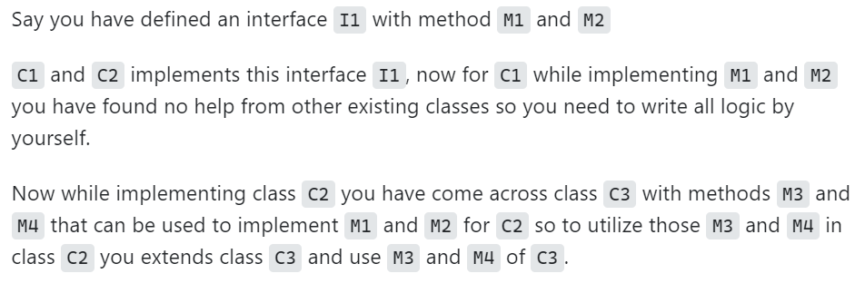
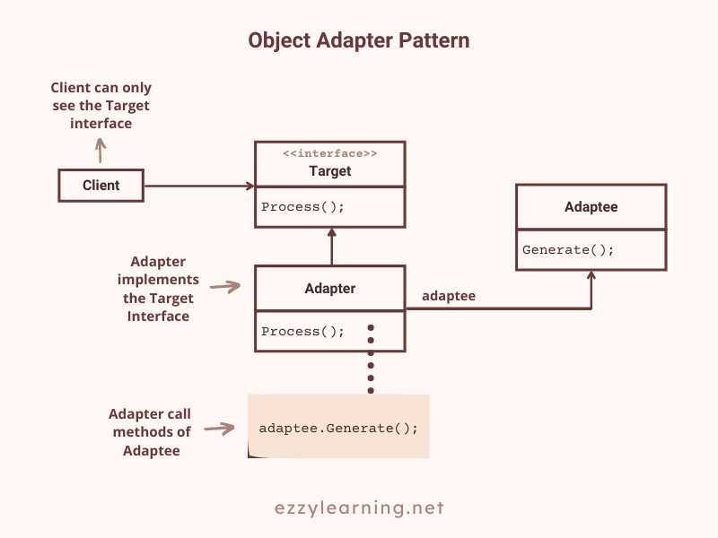

# Adapter
* Real world is full of this pattern like **USB to ethernet**, since ethernet and usb are incompatible we need to have an adapter. 
* **Definition**: We have a **class(client)** expecting some type of object and we have an **object(adaptee)** offering the same features but exposing a different interface. **The adapter pattern convert the interface of a class into another interface clients expect.**
* this promotes re-usability of old functionality with new requirements. 
* TO use an adapter: 
    1. The client makes a request to adapter by calling a method on it using the target interface. 
    2. The adapter translates that request on the adaptee using the adaptee interface. 
    3. Client receives the result of the call and is unaware of adapater's presence.


## Intent 
* convert the interface of a class into another interface client expects. 
* Wrap existing class with a new interface for compatibility

## Object Adapter vs Class Adapter 
* Object adapter pattern holds an instance of adaptee. 
* We can have a class adapter which use inhertitance instead of composition but you require multiple inheritance to implement is. 

> **NOTE**: Mapper is not adapter pattern but think of an adapter not as a **creator of new objects(like a mapper)** but as an **interface translator**
```
Mapper m = new Mapper();
Dog dof = (Dog)m.mapRow(resultSet); //creating new object

Cat cat = new Cat("Felix"); 
Dog dog = new DogAdapter(cat);  // cat still exists here 
dog.bark(); //yeilds meow
```

## Check list 
1. **Identify the players**: the component(s) that want to be accommodated (i.e. the client), and the component that needs to adapt (i.e. the adaptee).
2. **Identify the interface** that the client requires.
3. **Design a "wrapper" class** that can "impedance match" the adaptee to the client.
4. The adapter/wrapper class **"has a"** instance of the adaptee class.
5. The adapter/wrapper class **"maps"** the client interface to the adaptee interface.
6. The client uses (is coupled to) the new interface

## Rules of Thumb
1. Adapter makes things work after they're designed; Bridge makes them work before they are.
2. **Bridge is designed up-front to let the abstracti**on and the implementation vary independently. **Adapter is retrofitted** to make unrelated classes work together.
3. Adapter provides a different interface to its subject. 
4. **Proxy** provides the same interface. 
5. **Decorator** provides an enhanced interface.
6. **Adapter** is meant to change the interface of an existing object. 
7. **Decorator** enhances another object without changing its interface. Decorator is thus more transparent to the application than an adapter is. As a consequence, Decorator supports recursive composition, which isn't possible with pure Adapters.
8. **Facade** defines a new interface, whereas Adapter reuses an old interface. Remember that Adapter makes two existing interfaces work together as opposed to defining an entirely new one.

## When to use? 
* we can use adapter when we deal with different interfaces with similar behavior **(classes with similar behavior but with different methods)**. So, in your code (called Client in the UML diagrams), instead of hard code the method calls of each vendor (or Adaptee), you could then create a generic interface (called Target in UML diagrams) to wrap these similar behaviors and work with only one type of object.
* The Adapters will then implement the Target interface delegating its method calls to the Adaptees that are passed to the Adapters via constructor.

* A class needs to be reused that does not have an interface that a client requires.
* Allow a system to use classes of another system that is incompatible with it.
* Allow communication between a new and already existing system that is independent of each other.
* Sometimes a toolkit or class library cannot be used because its interface is incompatible with the interface required by an application.

## Implementing Adapter using Object Adapter
* Here adapter class implements the target interface but does not inherit the Adaptee class. 
* The adaptee object is passed into constructor of adapter class. 
* The adapter class perform all the conversions and use the adaptee object to delegate all requests to adaptee. 


> **NOTE**: See code in SRC folder
* https://www.ezzylearning.net/tutorial/adapter-design-pattern-in-asp-net-core 
## Example 1: Shapes
* Existing interface 
```
interface Shape{
    public int calculateArea(int r);
}
```
* Current implementation of shape interface
```
class Square implements Shape{
    @Override
    public int calculateArea(int r){
        return r * r;
    }
}
```
* Circle class wants to adapt to our exiting interface without changing code : 
```
class Circle {
    public double calculateCiruclarArea(int r){
        return 3.14 * r * 4;
    }
}
```
* now we adapt circle implementation  to our Shape interface 
```

class circleAdapter extends Circle implements Shape {
    @Override 
    public int calculateArea(int r){
        return (int)calculateCircularArea(r);
    }
}    
```
* circleAdaptor is adaptor, Circle is Adaptee, Shape is target interface
```
public class AdapterPattern {
    public static void main(String[] args) {
        Shape circle = new CirCleAdaptor();
        System.out.println("Circle Area " + circle.calculateArea(5));
        Shape square = new Square();
        System.out.println("Square Area " + square.calculateArea(5));
    }
}
```