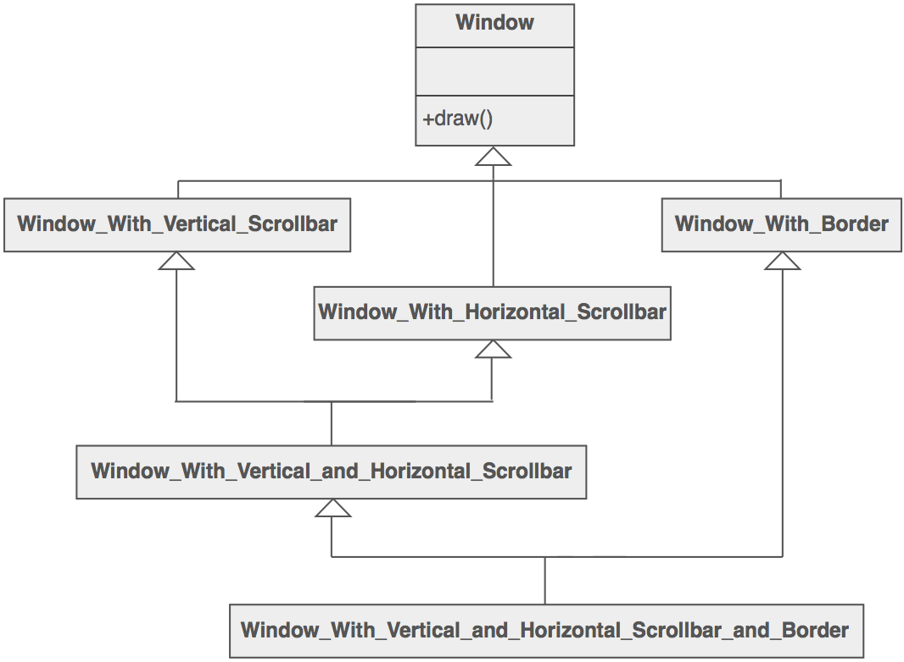

# Decorator
* The main purpose of this pattern is to let client add **additional functionality to object dynamically**
* Client has freedom to create object and **extend it by adding variety of features**
* **Definition**: It is all about classes and object composition. Structural class-creation pattern uses inheritance to compose interfaces. 
* Adding caching functionality to repository to create cached repository. 
* Real Life Example: A bag pack: 

```
int main{
    IBagPack *bp = new LaptopSlot(new UsbCharge(...))));
    return 1;
}
```

## Intent 
* Attach **additional responsibilities** to an object dynamically. 
* Decorators provide **flexible** alt to sub-classing for extending functionality.

## Problem 
* you want to add behavior to state to individual objects at run-time. 
* **Inheritance is not feasible** as its static and applies to entire class. 

## Scenario 
* Suppose you are working on a user interface toolkit and you wish to support adding borders and scroll bars to windows. You could define an inheritance hierarchy like ...

* But the Decorator pattern suggests giving the client the ability to specify whatever combination of "features" is desired.
```
Widget* aWidget = new BorderDecorator(
  new HorizontalScrollBarDecorator(
    new VerticalScrollBarDecorator(
      new Window( 80, 24 ))));
aWidget->draw();
```
## Steps to implement
1. **Define the base** : Define the base interface that will be the base for all objects, and an abstract implementation for the base objects. 
```
// base interface for all objects
public interface IText{
    string GetText();
}

//base class 
public abstract class TextBase: IText {
    private readonly string _text; 
    public TextBase(string text){
        _text = text;
    }

    public virtual string GetText(){
        //do something 
        return _text;
    }
}
```

2. **Define the decorator base**: The Decorator at the same time **IS** of the type and **HAS** the type will decorate.
* This abstract class inherits from the same interface of base object and by constructor receives an instance of object will decorate (any object of the same type).
```
// decorator base
public abstract class TextDecorator : IText {
    internal readonly IText _text; 

    //recieves an instance of IText (object to decorate)
    public TextDecorator(IText text){
        _text = text;
    }

    //implement the method as virtual , so the decorator can override 
    public virtual string GetText(){
        //the basic implementation just calls the base method.
        return _text.GetText();
    }

}
```

3. **create the decorators**: Inherit from abstract decorator base to create each decorator we want 
```
// decorator to apply bold format 
public class BoldDecorator: TextDecorator{

    public BoldDecorator(IText text): base(text){

    }

    // specific implementation to apply the decorator
    public override string GetText(){
        //calls the same method from contained object 
        // to get value from contained object 
        string baseText = _text.GetText();

        //apply decorator (changing the text to simulate the application of the format)
        string decoratedText = baseText + "_BOLDAPPLIED";

        return decoratedText;
    }
}

public class ItalicDecorator: TextDecorator{

    public ItalicDecorator(IText text): base(text){

    }

    // specific implementation to apply the decorator
    public override string GetText(){
        //calls the same method from contained object 
        // to get value from contained object 
        string baseText = _text.GetText();

        //apply decorator (changing the text to simulate the application of the format)
        string decoratedText = baseText + "_ItalicAPPLIED";

        return decoratedText;
    }
}
```

* Now we can use the decorator we want, combining and accumulating. Then just call the method from interface (IText.GetText) and the result will depends on which decorators were applied.
* We can also isolate the decorating logic by just receiving an instance of IText and delegating the creation to a factory or another class.

4. **using in client**
```
// base object 
IText textToScreen = new TextToScreen("hjkdefkjfldfkjnkdfjn nfdjkndfkjnf ndfjkndfk");

IText italicDecorator = new ItalicDecorator(textToScreen);

IText boldDecorator = new BoldDecorator(italicDecorator);

string decoratedText = italicDecorator.GetText();
```

## When to use? 
* We can use it in following situation: 
1.  Several conditions to apply different behaviors/features to an object
2.  Class explosion(when number of classes being required to add new functionality) being used to combine variations of an object. In our example would be something like having all those classes: TextBold, TextItalic, TextUnderline, TextBoldAndItalic, TextBoldAndUnderline, TextBoldAndItalicAndUnderline.
3. One or more attributes that during a process are modified in a chained or accumulative way.
4. An object with Boolean flags being used to apply modifications on the object itself.
5. It is used **a lot with streams** to get added functionality. 
6. It is used extensively in C# decorated versions are BufferedStream, FileStrem, MemoryStrem, NetworkStream and CryptoStream classed.
## Drawbacks 
1. Too many small classes and will add maintenance overhead. 
2. Over use of **open closed principle**. 

### Code scenarios 
1. Let's say you are writing an encryption module. This encryption can encrypt the clear file using DES - Data encryption standard. Similarly, in a system you can have the encryption as AES - Advance encryption standard. Also, you can have the combination of encryption - First DES, then AES. Or you can have first AES, then DES.

## Strategy vs Decorator 
* The key difference is **change vs augment** 
* The strategy pattern allows you to change the implementation of something used at runtime.
*  The decorator pattern allows you augment (or add to) existing functionality with additional functionality at run time. 

# Decorators and Dependency Injection 
* This pattern is out of box supported by built in dependency injection. 
> **NOTE**: If I register 2 copies of IService then any class attempting to consume IService will receive the one that was registered last. If they try to consume an IEnumerable then they will receive all of them

[More info here about below approaches](https://greatrexpectations.com/2018/10/25/decorators-in-net-core-with-dependency-injection)
## Approach 1: Reference a Concrete Type 
* Having a decorator explicitly depend on a concrete implementation of wrapped class. 
```
class Decorator : IService {
    public Decorator(ConcreteService service){}
}

public static void ConfigureServices(IServiceCollection services){
    services.Replace(serviceDescriptor.Scoped<IService, Decorator>());
}

```

## Approach 2: Using Factory Registration
* use a factory method to pass the explicit concrete type to the decorator constructor. 
```
class Decorator : IService {
  public Decorator(IService concreteService) {}
}

public static void ConfigureServices(IServiceCollection services) {
  services.Replace(ServiceDescriptor.Scoped<IService>(s =>
    new Decorator(s.GetRequiredService<ConcreteService>())
  ));
}
```

* this works fine untill your decorator class doesnt have other dependencies
```
class Decorator : IService {
  public Decorator(
    IService concreteService,
    IOtherService1 anotherDependency,
    IOtherService2 yetAnotherDependency) {}
}

public static void ConfigureServices(IServiceCollection services) {
  services.Replace(ServiceDescriptor.Scoped<IService>(s =>
    new Decorator(
      s.GetRequiredService<ConcreteService>(),
      s.GetRequiresService<IOtherService1>(),
      s.GetRequiredService<IOtherService2>())
  ));
}
```

## Approach 3: Reusing the existing service descriptor
* **IServiceCollection** is largely a wrapper around a list of **ServiceDescriptor** objects so we can go grab the existing registration and use that in our factory.
```
class Decorator : IService {
  public Decorator(
    IService concreteService,
    IOtherService1 anotherDependency) {}
}

public static void ConfigureServices(IServiceCollection services) {
  var wrappedServiceDescriptor = services.First(s => s.ServiceType == typeof(IService));

  services.Replace(ServiceDescriptor.Describe(
    typeof(IService),
    s => new Decorator(
      s.CreateInstance(wrappedServiceDescriptor),
      s.GetRequiresService<IOtherService1>()),
    wrappedServiceDescriptor.Lifetime
  ));
}

public static object CreateInstance(this IServiceProvider services, ServiceDescriptor descriptor)
{
  if (descriptor.ImplementationInstance != null)
    return descriptor.ImplementationInstance;

  if (descriptor.ImplementationFactory != null)
    return descriptor.ImplementationFactory(services);

  return ActivatorUtilities.GetServiceOrCreateInstance(services, descriptor.ImplementationType);
}
```

## Approach 4: Using intermediate Scope
```
 //Decorator class as above

public static void ConfigureServices(IServiceCollection services) {
  var wrappedServiceDescriptor = services.First(s => s.ServiceType == typeof(IService));

  // add the decorator as a concrete type (with the same lifetime as the wrapped service)
  services.Add(ServiceDescriptor.Describe(typeof(Decorator), typeof(Decorator), wrappedServiceDescriptor.Lifetime);

  // build a new service provider that contains the decorator
  // as a concrete type and the wrapped service as the interface
  // (as well as anything that has already been registered)
  var intermediateProvider = services.BuildServiceProvider();

  // replace the interface registration by resolving the
  // decorator type from the intermediate provider
  services.Replace(ServiceDescriptor.Describe(
    typeof(IService),
    s => intermediateProvider.GetRequiredService<Decorator>(),
    wrappedServiceDescriptor.Lifetime
  ));
}
```