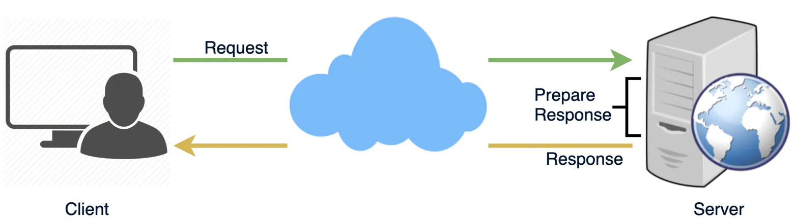
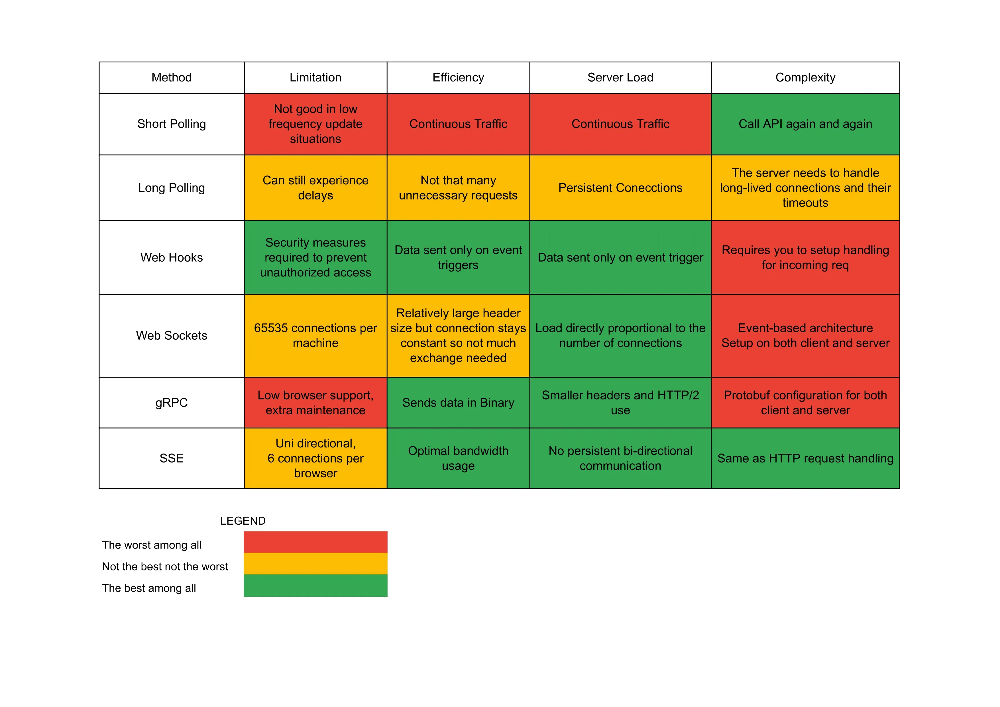

# Long Polling vs Web Sockets vs Server-sent events
* These are communication protocols between client and server. 
* **Working of HTTP requests**
  * Client opens a connection and requests data from server.
  * Server calculates the response
  * Server sends the response back to the client on the opened request
  


## HTTP Long-Polling
* It is variation of traditional polling technique in which server pushes information to client whenever data is available
* Client requests information from the server exactly as in normal polling, but with expectation that server may not respond immediately. AKA **Hanging Get**
  * If server has no data -> server holds the request and waits until some data becomes available. 
  * Once data is available, full response is sent to the client. 
  * Client immediately re-requests information from server so server will almost always have an available waiting request. 
* **Lifecycle  of App using HTTP Long polling**
  * Client makes an initial request using regular HTTP
  * server delays it's response until an update is available or timeout has occurred. 
  * When an update is available, the server sends a full response 
  * Client typically sends a new long poll request,  either immediately or pause to allow an acceptable latency period. 
  * Each long polling has timeout
```csharp
app.MapGet("/", async (CancellationToken userCt, ItemService itemService) =>
{
    var cts = CancellationTokenSource.CreateLinkedTokenSource(userCt);
    cts.CancelAfter(TimeSpan.FromSeconds(30));
    
    var timeoutTask = Task.Delay(-1, cts.Token);
    var itemArrivedTask = itemService.WaitForNewItem();
    
    var completedTask = await Task.WhenAny(itemArrivedTask, timeoutTask);
    if (completedTask == itemArrivedTask)
    {
        var item = await itemArrivedTask;
        itemService.Reset();
        return Results.Ok(item);
    }

    return Results.NoContent();
});
```


## Web Sockets
* its provides a `full duplex` communication channel over a single TCP connection. 
* Provides persistent connection between a client and a server that both parties can use to start sending data any time
* Client establishes connection using **Websocket handshake**
* If it succeeds then both parties can send data anytime. 
* This provides bi-directional communication with lower overheads.

## Server Sent Events
* Under SSE clients establishes persistent and long-term connection with server. 
* The server uses this connection to send data to the server
* If clients want to send the data then it has to use come different protocols
* **UseCase**: When we need real-time traffic from server to the client or if the server is generating data in loop.

