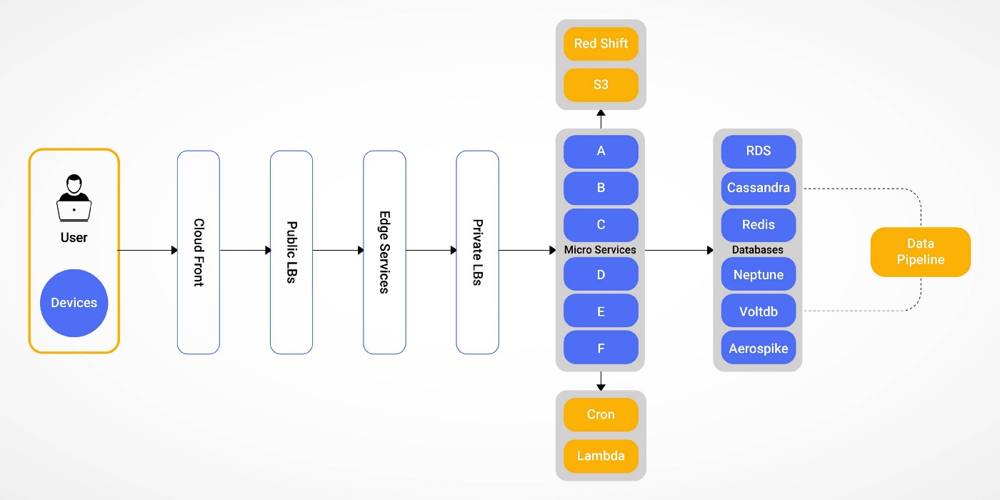

# How Dream11 Scale in or Scale Out? 

## Application Architecture

## Capacity Estimations
1. A user base of more than 100 million 
2. User concurrency of over 5.5 million
3. Over 100 million Request per minute at edge services.
4. More than 30K + compute resources to support peak IPL traffic. 
5. More than 100+ microservices running in parallel

## Functional Challenges
* **Behavioral trend** of users is very **spiky**
* Users are dynamic and surge frequently at key times + other factors(sports, popularity of events, etc)
* **uncontrolled variable** which generate spike on platform: 
    1. User interest depend on popularity of match which effect RPM
    2. Match-Specific events such as toss, squad announcements, mid-hour, fall of wickets, hitting of sixes. 

## Challenges in Scaling 
### Why AUTO SCALING wont work? 
1. It's provisioning time is not fast enough to compute requirements during key events. 
2. **Spot Availability**(Specialized AWS instance) of nodes is limited and highly competitive - especially at key hours. 
3. **Step Scaling** may not work as it is limited to certain number of nodes. 
4. **Rebalancing or rearranging** number of nodes across availability zones based on availability of resources, may further add provisioning cost with respect to time.  

## Limitations of Classic and application Load Balances (CLB/ALB)   